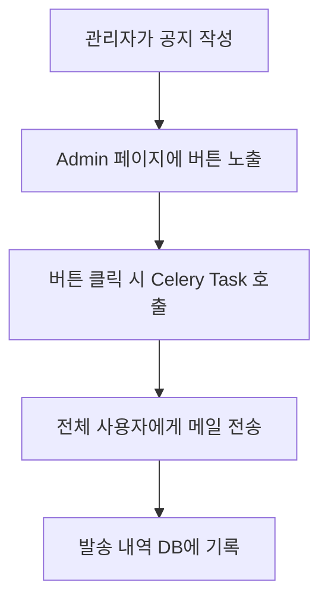

## 관리자도 자동화가 필요한 이유

AInfo 프로젝트에서는 관리자(admin)가 전체 사용자에게 공지 메일을 발송해야 하는 경우가 존재합니다. 하지만 수천 명의 유저에게 동기 방식으로 메일을 보낼 경우:

- 서버가 느려지고,
- 응답이 지연되며,
- 사용자 경험이 저하됩니다.

이를 해결하기 위해 **Django Admin + Celery + 비동기 메일 발송 구조**를 구성했습니다.


## 구현 목표

> **Django 관리자 페이지에서 버튼 한 번 클릭으로 전체 사용자에게 공지 메일 전송**


## 기능 흐름 요약




## 1. 공지 메일 모델 정의 (`notifications/models.py`)

```python
class EmailNotification(models.Model):
    title = models.CharField(max_length=255)
    content = models.TextField()
    sent_at = models.DateTimeField(auto_now_add=True)
    sender = models.CharField(max_length=50, null=True, blank=True)
```

- 제목, 내용, 발송일, 보낸 사람(관리자 이름)을 저장합니다.


## 2. Celery Task 정의 (`notifications/tasks.py`)

```python
@shared_task
def send_mail_to_all(title, content, sender_name):
    users = User.objects.filter(terms_agree=True).values_list("email", flat=True)
    email_messages = [
        (title, content, settings.DEFAULT_FROM_EMAIL, [email])
        for email in users if email
    ]
    send_mass_mail(email_messages, fail_silently=True)

    EmailNotification.objects.create(
        title=title, content=content, sender=sender_name
    )
```

- `terms_agree=True`인 유저 대상으로 메일 전송
- 발송 완료 후 DB에 기록


## 3. Django Admin 페이지에 버튼 추가 (`notifications/admin.py`)

```python
class EmailNotificationAdmin(admin.ModelAdmin):
    list_display = ("title", "content", "sent_at", "sender", "send_email_button")
    readonly_fields = ("sent_at",)

    def send_email_button(self, obj):
        return format_html(
            '<a class="button" href="{}">💌 전체유저에게 공지메일 보내기 💌</a>',
            self.get_send_email_url(obj),
        )

    def send_email_view(self, request, email_id):
        email_notification = EmailNotification.objects.get(id=email_id)
        email_notification.sender = request.user.name
        email_notification.save()
        send_mail_to_all.delay(
            email_notification.title, email_notification.content, request.user.name
        )
        self.message_user(request, "📨 공지 메일이 전체 사용자에게 전송되었습니다!")
        return redirect("/admin/notifications/emailnotification/")
```

- 버튼을 누르면 `send_mail_to_all.delay(...)` 호출
- 관리자 이름도 함께 기록


## 4. 실행 결과

- 관리자 페이지에서 공지 작성 후, 버튼 한 번으로 전체 발송 완료
- 비동기 전송이라 빠르게 응답 반환됨
- 발송 내역은 Admin 페이지에서 확인 가능


## 마무리

이 기능은 단순하지만 강력합니다. **관리자는 코드를 몰라도 Django Admin 페이지에서 전체 공지를 발송할 수 있고**, Celery 덕분에 시스템에 부담 없이 비동기 처리됩니다.
