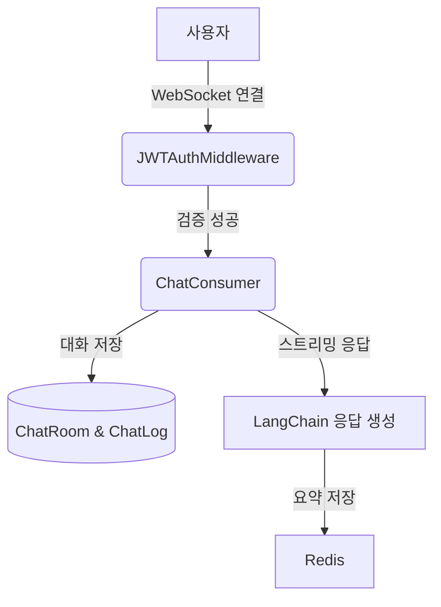

## 실시간 WebSocket 기반 구조

AInfo는 사용자의 정책 질문에 실시간으로 응답하는 챗봇 기능을 Django Channels 기반 WebSocket 구조로 구현했습니다. 사용자 인증부터 메시지 스트리밍, Redis 기반 대화 기록 저장까지 실제로 어떻게 구현했는지 설명합니다.


## 전체 구조 개요



- Django Channels 기반 `AsyncWebsocketConsumer`로 실시간 채팅 구현
- WebSocket 연결 시 JWT 토큰을 포함해 요청
- JWTAuthMiddleware에서 토큰을 검증하고 사용자 ID를 scope에 저장
- 인증된 사용자만 ChatConsumer에서 채팅방 접근 허용
- 메시지는 DB(ChatRoom, ChatLog)에 저장, 이전 대화도 불러오기 가능
- LangChain의 RAG 체인을 활용해 스트리밍 응답 생성
- Redis에 과거 대화를 저장하여 멀티턴 흐름 유지


## 1. WebSocket 인증: `JWTAuthMiddleware`

```python
# chatbot/middleware.py
class JWTAuthMiddleware(BaseMiddleware):
    async def __call__(self, scope, receive, send):
        token = self.get_token_from_scope(scope)
        if token:
            user_id = await self.get_user_from_token(token)
            scope["user_id"] = user_id
        return await super().__call__(scope, receive, send)
```

- 클라이언트는 WebSocket 연결 시 `?token=<access_token>` 쿼리로 JWT를 전달
- 인증 성공 시 `scope['user_id']`에 사용자 ID 저장
- `Consumer`에서는 이 정보를 기반으로 유저 인증 및 채팅방 권한 확인


## 2. 채팅 메시지 흐름: `ChatConsumer`

```python
# chatbot/consumers.py
class ChatConsumer(AsyncWebsocketConsumer):
    async def connect(): ...
    async def receive(text_data): ...
    async def disconnect(): ...
```

### 주요 흐름
1. **connect**
    - `room_id`와 `user_id` 확인 → 유효하지 않으면 연결 종료
    - 채팅방이 사용자가 만든 것인지 확인
    - 이전 채팅 내역을 불러와 전송
2. **receive**
    - 사용자 메시지 검증 후 LangChain 기반 응답 생성
    - 스트리밍 응답: `is_streaming=True`로 청크 전송 → 마지막은 `is_streaming=False`
3. **disconnect**
    - 채팅방 그룹에서 연결 제거

### DB 연동
- 메시지는 `ChatLog` 모델에 저장
- 채팅방은 `ChatRoom` 모델을 통해 관리


## 3. 채팅 기록 관리: Redis 기반 멀티턴 구조

```python
# chatbot/langchain_flow/memory.py
class ChatHistoryManager:
    def get_memory_manager() -> ConversationSummaryBufferMemory
```

- LangChain의 `ConversationSummaryBufferMemory`와 Redis를 조합
- 200 토큰 이상 넘어가면 요약하여 저장 (비용 효율성 확보)
- 채팅방 ID와 사용자 ID로 Redis 세션 식별


## 4. WebSocket URL 라우팅

```python
# chatbot/routing.py
websocket_urlpatterns = [
    re_path(r"^ws/chat/(?P<room_id>\d+)/$", ChatConsumer.as_asgi()),
]
```

- `/ws/chat/<room_id>/` 형식으로 연결
- URL 내부의 `room_id`를 기반으로 해당 채팅방 연결 허용


## 5. 정리

| 고려 항목 | 내용 |
|-----------|------|
| 인증 방식 | JWT 기반 WebSocket 인증 (`query_string` 전달) |
| 보안 강화 | 본인 소유의 `chatroom_id`만 연결 허용 |
| 저장 방식 | Redis (요약 기반 메모리), ChatLog 모델 (전체 메시지) |
| 응답 방식 | LangChain 기반 스트리밍 응답 (청크 전송) |
| 사용자 경험 | 이전 대화 불러오기, 실시간 입력/응답 UI 대응 |
