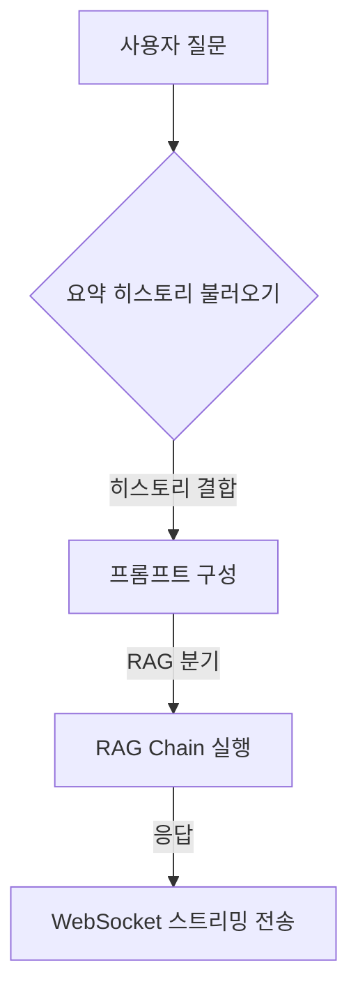

## 멀티턴 구조가 필요한 이유

AInfo는 단순한 일문일답 챗봇이 아닌 **지속적인 문맥을 기억하며 정책 추천**을 수행해야 하는 서비스입니다.
이를 위해 LangChain의 `Memory` 기능과 RAG 체인을 함께 사용해 멀티턴 대화를 구현했습니다.

- 사용자의 이전 질문 요약 → 다음 질문에 반영
- Redis에 저장된 요약 메모리로 **세션 유지**
- LangChain `ConversationSummaryBufferMemory` 활용


## 전체 흐름 구조




## 1. LangChain Memory 구조

AInfo에서는 LangChain의 `ConversationSummaryBufferMemory`와 Redis를 함께 사용합니다.
요약 방식이기 때문에 비용을 절감하면서도 문맥을 유지할 수 있습니다.

```python
# chatbot/langchain_flow/memory.py
def get_memory_manager(chatroom_id: int, user_id: int):
    memory = ConversationSummaryBufferMemory(
        llm=ChatOpenAI(model_name="gpt-4o", temperature=0),
        memory_key="chat_history",
        return_messages=True,
        max_token_limit=200,
        chat_memory=RedisChatMessageHistory(
            session_id=f"{chatroom_id}:{user_id}",
            url=settings.REDIS_URL,
        ),
    )
    return memory
```

- `max_token_limit=200` 이상이면 자동 요약
- Redis URL은 `.env`에서 환경변수로 관리
- `chatroom_id:user_id` 조합으로 세션 관리


## 2. LangChain RAG 체인 실행 구조

사용자의 질문을 받아 다음과 같은 순서로 처리합니다:

1. **기존 히스토리 조회**: Redis에서 이전 요약 가져오기
2. **프롬프트 결합**: 현재 질문과 히스토리를 붙여 Input 구성
3. **RAG 실행**: Chroma 벡터DB에서 유사한 문서 검색 + 응답 생성
4. **응답 스트리밍**: WebSocket으로 청크 단위 전송

```python
# chatbot/langchain_flow/chains/news_search_executor.py
def get_chatbot_response(question, chatroom_id, user_id):
    memory = get_memory_manager(chatroom_id, user_id)

    chain = ConversationalRetrievalChain.from_llm(
        llm=ChatOpenAI(model="gpt-4o", streaming=True),
        retriever=retriever,  # Chroma 기반
        memory=memory,
        return_source_documents=True,
        verbose=True,
    )

    return chain.invoke({"question": question})
```

- `streaming=True` 옵션으로 WebSocket 응답과 연계
- source document까지 포함되도록 설정


## 3. Vector DB와 유사도 검색

RAG는 핵심적으로 **질문과 가장 유사한 문서를 찾는 것**이 중요합니다.
AInfo는 ChromaDB를 사용하며, 컬렉션별로 필터링 기능도 지원합니다.

```python
# chatbot/retriever.py
class VectorRetriever:
    def search(self, query: str, filters: dict = None, collection_names: list = None, k=5):
        ...
        # 컬렉션 단위로 Chroma에서 유사도 기반 검색
        return results
```

**다음 글에서는 이 `retriever.py` 파일을 집중적으로 분석**합니다.
- 어떤 방식으로 유사도 검색을 수행하는지
- Chroma 컬렉션을 어떻게 선택하고 필터링하는지
- 최종 응답 형식은 어떻게 정리되는지

이 구조를 이해하면 나중에 직접 커스텀 Tool을 만들거나 CrewAI와 연동할 때도 도움이 됩니다.


## 4. 멀티턴 기반 조건 분기 처리

단일 RAG 체인만 사용하는 것이 아니라, **질문 유형에 따라 실행 체인을 분기**할 수 있도록 조건 분기 로직도 포함되어 있습니다.

```python
if "추천" in question or "지원금" in question:
    # 정책 RAG 추천으로 분기
    return RAGCrew().crew(...).kickoff()
else:
    # 기본 LangChain 체인 실행
    return get_chatbot_response(...)
```

- 사용자 질문에 따라 RAG 기반 추천 흐름 또는 일반 검색 체인을 선택
- 향후 CrewAI 및 LangGraph와 자연스럽게 연결될 수 있도록 구성함


## 5. WebSocket에서 멀티턴 실행 흐름

실제 `ChatConsumer`에서 사용자의 메시지를 받을 때마다 다음 과정을 거칩니다.

```python
# chatbot/consumers.py
class ChatConsumer(AsyncWebsocketConsumer):
    async def receive(self, text_data):
        ...
        memory = get_memory_manager(chatroom_id, user_id)
        result = get_chatbot_response(question, chatroom_id, user_id)
        ...
```


## 6. 정리

| 항목 | 설명 |
|------|------|
| 히스토리 저장 방식 | Redis 요약 방식 (200 토큰 초과 시 요약) |
| 세션 키 | `chatroom_id:user_id` 조합으로 Redis 구분 |
| 비용 절감 | 전체 로그 저장이 아닌 요약 방식으로 프롬프트 최적화 |
| 분기 처리 | 키워드 기반 조건 분기 (LangChain vs CrewAI) |
| 확장성 | LangGraph, CrewAI와 자연스럽게 연동 가능 |
| 실시간 응답 | WebSocket 청크 기반 스트리밍 응답 구성 |
