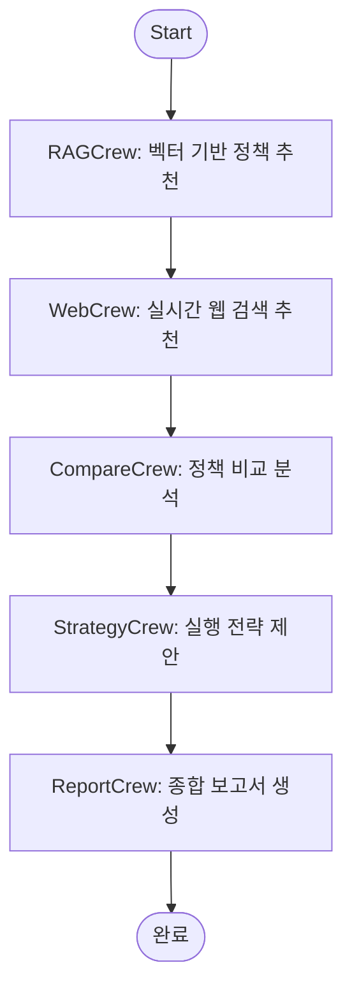

## CrewAI 도입 배경

LangChain 구조에서는 단일 체인 내에서 검색과 응답을 처리했습니다. 하지만 질문의 복잡도가 높아지고, 다음과 같은 요구사항이 생기면서 **멀티에이전트 시스템**이 필요해졌습니다.

- 웹 검색과 벡터 검색 결과를 비교하고 추천해야 함
- 사용자에게 가장 적합한 정책을 판단하고 전략까지 안내해야 함
- 최종 결과를 문서화된 보고서 형태로 출력해야 함

이를 위해 AInfo에서는 CrewAI를 도입해 **역할별 에이전트를 Task 단위로 묶고**, 전체 흐름을 Flow로 관리하는 구조를 구성했습니다.


## 전체 흐름 요약: Flow → Crew → Task → Agent/Tool



- **Flow**: 정책 추천 전체 흐름 정의 (순차 실행, 에러 재시도 포함)
- **Crew**: 각 단계의 기능 단위 (검색, 비교, 전략 등)
- **Task**: 각 에이전트의 작업 정의 (프롬프트 포함)
- **Agent**: 역할을 가진 실행자 (LLM 기반)
- **Tool**: Task에서 사용하는 실질적 도구 (벡터 검색, 웹 검색 등)

> CrewAI에서는 “작업”을 중심으로 Agent + Tool을 묶고, 이들을 단계별로 연결한 Flow를 실행함으로써 전체 프로세스를 구성합니다.


## 1. Flow 구조 - `PolicyFlow`

```python
class PolicyFlow(Flow):
    def rag_search(self): ...
    def web_search(self): ...
    def compare_services(self): ...
    def make_strategy(self): ...
    def generate_report(self): ...
```

- `@start()`와 `@listen(...)` 데코레이터로 실행 순서를 정의
- 중간에 RateLimit 발생 시 자동 재시도 처리 포함
- 상태값 `self.state`로 결과를 다음 단계에 넘김


## 2. 각 Crew의 역할 정리

| Crew 이름 | 역할 설명 |
|-----------|-----------|
| `RAGCrew` | 사용자 질문 + 프로필로 벡터 기반 정책 추천 수행 |
| `WebCrew` | Tavily 기반 웹 검색으로 정책 추천 보완 |
| `CompareCrew` | RAG + Web 결과를 비교하고 최적 정책 분석 |
| `StrategyCrew` | 적합한 정책의 신청 순서 및 전략 도출 |
| `ReportCrew` | 전체 결과를 기반으로 사용자 맞춤 보고서 생성 |


## 3. Task와 프롬프트 구성

Task는 다음 정보를 포함합니다:

- `description`: 시스템에게 줄 프롬프트 지침
- `expected_output`: 출력 형식 또는 기대 결과
- `agent`: 이 Task를 수행할 에이전트
- `tools`: 필요한 경우 사용하는 도구 목록

예시:
```python
Task(
    description="사용자 질문에 맞는 정책을 추천해 주세요",
    expected_output="정책 이름, 설명, 신청 링크 포함",
    agent=search_agent,
    tools=[RagSearchTool()]
)
```

> 프롬프트는 대부분 공통 템플릿에 정의된 문자열 상수로 유지합니다. (`prompts.py`)


## 4. Agent와 Tool의 구성

Agent는 다음 속성으로 정의됩니다:

- `role`: 전문가 역할 (예: 정책 추천 전문가)
- `goal`, `backstory`: 목적과 배경
- `llm`: 사용하는 LLM 객체 (ex. gpt-4o)
- `system_prompt`: 시스템 메시지로 들어갈 프롬프트

Tool은 LangChain의 기능 또는 자체 정의 함수 기반입니다:

- `RagSearchTool`: Chroma에서 유사도 기반 검색
- `SearchWebTool`, `StrategyWebTool`: Tavily 기반 웹 검색


## 5. 멀티 크루 실행 결과를 연결

각 Crew에서 반환된 결과는 다음 Crew로 넘겨지고, 마지막 ReportCrew가 전체 결과를 종합해 문서 형태로 마무리합니다.

```python
self.state["crew_result"] = RAGCrew().crew(...).kickoff()
...
self.state["report_result"] = ReportCrew().crew(...).kickoff()
```


## 마무리: 왜 CrewAI인가?

CrewAI는 단순히 에이전트를 나열하는 방식이 아니라, **Flow → Crew → Task → Agent/Tool**이라는 계층적 구조를 통해 대규모 멀티턴 챗봇에서의 복잡한 작업 흐름을 유연하게 다룰 수 있습니다.

| 비교 항목 | LangChain 단일 체인 | CrewAI 멀티 크루 구조 |
|------------|------------------|--------------------|
| 구조 | 일관된 체인 하나 | 역할별로 분리된 작업 흐름 |
| 확장성 | 기능 추가 시 체인 복잡도 증가 | Task/Agent 단위로 모듈화 용이 |
| 흐름 제어 | 조건문 기반 | Flow 데코레이터로 명확한 흐름 구성 |

추가로 AInfo에서는 아래와 같은 장점을 체감하며 도입을 결정했습니다:

| 항목 | 설명 |
|------|------|
| 모듈화 | 기능별 Agent/Task 분리로 유지보수 용이 |
| 재사용성 | 각 Crew는 독립적으로도 사용 가능 |
| 설명력 | 보고서 생성까지 포함해 사용자 응답의 완결성 향상 |
| 확장성 | LangGraph로도 전환 가능하도록 설계 |
| 비용 | 각 Agent 실행마다 API 호출 비용 발생 → 제한적 호출 필요 |

결과적으로, CrewAI는 "복잡한 대화 흐름"과 "단계적 분석 및 설명"이 중요한 AInfo 챗봇의 특성과 잘 맞았습니다.
