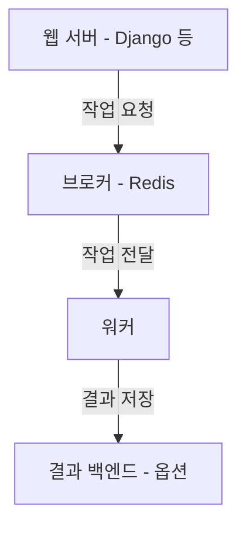

## Celery란?

**Celery**는 파이썬 기반의 **비동기 작업 큐 프레임워크**입니다. 웹 애플리케이션에서 발생하는 **시간이 오래 걸리는 작업들을 백그라운드에서 처리**할 수 있도록 해줍니다.

보통 사용자 요청에 대한 처리는 빠르게 끝나야 사용자 경험이 좋습니다. 그런데 다음과 같은 작업들은 시간이 오래 걸립니다:

- 이메일 전송 (SMTP 서버 응답 대기)
- 외부 API 호출 (응답 지연)
- 대용량 이미지 처리 (압축, 변환 등)
- 보고서 생성 및 PDF 저장
- 공공데이터 수집 및 정제

이런 작업들을 사용자 요청 흐름 안에서 처리하면 응답 시간이 길어지고 서버가 과부하에 걸릴 수 있습니다. 그래서 이 작업들을 **큐(Task Queue)**에 넣고, 백그라운드에서 별도로 실행하는 것이 좋습니다. 바로 이런 구조를 가능하게 해주는 것이 Celery입니다.


## Celery의 기본 개념과 구성 요소

Celery는 크게 다음 4가지 요소로 구성됩니다:



1. **프로듀서 (Producer)**: 작업을 생성하는 주체. 예: Django의 View, API 요청 등
2. **브로커 (Broker)**: 작업을 임시로 저장하고 워커에게 전달. 일반적으로 Redis나 RabbitMQ 사용
3. **워커 (Worker)**: 대기 중인 작업을 꺼내 실제 실행하는 주체
4. **결과 백엔드 (Backend)**: 작업 결과를 저장하거나 상태를 추적 (선택 사항)

### 실제 동작 순서
1. 사용자 요청이 Django 서버로 들어옵니다.
2. View에서 특정 작업을 Celery Task로 등록합니다 (`task.delay(...)`).
3. 이 Task는 Redis와 같은 브로커로 전달됩니다.
4. Celery 워커가 브로커에서 대기 중인 작업을 꺼내 실행합니다.
5. 작업 결과는 백엔드에 저장되거나 무시될 수 있습니다.


## 왜 Redis를 쓰는가?

Redis는 메모리 기반의 초고속 키-값 저장소로, Celery의 브로커로 가장 널리 사용됩니다.
- 속도가 빠르고
- 설치와 설정이 간단하며
- Celery와의 호환성이 뛰어납니다.

RabbitMQ도 사용할 수 있지만, 처음 Celery를 도입할 땐 Redis를 추천합니다.


## Django 프로젝트에서 Celery 설정하기

Celery를 Django에 통합하려면 몇 가지 파일과 설정이 필요합니다.

### 1. Celery 인스턴스 생성 (config/celery.py)

```python
from celery import Celery
import os

os.environ.setdefault("DJANGO_SETTINGS_MODULE", "config.settings")

app = Celery("config")
app.config_from_object("django.conf:settings", namespace="CELERY")
app.autodiscover_tasks()
```

- `autodiscover_tasks()`는 각 앱 내부의 `tasks.py` 파일에서 작업을 자동 탐색합니다.
- `CELERY_`로 시작하는 환경 변수들을 Django 설정에서 읽습니다.

### 2. 프로젝트 초기화 연결 (__init__.py)

```python
from .celery import app as celery_app
__all__ = ["celery_app"]
```

이렇게 하면 Django가 시작될 때 Celery도 함께 초기화됩니다.

### 3. Redis 설정 추가 (settings.py)

```python
CELERY_BROKER_URL = "redis://localhost:6379/0"
CELERY_RESULT_BACKEND = "redis://localhost:6379/0"  # 선택 사항
```

`redis://` 뒤에 포트와 DB 인덱스를 지정할 수 있습니다 (`/0`, `/1` 등)


## 실제 Task 정의 예시

`accounts/tasks.py`:

```python
from celery import shared_task
from django.core.mail import send_mail
from django.contrib.auth import get_user_model

User = get_user_model()

@shared_task
def send_welcome_email(user_id):
    user = User.objects.get(id=user_id)
    send_mail(
        subject="가입을 환영합니다!",
        message="Test에 오신 것을 환영합니다.",
        from_email="noreply@test.com",
        recipient_list=[user.email],
    )
```

- `@shared_task` 데코레이터는 Celery가 이 함수를 Task로 인식하게 해줍니다.
- 일반적인 파이썬 함수처럼 작성하면 됩니다.


## Task 실행 방법

### 워커 실행

```bash
celery -A config worker --loglevel=info
```

이 명령어로 Celery 워커를 실행하면, 브로커에서 대기 중인 작업들을 하나씩 처리합니다.


## 실제 사용 예시: 비밀번호 재설정 이메일 비동기 전송

```python
# views.py
class ResetPasswordView(APIView):
    def post(self, request):
        user = get_user_by_email(request.data["email"])
        send_reset_email.delay(user.id)  # delay()를 붙이면 비동기 처리
        return Response({"message": "비밀번호 재설정 메일이 발송되었습니다."})
```

```python
# tasks.py
@shared_task
def send_reset_email(user_id):
    user = User.objects.get(id=user_id)
    ... # 이메일 전송 로직
```

- `delay()`는 Celery Task를 큐에 넣는 역할을 합니다.


## Celery Beat: 주기적 작업 스케줄링

### 언제 쓰나요?
- 매일 특정 시간에 데이터 수집
- 매주 보고서 자동 생성
- 1시간마다 사용자 통계 수집

Celery에는 `celery-beat`이라는 모듈이 있어서 crontab처럼 주기 작업을 설정할 수 있습니다.

### 예시 설정
```python
from celery.schedules import crontab

app.conf.beat_schedule = {
    "load-weekly-data": {
        "task": "dataload.tasks.load_data",
        "schedule": crontab(hour=3, minute=0, day_of_week=0),  # 일요일 3시
    }
}
```

### 실행 명령어

```bash
celery -A config beat --loglevel=info
```

beat은 `schedule`에 따라 정해진 시간에 작업을 워커에게 넘겨주는 역할을 합니다.


## Celery에서 자주 쓰는 패턴들

- `.delay()`: 비동기로 작업 큐에 등록
- `.apply_async()`: ETA(실행시간 예약), countdown 등 다양한 옵션
- `@shared_task(bind=True)`: self 참조용
- `retry()`: 실패한 작업 재시도


## 팁

- 워커 수를 늘려 병렬처리 → `--concurrency` 옵션
- 실패한 작업 로그 남기기 → `task_failure` signal
- task 실행 시간 제한 설정 → `task_time_limit` 설정
- Celery Dashboard를 위한 Flower 설치


## Celery는 왜 중요한가?

Celery는 단순히 비동기 처리를 넘어서, 시스템의 **확장성과 안정성**을 위해 꼭 필요한 구성 요소입니다.

AInfo 프로젝트에서도 다음과 같은 작업에 Celery가 활용되었습니다:

- 이메일 인증, 비밀번호 재설정 → 사용자 요청 흐름과 분리
- 공공 데이터 정기 수집 → 매주 새벽 자동 실행
- 전체 사용자에게 공지 메일 발송 → 여러러 명 대상 대용량 메일 처리


---


## Celery 고급 기능

Celery는 단순한 `delay()` 호출 외에도 강력한 고급 기능들을 제공합니다. 실무에서는 이 기능들을 적절히 조합해 워크플로우를 최적화할 수 있습니다.


### 1. retry(): 실패한 작업 자동 재시도

작업 중 네트워크 오류, 외부 API 장애 등으로 실패하는 경우를 대비해, `retry()` 메서드를 통해 **자동 재시도** 로직을 구성할 수 있습니다.

```python
from celery import shared_task
from requests.exceptions import RequestException

@shared_task(bind=True, max_retries=3)
def fetch_data(self, url):
    try:
        response = requests.get(url)
        return response.json()
    except RequestException as exc:
        raise self.retry(exc=exc, countdown=60)  # 1분 뒤 재시도
```

- `bind=True`는 `self.retry()`를 사용하기 위한 설정입니다.
- `countdown=60`으로 지정하면, 60초 뒤에 재시도합니다.


### 2. countdown, eta: 작업 지연 실행

특정 Task를 **몇 초 뒤**, 또는 **특정 시간에 실행**하고 싶다면 `apply_async()` 메서드를 사용할 수 있습니다.

```python
send_mail_task.apply_async(args=[user_id], countdown=300)  # 5분 뒤 실행
```

```python
from datetime import datetime, timedelta
eta_time = datetime.utcnow() + timedelta(minutes=10)
send_mail_task.apply_async(args=[user_id], eta=eta_time)
```


### 3. chain: 작업을 순차적으로 연결하기

여러 Task를 순서대로 실행하고 싶을 때는 `chain()`을 사용합니다.

```python
from celery import chain

workflow = chain(task_1.s(arg), task_2.s(), task_3.s())
workflow.delay()
```

- `task_1`의 결과가 `task_2`로 전달되고, 그 결과가 다시 `task_3`로 넘어갑니다.


### 4. group: 병렬 실행

`group()`은 여러 Task를 동시에 실행하고, 결과를 리스트 형태로 받습니다.

```python
from celery import group

group_tasks = group(fetch_page.s(url) for url in url_list)
result = group_tasks.apply_async()
```

- 병렬로 실행된 결과는 `.get()`으로 리스트 형태로 받을 수 있습니다.


### 5. chord: group + callback

`chord()`는 `group()`으로 병렬 실행한 후, 모든 작업이 끝나면 마지막에 **콜백 함수**를 실행합니다.

```python
from celery import chord

chord(
    [process_file.s(file) for file in files],
    summarize_results.s()  # 모든 결과를 받아 처리
).delay()
```


## 고급 패턴 요약표

| 기능 | 설명 | 예시 메서드 |
|------|------|-------------|
| retry | 실패한 작업 재시도 | `self.retry()` |
| delay | 기본 비동기 실행 | `task.delay()` |
| apply_async | 예약 실행 | `apply_async(countdown=300)` |
| chain | 순차 실행 | `chain(a.s(), b.s())` |
| group | 병렬 실행 | `group([...])` |
| chord | 병렬 실행 후 콜백 | `chord([...], callback)` |


## Celery를 제대로 활용하기

Celery는 단순한 Task 큐에 머무르지 않습니다. 여러 Task를 조합해 복잡한 워크플로우를 구성하고, 안정적으로 운영할 수 있는 강력한 시스템입니다.

특히 다음과 같은 상황에서는 고급 기능을 적극 고려해보세요:

- 외부 서비스 장애를 고려한 `retry()`
- 리포트 생성 → 저장 → 알림 발송 순서의 `chain()`
- 여러 사용자 대상 병렬 작업과 결과 요약의 `chord()`

Celery의 고급 기능들을 제대로 이해하고 활용하면, **안정적이고 확장성 높은 비동기 시스템**을 설계할 수 있습니다.

---


## 다음 단계: Celery 운영과 모니터링 with Flower

이제 실제 서비스 환경에서 안정적으로 운영하기 위한 **모니터링과 관리**가 필요합니다. 그중 가장 널리 쓰이는 도구가 바로 **Flower**입니다.


### Flower란?

**Flower**는 Celery 작업 상태를 실시간으로 모니터링할 수 있는 웹 기반 도구입니다.

- 현재 실행 중인 작업, 대기 중인 작업 확인
- 실패한 작업 확인 및 재시도
- 워커 상태 확인 (실행 중, 중지됨 등)
- 작업 실행 통계 확인 (성공률, 처리 시간 등)


### 설치 및 실행 방법

```bash
pip install flower
celery -A config flower --port=5555
```

실행 후 브라우저에서 `http://localhost:5555` 접속하면 Flower UI를 볼 수 있습니다.


### 주요 화면 기능

| 탭 | 설명 |
|-----|------|
| Dashboard | 전체 워커 상태 요약, 실행된 작업 통계 |
| Tasks | 개별 작업 목록, 상태(성공, 실패, 진행 중) |
| Broker | 대기 중인 메시지 큐 길이 확인 |
| Workers | 워커별 상태 및 최근 작업 확인 |


### Flower + Redis 보안 주의사항

- Flower는 누구나 접속할 수 있으므로, 운영 환경에서는 **기본 인증**이나 **프록시 서버(Nginx 등)**를 통한 보호가 필요합니다.
- Redis도 외부에서 접근 가능하지 않도록 `bind 127.0.0.1` 설정 유지하기


## 기타 운영 팁

- **worker 자동 재시작 설정**: Supervisor, systemd 등을 사용해 워커가 비정상 종료되었을 때 자동 재시작
- **로깅 설정 강화**: `--loglevel=info` 또는 `warning`, `error` 등 로그 수위 조절
- **에러 알림 설정**: Sentry 같은 도구와 연동하여 Task 실패 시 알림 받기
- **작업 타임아웃 설정**: `task_time_limit`, `soft_time_limit`으로 무한 대기 방지


## 운영까지 고려한 Celery 활용

Celery는 강력한 도구이지만, 그만큼 운영에도 신경을 써야 합니다.

점검 항목:
- 작업 누락, 중복 실행 방지
- 작업 대기열 모니터링
- 장시간 실행 Task 감지 및 처리
- 실패한 작업의 재시도/보상 전략 마련


---


## Celery 트러블슈팅 가이드

자주 발생하는 이슈와 그에 대한 해결법을 정리합니다.


### 1. 워커가 멈추거나 응답하지 않는 현상

**현상**:
- Flower에서 워커 상태가 'offline'으로 표시됨
- Task가 큐에 쌓이지만 처리되지 않음

**원인**:
- 워커 프로세스가 죽었거나 중단됨
- 메모리 부족, 무한 루프 등으로 프로세스 hang 상태

**해결책**:
- `supervisor`, `systemd` 등의 프로세스로 워커 재시작 자동화 설정
- `task_time_limit`, `soft_time_limit` 설정으로 무한 실행 방지

```python
CELERY_TASK_SOFT_TIME_LIMIT = 60  # 1분 뒤 경고
CELERY_TASK_TIME_LIMIT = 90       # 1분 30초 뒤 강제 종료
```

- 문제가 된 작업 로그를 확인해 원인 분석 후 개선


### 2. Redis 브로커가 응답하지 않음

**현상**:
- Celery가 시작되지 않음
- `ConnectionError: Error 111 connecting to localhost:6379` 등의 메시지 출력

**원인**:
- Redis 서버가 꺼져 있음
- 포트 충돌 또는 방화벽 설정 문제

**해결책**:
- Redis 서버 상태 확인 (`sudo systemctl status redis`)
- 로컬 포트 확인 (`netstat -tnlp | grep 6379`)
- Docker 환경이라면 컨테이너 실행 상태 점검


### 3. 작업이 중복 실행되는 경우

**현상**:
- 동일한 Task가 두 번 이상 실행되어 이메일이 중복 발송됨 등

**원인**:
- 사용자 측 중복 요청 (더블 클릭 등)
- 워커 충돌로 인해 동일 Task가 중복 처리됨

**해결책**:
- 작업 ID 기반 중복 방지 로직 추가
- Django 쪽에서 요청에 대한 debounce 처리 (프론트도 포함)


### 4. 작업 실패 시 에러 로그가 보이지 않음

**현상**:
- 작업이 실패했지만, Flower나 로그에서 원인을 파악하기 어려움

**해결책**:
- Celery 로그 수준을 높이기 (`--loglevel=debug`)
- 실패 Task의 trace 정보 출력 활성화
- `task_failure` signal을 활용해 Sentry 연동

```python
from celery.signals import task_failure

@task_failure.connect
def handle_failure(sender=None, task_id=None, exception=None, **kwargs):
    print(f"Task {sender.name} 실패: {exception}")
```


### 5. Celery 작업 큐가 너무 빨리 쌓이는 문제

**현상**:
- 짧은 시간에 수백 개의 작업이 생성됨
- Redis 메모리 과부하, 처리 지연 발생

**해결책**:
- 작업 요청 쪽에서 큐잉 조건을 조절하거나 제한
- 동일 Task 요청 제한 (Throttle 로직)
- 중요도가 낮은 작업은 예약 처리 (`countdown` 옵션 활용)


## 마무리

서비스가 커질수록 Celery는 더욱 많은 역할을 맡게 됩니다.
따라서 **운영 중 발생하는 이슈에 대한 경험과 대처 전략**은 매우 중요합니다.