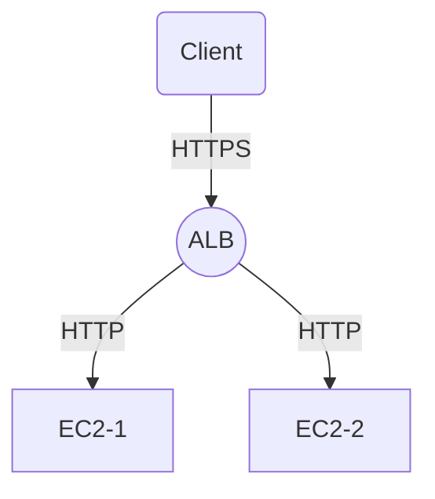

# AWS Elastic Load Balancer(ELB)

## 1. ELB란 무엇인가?

AWS Elastic Load Balancer(ELB)는 **클라이언트 요청을 여러 대상(EC2, Lambda 등)에 자동으로 분산**시켜주는 서비스. 고가용성과 장애 대응을 위해 반드시 필요한 인프라 구성 요소.

> 트래픽이 몰릴 때 하나의 서버가 과부하되지 않도록 "자동으로 분산"하는 프록시 역할을 수행.

---

## 2. ELB의 주요 기능

| 기능            | 설명                                           |
| ------------- | -------------------------------------------- |
| **로드 밸런싱**    | 클라이언트 요청을 여러 EC2 등 대상으로 고르게 분산               |
| **장애 자동 감지**  | 헬스 체크로 비정상 대상 제외                             |
| **확장성 확보**    | Auto Scaling과 연계 가능                          |
| **SSL 종료 처리** | HTTPS 요청을 ELB에서 종료 후 내부는 HTTP로 전달 (SSL 오프로드) |

---

## 3. ELB 유형 비교

| 유형                              | 계층               | 주요 특징                        | 사용 사례         |
| ------------------------------- | ---------------- | ---------------------------- | ------------- |
| ALB (Application Load Balancer) | 7계층 (HTTP/HTTPS) | URL 경로/호스트 기반 라우팅, Lambda 지원 | API 서버, 웹앱    |
| NLB (Network Load Balancer)     | 4계층 (TCP/TLS)    | 고성능, 정적 IP, 빠른 연결            | 게임, 금융, IoT   |
| CLB (Classic Load Balancer)     | 4/7계층 (레거시)      | 구형 방식, 신규에 비권장               | 이전 시스템 마이그레이션 |

---

## 4. ALB 구성 예시

* 도메인 기반 또는 경로 기반 라우팅 설정 가능
* ALB → Target Group → EC2 구조로 트래픽 전달

---

## 5. ELB 구성 요소

| 구성 요소            | 설명                               |
| ---------------- | -------------------------------- |
| **Target Group** | 트래픽을 받을 대상 (EC2, Lambda 등) 그룹    |
| **Listener**     | 수신 포트/프로토콜 정의 (ex. HTTP 80)      |
| **Health Check** | 헬스 체크 경로 설정 (/health 등)          |
| **Routing Rule** | URL, Host에 따라 라우팅 경로 지정 (ALB 기준) |

---

## 6. ALB 실습 절차 요약

1. EC2 2대 생성 및 웹 서버(Apache/Nginx) 구성
2. Target Group 생성 후 EC2 등록
3. ALB 생성 및 Target Group 연결
4. ALB 보안 그룹: 포트 80 허용, EC2는 ALB SG만 허용
5. ALB DNS 접속으로 로드밸런싱 테스트

---

## 7. 보안 설정 & SSL

* ALB: 포트 80/443 허용
* EC2: ALB SG만 인바운드 허용
* HTTPS를 위한 SSL 인증서는 ACM을 통해 발급
* ALB Listener에 SSL 연결 설정 가능

---

## 8. 모니터링 & 로깅

| 도구              | 설명                       |
| --------------- | ------------------------ |
| **CloudWatch**  | 트래픽, 지연시간, 에러율 등 지표 시각화  |
| **Access Logs** | 요청 로그 S3 저장 (ALB/NLB 지원) |
| **X-Ray**       | 애플리케이션 레벨의 트래픽 추적 가능     |

---

## 9. ELB FAQ 요약

* 리전 외 요청은 ELB 하나로 불가 → Route 53 필요
* ALB는 정적 IP ❌ → NLB만 정적 IP 지원
* Target Group에 등록된 인스턴스만 트래픽 수신 가능

---

# AWS Auto Scaling Group (ASG)

## 1. Auto Scaling이란?

애플리케이션의 트래픽 수요 변화에 따라 **EC2 인스턴스 수를 자동 조정**하는 기능.

> 낮에는 인스턴스 5대, 밤에는 1대만 운영처럼 유연하게 대응

---

## 2. ASG 구성 요소

| 구성 요소                  | 설명                                  |
| ---------------------- | ----------------------------------- |
| **Launch Template**    | EC2 생성 시 사용할 설정 모음 (AMI, 인스턴스 타입 등) |
| **Auto Scaling Group** | 여러 EC2 인스턴스를 논리적으로 묶는 단위            |
| **Scaling Policy**     | 트래픽/지표 기준 확장/축소 조건 설정               |
| **Health Check**       | 비정상 인스턴스 자동 교체                      |
| **Lifecycle Hook**     | 인스턴스 시작/종료 시 커스텀 작업 수행              |

---

## 3. 작동 방식

1. ASG 설정: 최소/최대/기본 인스턴스 수 지정
2. CloudWatch 지표 감시 (예: CPU > 70%)
3. 정책 조건 만족 시 인스턴스 추가/삭제
4. 비정상 인스턴스는 자동 교체됨

---

## 4. Scaling 정책 유형

| 정책                    | 설명                              |
| --------------------- | ------------------------------- |
| **Target Tracking**   | 목표 지표 유지 (ex. CPU 50%)          |
| **Step Scaling**      | 조건별 증감량 조절 (70% → +1, 90% → +2) |
| **Scheduled Scaling** | 특정 시간대에 스케일 조정                  |

---

## 5. 실습 구성 예시

1. Launch Template 생성 (AMI, 보안 그룹 등 포함)
2. Auto Scaling Group 생성 (AZ 2개 이상 분산)
3. ALB 생성 및 Target Group에 ASG 연결
4. Scaling Policy 등록 (CPU 70% 초과 → 1대 추가 등)
5. 부하 테스트로 자동 스케일링 작동 확인

---

## 6. 연동 서비스

* **ALB/NLB**: 트래픽 분산 및 헬스 체크
* **CloudWatch**: 지표 수집 및 스케일링 트리거
* **SNS / Lambda**: 후크 알림 및 설정 자동화
* **CloudFormation**: 인프라 구성 코드로 자동화

---

## 7. 비용 팁

* Auto Scaling 자체는 무료
* EC2, EBS, ELB 등 연동 리소스는 사용량 기준 과금
* Scheduled Scaling으로 야간 리소스 축소 시 비용 절감

---

## 8. TIP

* **Launch Template** 사용 권장 (Launch Config은 구식)
* **AZ 쏠림 방지** 위해 다중 AZ 구성 필수
* 인스턴스를 수동 종료하면 ASG가 자동으로 재생성
* 기본 지표는 5분 단위 반영 → 지연 감안

---

## 요약

| 항목     | ELB                          | Auto Scaling Group               |
| ------ | ---------------------------- | -------------------------------- |
| 목적     | 트래픽 분산                       | 인스턴스 수 자동 조절                     |
| 유형     | ALB / NLB / CLB              | Target Tracking, Step, Scheduled |
| 주요 리소스 | Listener, Target Group, Rule | Launch Template, Policy          |
| 연동     | ALB + ASG 조합이 웹 운영의 표준       |                                  |
| 실습 흐름  | EC2 → Target → ALB → ASG 구성  |                                  |

