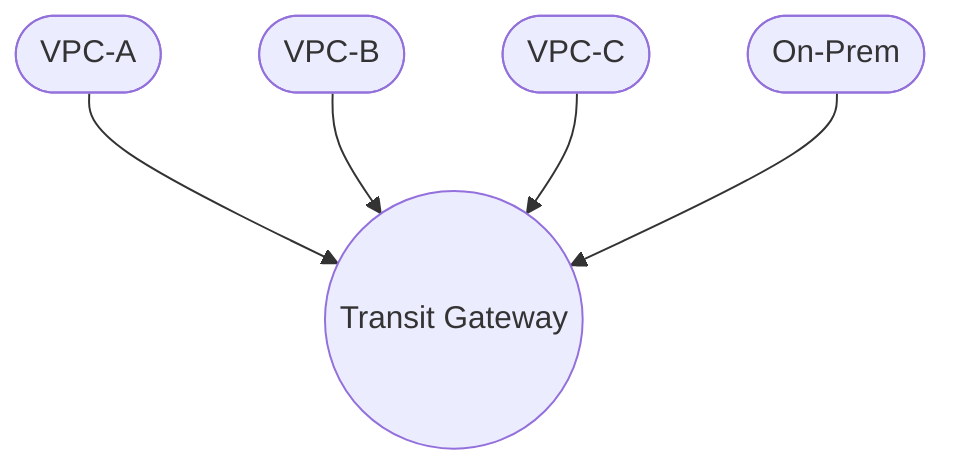
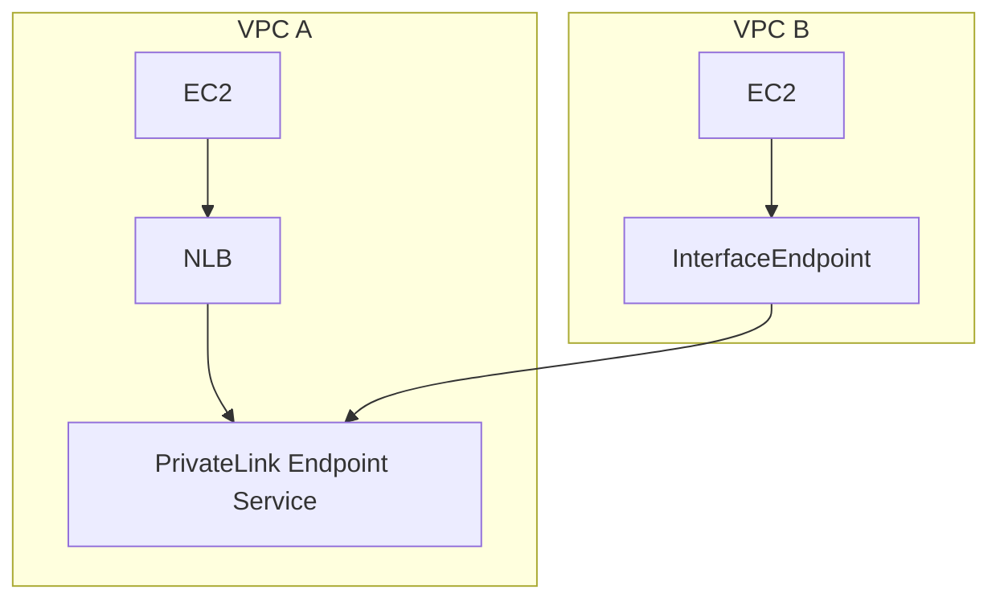

# AWS Transit Gateway (TGW)

## 1. TGW란?

* **Transit Gateway**: 여러 VPC, 온프레미스, VPN, Direct Connect를 연결하는 **AWS 네트워크 허브 서비스**
* **허브-스포크 구조**로 수많은 네트워크를 효율적으로 연결하고 라우팅 정책을 통합 관리할 수 있음

## 2. 구조 개념 (허브-스포크)

* TGW는 중앙 허브
* VPC, VPN, DX는 각각의 스포크처럼 TGW에 연결됨

## 3. 연결 대상

| 대상             | 설명                                 |
| -------------- | ---------------------------------- |
| VPC            | 동일 계정 또는 다른 계정, 다른 리전 모두 가능        |
| VPN            | 온프레미스 ↔ AWS 간 암호화 연결               |
| Direct Connect | DX Gateway 연계 가능                   |
| TGW Peering    | 리전 간 TGW 연결도 가능 (인터리전 TGW Peering) |

## 4. 구성 요소

* **Transit Gateway**: 중앙 라우팅 허브 역할
* **Attachment**: VPC/VPN과 TGW 간 연결 단위
* **TGW Route Table**: TGW 내부의 라우팅 제어 테이블 (Attachment별 라우팅 가능)

## 5. 실습 시나리오

* VPC A: `10.0.0.0/16` (Web)
* VPC B: `10.1.0.0/16` (App)
* Transit Gateway 연결

### 설정 흐름

1. TGW 생성
2. 각 VPC에 Attachment 생성
3. TGW 라우팅 테이블에 CIDR 경로 추가
4. 각 VPC 서브넷 라우팅 테이블에도 TGW 연결 경로 추가

## 6. 보안 및 라우팅 정책

* TGW Route Table로 트래픽 흐름을 제어
* App ↔ DB 허용 / Web ↔ DB 차단 등 정책적 통제 가능
* **SG, NACL** 외에도 **TGW Route Table 분리**하여 제어 가능

## 7. 요금

| 항목       | 과금              |
| -------- | --------------- |
| TGW 생성   | 시간 단위 과금        |
| 데이터 전송   | 아웃바운드 기준 GB당 과금 |
| 리전 간 피어링 | 별도 데이터 요금 부과    |

## 8. Best Practice

* 서브넷 1개만 TGW에 연결
* 라우팅 테이블을 목적에 따라 분리 (내부/외부/온프)
* CloudWatch Logs + Flow Logs로 모니터링
* RAM (Resource Access Manager)로 계정 간 공유

---

# AWS PrivateLink

## 1. 정의

* **PrivateLink**: **인터넷 없이 VPC 외부의 서비스에 안전하게 접근**할 수 있는 방식
* S3, SaaS, API 등 서비스를 **프라이빗 통신**으로 연결

## 2. 사용 시점

| 상황              | 설명                           |
| --------------- | ---------------------------- |
| SaaS 접근         | Snowflake, Datadog 등 안전하게 접근 |
| VPC 간 특정 서비스 연결 | 전체 피어링 없이 서비스만 공유            |
| AWS 서비스 접근      | Public 없이 S3, SSM 접근 등       |

## 3. 구성 요소

| 역할  | 리소스                | 설명                             |
| --- | ------------------ | ------------------------------ |
| 제공자 | Endpoint Service   | PrivateLink 서비스 등록 (NLB 뒤에 배포) |
| 소비자 | Interface Endpoint | 제공 서비스에 연결 (VPC 내부 ENI)        |

## 4. 아키텍처 예시

## 5. 보안 장점

* Public IP, IGW, NAT 없이 호출 가능
* SG + IAM 정책 + 접근 제한
* 라우팅 불필요, 특정 서비스만 노출 가능

## 6. FAQ

| 질문                | 답변                     |
| ----------------- | ---------------------- |
| HTTPS 서비스도 되나요?   | NLB는 TLS 패스스루 가능     |
| 리전 간 연결 되나요?      | ❌ 기본은 리전 내 전용          |
| VPC 피어링이 없어도 되나요? | 서비스 단위 연결이므로 피어링 불필요 |

---

# VPC Endpoint

## 1. 정의

* **VPC Endpoint**는 **AWS 서비스 또는 SaaS에 NAT/IGW 없이 직접 연결**할 수 있는 방식

## 2. 유형 비교

| 유형                 | 설명                                  |
| ------------------ | ----------------------------------- |
| Gateway Endpoint   | S3, DynamoDB 전용. 라우팅 테이블로 동작        |
| Interface Endpoint | PrivateLink 기반. ENI 생성 (TCP 서비스 지원) |

## 3. 실무 활용

* **S3 접근**: Gateway Endpoint → 퍼블릭 없이 저장소 접근
* **SSM, SNS, SQS, CloudWatch 등**: Interface Endpoint

## 실습 흐름 (예: SSM 연결)

1. VPC 내 EC2 생성 (퍼블릭 IP 없음)
2. Interface Endpoint 생성 (`ssm.region.amazonaws.com`)
3. 보안 그룹에서 TCP 443 허용
4. Session Manager 연결 → 성공

## 요금

| 유형                 | 요금                             |
| ------------------ | ------------------------------ |
| Gateway Endpoint   | 무료 (트래픽 요금만 발생)                |
| Interface Endpoint | \$0.01/시간 + \$0.01/GB (리전별 상이) |

---

# 비교 요약

| 항목        | Transit Gateway | PrivateLink | VPC Endpoint   |
| --------- | --------------- | ----------- | -------------- |
| 연결 범위     | 전체 네트워크         | 특정 서비스      | AWS 서비스 / SaaS |
| 라우팅 필요    | 필요               | 없음           | Gateway는 필요    |
| 퍼블릭 통신 여부 |  없음            |  없음        |  없음           |
| 보안 그룹 필요  | 없음 (VPC 단위)      | 필요 (ENI 있음)  | Interface만 필요  |
| 요금 구조     | 시간 + 트래픽        | 시간 + 트래픽    | 대부분 무료 or 저렴   |
| 사용 사례     | 대규모 네트워크 통합     | 서비스 단위 공유   | AWS 서비스 연결     |
