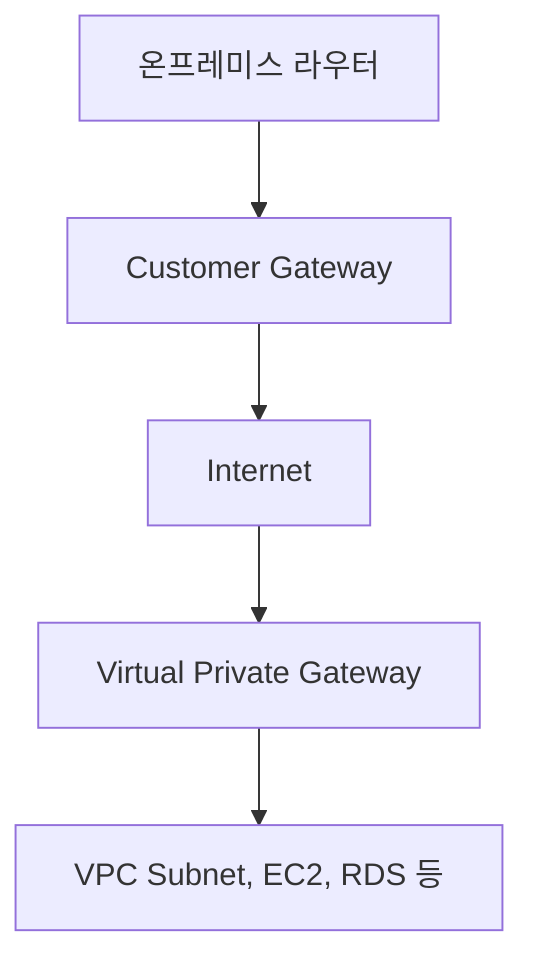

# 인터넷 게이트웨이(IGW)란?

## 정의

* **인터넷 게이트웨이(IGW)**: **VPC 내부 리소스와 외부 인터넷 간의 양방향 통신을 가능하게 하는 AWS 구성 요소**
* 퍼블릭 서브넷에 배치된 EC2 인스턴스가 **인터넷을 통해 데이터를 송수신하려면 IGW가 필수**

## 주요 역할

| 기능     | 설명                             |
| ------ | ------------------------------ |
| 아웃바운드  | EC2 → 인터넷 (예: 소프트웨어 설치)        |
| 인바운드   | 인터넷 → EC2 (예: SSH, HTTP 요청 수신) |
| NAT 지원 | NAT Gateway가 있는 퍼블릭 서브넷에도 필수   |

## 구성 방법

1. 인터넷 게이트웨이 생성

```bash
aws ec2 create-internet-gateway
```

2. VPC에 연결

```bash
aws ec2 attach-internet-gateway \
  --vpc-id vpc-xxxx \
  --internet-gateway-id igw-xxxx
```

3. 서브넷 라우팅 테이블 설정

```text
Destination: 0.0.0.0/0 → Target: igw-xxxxxxxx
```

## 퍼블릭 서브넷 조건

| 조건     | 설명                            |
| ------ | ----------------------------- |
| IGW 연결 | VPC에 IGW가 연결되어 있어야 함          |
| 퍼블릭 IP | EC2 인스턴스에 퍼블릭 IP 할당           |
| 라우팅    | `0.0.0.0/0 → igw` 설정 필수       |
| 보안 그룹  | 인바운드 포트 오픈 (22, 80, 443 등) 필요 |

## IGW가 없을 때 발생하는 문제

| 문제      | 원인                       |
| ------- | ------------------------ |
| 인터넷 안됨  | IGW가 attach 안 됨          |
| 통신 안됨   | 라우팅 테이블 경로 누락            |
| curl 안됨 | 보안 그룹 아웃바운드 차단 or DNS 누락 |

## 보안 구성 요소와의 관계

| 구성 요소   | 역할                       |
| ------- | ------------------------ |
| 보안 그룹   | EC2 수준에서 트래픽 제어 (상태 저장형) |
| NACL    | 서브넷 단위 접근 제어 (비상태형)      |
| 라우팅 테이블 | IGW로 트래픽 유도              |
| 퍼블릭 IP  | 외부에서 인스턴스 식별             |

## IGW vs NAT Gateway

| 항목        | IGW          | NAT Gateway     |
| --------- | ------------ | --------------- |
| 서브넷 대상    | 퍼블릭 서브넷      | 프라이빗 서브넷        |
| 통신 방향     | 인바운드 + 아웃바운드 | 아웃바운드 전용        |
| 퍼블릭 IP 필요 | EC2가 직접 가짐   | 필요 없음 (NAT가 보유) |
| 구성 위치     | 퍼블릭 서브넷      | 퍼블릭 서브넷         |
| 보안성       | 외부 노출 가능     | 내부망 보호 가능       |

## 실습: 퍼블릭 EC2가 인터넷에 접속하도록 구성

1. VPC 생성 (10.0.0.0/16)
2. 퍼블릭 서브넷 생성 (10.0.1.0/24)
3. 인터넷 게이트웨이 생성 및 attach
4. EC2 인스턴스 생성 + 퍼블릭 IP 할당
5. 서브넷 라우팅 테이블 설정
6. 보안 그룹: 인바운드 `22`, 아웃바운드 `0.0.0.0/0` 허용
7. `ssh`, `curl google.com` 성공 확인

---

# NACL (Network ACL)

## 정의

* **서브넷 단위에서 네트워크 트래픽을 허용 또는 차단하는 방화벽**
* **비상태형(Stateless)**이며, **인바운드와 아웃바운드를 각각 설정**해야 함

## 보안 그룹과 비교

| 항목       | 보안 그룹      | NACL           |
| -------- | ---------- | -------------- |
| 적용 대상    | 인스턴스 (ENI) | 서브넷            |
| 상태 저장 여부 | ✅          | ❌              |
| 룰 평가 방식  | 모든 룰 확인    | 번호순, 첫 일치 룰 적용 |
| 기본 동작    | 모든 트래픽 차단  | 모든 트래픽 허용      |

## NACL 구조 예시

```text
Rule # | Type | Protocol | Port Range | Source/Dest | Allow/Deny
--------------------------------------------------------------
100    | ALL  | ALL      | ALL        | 0.0.0.0/0    | ALLOW
110    | TCP  | 80       | 0.0.0.0/0  | ALLOW
120    | ALL  | ALL      | 0.0.0.0/0  | DENY
```

## 실습: 웹 서버 포트만 열기

* 인바운드: HTTP(80), SSH(22) ALLOW → 나머지 DENY
* 아웃바운드: ALL ALLOW

## 주의 사항

* **응답 트래픽도 명시적으로 허용 필요** (비상태형이기 때문)
* **보안 그룹과 병렬 적용** → 둘 다 허용해야 통신 가능

## 요약

| 항목   | 설명                       |
| ---- | ------------------------ |
| 정의   | 서브넷 수준에서 네트워크 제어하는 ACL   |
| 특징   | 비상태형, 룰 우선순위 있음          |
| 실무 팁 | deny 명시, Flow Logs로 모니터링 |

---

# AWS VPN

## 정의

* **AWS VPN**은 **온프레미스 네트워크와 AWS 간의 보안 터널**
* **IPSec 기반 암호화**로 퍼블릭 인터넷을 통해도 안전한 연결 보장

## 구성요소

| 구성 요소                   | 설명                       |
| ----------------------- | ------------------------ |
| Customer Gateway        | 온프레미스 라우터 또는 방화벽         |
| Virtual Private Gateway | AWS 측 VPN 수신 지점          |
| VPN Connection          | 암호화된 터널 연결 (이중 터널로 고가용성) |

## 구성 흐름도 (Mermaid)



## 실습 절차

1. Customer Gateway 생성 (공인 IP 필요)
2. Virtual Private Gateway 생성 및 VPC 연결
3. VPN Connection 생성 (CGW ↔ VGW)
4. 라우팅 테이블 설정 (VPC ↔ VGW)
5. 온프레미스 라우터에도 AWS CIDR 반영

## 보안 요소

* 암호화: AES-256, SHA-2 기반
* 모니터링: CloudWatch, VPN 로그
* BGP 또는 정적 라우팅 선택 가능

## 요금

| 항목               | 비용                |
| ---------------- | ----------------- |
| Site-to-Site VPN | 약 \$0.05/시간 + 전송료 |
| Client VPN       | 시간당 요금 + 사용자 수 기반 |

## 요약

| 항목    | 설명                         |
| ----- | -------------------------- |
| 정의    | 온프레미스 ↔ AWS 간 보안 터널 연결 서비스 |
| 보안    | 암호화 + 트래픽 통제               |
| 구성 요소 | CGW, VGW, VPN Connection   |
| 비교 대상 | Direct Connect, TGW        |
