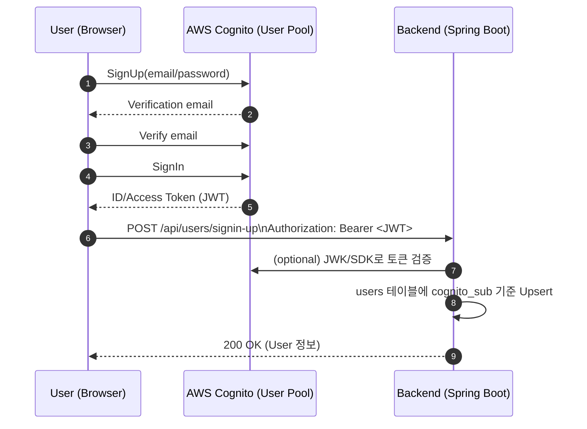
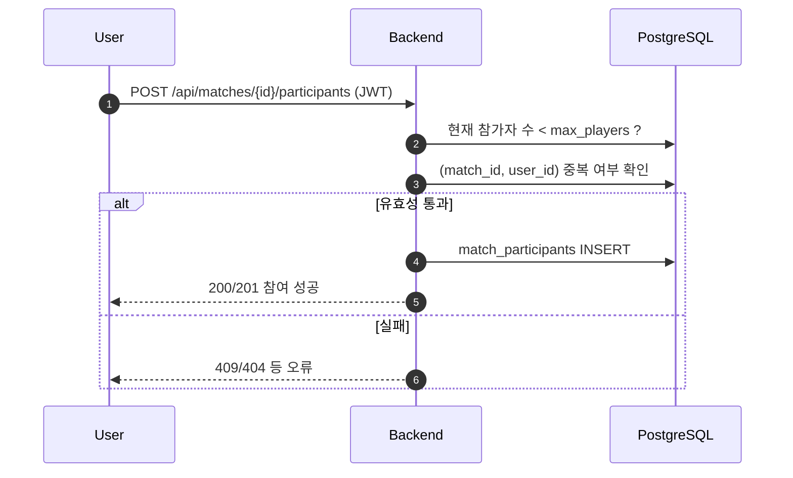
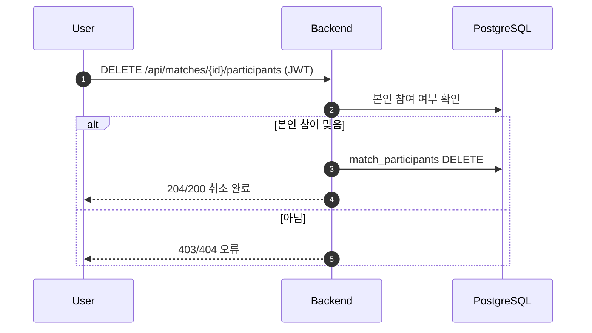
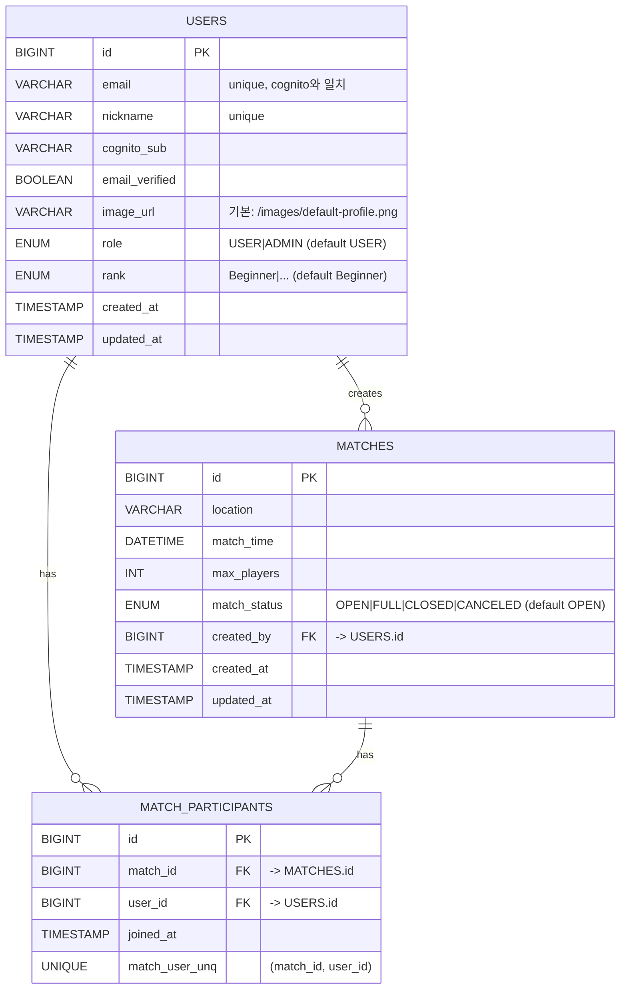

> **한눈에 보기**: 관리자가 경기를 개설하면 사용자가 참여/취소하는 **풋살 매칭 서비스**. AWS Cognito로 인증하고, Spring Boot + React + PostgreSQL 기반으로 구현했습니다.
> {: .prompt-info }

## 0. 메타 정보

* **프로젝트명**: Kickytime
* **프로젝트 기간**: 2025년 8월 01일 ~ 2025년 8월 17일
* **팀원**: 박민지(팀장), 하영현, 이혜민, 구태연, 임정우

---

## 1. 프로젝트 개요

### 1-1. 프로젝트 배경

> 많은 사람들이 풋살 경기에 참여하고 싶어하지만, 경기를 개설하거나 참여할 수 있는 플랫폼이 부족하다. 기존 오프라인/커뮤니티 중심 매칭은 번거롭고, 참여자 현황 관리도 어렵다.

**Kickytime**은 *“관리자가 개설한 경기 정보를 바탕으로 사용자들이 참여/취소할 수 있는 시스템”* 을 통해 **매칭 생성·참여·관리의 번거로움**을 줄이고, **실시간 참여 현황 파악**을 쉽게 합니다.

### 1-2. 프로젝트 목표

* 관리자 전용 **경기 개설/삭제** 기능 제공
* 일반 사용자 **경기 참여/취소** 기능 제공
* **인원 제한, 중복 참여 방지** 등 유효성 검증
* **AWS Cognito 기반 인증** 적용
* 향후 확장을 고려한 **모듈형 설계**


---

## 2. 주요 기능 (요약)

### 2-1. 사용자 기능

* 매칭 목록 확인(제목/시간/장소/정원/현재인원)
* 매칭 참여 신청(정원·중복 검사)
* 매칭 참여 취소(본인만 가능)
* 회원가입 시 이메일 필수 + **이메일 검증(Cognito)**
* 가입 시 프로필 사진 **기본 이미지** 설정

### 2-2. 관리자 기능

* 매칭 개설(시간·장소·정원 등 입력)
* 매칭 삭제(참여자 정보 포함 일괄 삭제)

---

## 3. 핵심 로직 플로우 (요약 다이어그램)

### 3-1. 회원가입 & 로그인 (Cognito)



### 3-2. 매칭 참여



### 3-3. 매칭 취소



---

## 4. 아키텍처 & 설계

### 4-1. 전체 아키텍처(개요)

{: .w-75 }
_두 AZ, ECS/EC2 App 서버 혼용, RDS, NAT×2, TGW, SSM 구조_


### 4-2. 데이터 모델(ERD)



#### 테이블 설명(요약)

* **USERS**: Cognito 최초 로그인 시 `cognito_sub` 기준으로 **upsert**. `password`는 MVP에선 사용하지 않을 수 있음(null 허용).
* **MATCHES**: 관리자만 생성/삭제. 상태 값으로 운영 정책 반영(예: 정원 도달 시 `FULL`).
* **MATCH_PARTICIPANTS**: `(match_id, user_id)` **UNIQUE**로 중복 참여 방지.

### 4-3. 핵심 API 요약(발췌)

| 구분      | 메서드    | 경로                                                | 설명            | 권한    |
| ------- | ------ | ------------------------------------------------- | ------------- | ----- |
| 사용자     | POST   | `/api/users/signin-up`                            | 최초 로그인 Upsert | USER  |
| 사용자     | GET    | `/api/users/me`                                   | 내 프로필 조회      | USER  |
| 경기      | GET    | `/api/matches`                                    | 경기 목록 조회      | USER  |
| 경기      | POST   | `/api/matches`                                    | 경기 개설         | USER  |
| 경기      | GET    | `/api/matches/me`                                 | 내가 참여한 경기     | USER  |
| 경기      | POST   | `/api/matches/{matchId}/participants`             | 경기 참여         | USER  |
| 경기      | DELETE | `/api/matches/{matchId}/participants`             | 참여 취소         | USER  |
| 경기(관리)  | DELETE | `/api/matches/{matchId}`                          | 경기 삭제         | ADMIN |
| 사용자(관리) | POST   | `/api/admin/users/backfill-cognito?confirm=false` | Cognito 백필    | ADMIN |

> 응답 코드 권장: 생성 **201**, 취소/삭제 **204**, 중복/정원초과 **409**, 인증/권한 문제 **401/403**.
> {: .prompt-tip }

---

## 부록 A. 상세 스키마 표 (원문 발췌)

### `users`

| 컬럼명             | 타입          | 설명                                              |
| --------------- | ----------- | ----------------------------------------------- |
| id              | BIGINT (PK) | 사용자 ID                                          |
| email           | VARCHAR     | 로그인 ID 이메일(고유), Cognito와 일치                     |
| nickname        | VARCHAR     | 별칭, 화면 표시용(고유, 중복 x)                            |
| cognito_sub    | VARCHAR     | Cognito 사용자 고유 식별자(sub)                         |
| email_verified | BOOLEAN     | 이메일 검증 여부                                       |
| password        | VARCHAR     | 비밀번호 (향후 로컬 로그인 확장 시; Cognito만 쓰면 null)         |
| role            | ENUM        | USER / ADMIN (기본값: USER)                        |
| image_url      | VARCHAR     | 프로필 사진 경로, 기본값 예: `/images/default-profile.png` |
| rank            | ENUM        | Beginner 등(기본값: Beginner)                       |
| created_at     | TIMESTAMP   | 가입일자                                            |
| updated_at     | TIMESTAMP   | 수정일자                                            |

> MVP 단계에서는 Cognito 로그인을 사용하므로 `password`는 사용하지 않거나 null 허용으로 둡니다.
> {: .prompt-info }

### `matches`

| 컬럼명           | 타입          | 설명                                       |
| ------------- | ----------- | ---------------------------------------- |
| id            | BIGINT (PK) | 매칭 ID                                    |
| location      | VARCHAR     | 장소                                       |
| match_time   | DATETIME    | 경기 시간                                    |
| max_players  | INT         | 최대 인원 수                                  |
| match_status | ENUM        | OPEN, FULL, CLOSED, CANCELED (기본값: OPEN) |
| created_by   | BIGINT (FK) | 관리자 ID (users 참조)                        |
| created_at   | TIMESTAMP   | 개설일시                                     |
| updated_at   | TIMESTAMP   | 수정일시                                     |

### `match_participants`

| 컬럼명                         | 타입          | 설명                 |
| --------------------------- | ----------- | ------------------ |
| id                          | BIGINT (PK) | 참여 ID              |
| match_id                   | BIGINT (FK) | 매칭 ID (matches 참조) |
| user_id                    | BIGINT (FK) | 사용자 ID (users 참조)  |
| joined_at                  | TIMESTAMP   | 참여 일시              |
| UNIQUE(match_id, user_id) | 제약          | 중복 참여 방지           |

---

## 부록 B. 예시 cURL (발췌)

```bash
# 로그인/업서트
curl -X POST http://localhost:8080/api/users/signin-up \
  -H "Authorization: Bearer <ACCESS_TOKEN>"

# 경기 목록
curl -X GET http://localhost:8080/api/matches \
  -H "Authorization: Bearer <ACCESS_TOKEN>"

# 경기 참여
curl -X POST http://localhost:8080/api/matches/10/participants \
  -H "Authorization: Bearer <ACCESS_TOKEN>"

# 참여 취소
curl -X DELETE http://localhost:8080/api/matches/10/participants \
  -H "Authorization: Bearer <ACCESS_TOKEN>"
```
