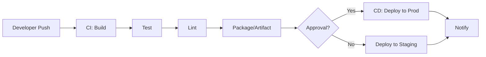

> 이 글은 CI/CD의 핵심 개념과 이유, 파이프라인의 일반 흐름을 정리하고, **Build/Deploy의 정확한 의미**와 **언어별 빌드 차이(Java·Python·Node)**, 그리고 **AWS CodePipeline·GitHub Actions·Jenkins**의 특징과 예제를 한 번에 정리한 가이드입니다.

---

# 1. CI/CD란?

## CI (Continuous Integration) — 지속적 통합

* 개발자가 코드 변경 사항을 **자주(main 브랜치 등)** 통합
* 변경사항마다 **자동 테스트와 빌드 수행**
* **버그 조기 발견**, 협업 효율 증가

## CD (Continuous Delivery/Deployment)

* **Continuous Delivery**: 스테이징 또는 운영 직전까지 자동 배포
* **Continuous Deployment**: 운영까지 **완전 자동 배포**
* 목표: 빠르고 안정적인 **릴리즈 자동화**

---

# 2. 왜 CI/CD가 필요한가?

| 문제 상황         | CI/CD로 해결 가능   |
| ------------- | -------------- |
| 수동 배포 → 실수 발생 | 자동 배포로 오류 최소화  |
| 긴 QA 주기       | 푸시마다 테스트 자동화   |
| 협업 중 충돌       | 통합 테스트로 사전 탐지  |
| 릴리즈 일정 지연     | 지속적 릴리즈로 안정 확보 |

> 💡 **핵심**: 코드가 바뀔 때마다 동일한 절차로 자동 검증·배포되어야 품질을 일정하게 유지할 수 있습니다.

---

# 2. 기본 흐름 이해 (Pipeline)

## 일반적인 CI/CD 흐름

```
Git Push → Build → Test → Lint → Package → Deploy → Notify
```

### 주요 단계 설명

| 단계         | 설명                     |
| ---------- | ---------------------- |
| **Build**  | 코드 컴파일, 종속성 설치         |
| **Test**   | 유닛, 통합, E2E 테스트        |
| **Lint**   | 코드 스타일 검사              |
| **Deploy** | 스테이징 또는 운영 배포          |
| **Notify** | Slack, Email 등으로 결과 알림 |

### 파이프라인 다이어그램 (Mermaid)



---

# 4. 대표적인 도구 소개

| 카테고리   | 도구                                                     | 설명                   |
| ------ | ------------------------------------------------------ | -------------------- |
| Git 기반 | **GitHub Actions**, GitLab CI                          | 코드 저장소에 내장된 워크플로우    |
| 독립형    | **Jenkins**, CircleCI, Travis CI                       | 강력한 커스터마이징, 다양한 플러그인 |
| 클라우드   | **AWS CodePipeline**, Azure DevOps, Google Cloud Build | 클라우드 서비스 연동에 최적화     |

> 선택 기준: **환경(온프렘 vs 클라우드)**, **권한/거버넌스**, **비용 모델**, **팀의 숙련도**.

---

# 5. Build란?

**Build**는 소스 코드를 실행 가능한 상태로 변환하는 과정입니다.

CI/CD 파이프라인에서 `Build 단계`는 다음을 포함할 수 있습니다:

* 코드 컴파일 (ex. Java → .class)
* 의존성 다운로드/설치
* 정적 분석 도구 실행
* 바이너리 또는 배포용 아티팩트 생성
* 패키징 (JAR, Wheel, zip 등)

> ⚠️ 빌드는 언어/플랫폼에 따라 달라집니다. **컴파일 언어(Java)**와 **인터프리터 언어(Python)**는 접근 방식이 다릅니다.

## Java Build 방식

### 주요 도구

* **Maven**, **Gradle**

### Build 작업 흐름

1. `src/`의 `.java` → `javac`로 컴파일 → `.class` 생성
2. 종속성(라이브러리) 다운로드
3. `.class`를 **JAR/WAR**로 패키징

### Maven 예시

```bash
# Maven 프로젝트 빌드
mvn clean install
```

* `target/` 폴더에 `.jar` 생성
* 테스트 수행 포함 (`mvn test`)

### Gradle 예시

```bash
# Gradle 빌드
./gradlew build
```

* 결과물은 `build/libs/`에 `.jar`

## Python Build 방식

### 일반적으로 "Build"의 의미

1. **의존성 설치** (requirements.txt, poetry 등)
2. **패키징**: 라이브러리/실행 파일 배포용 묶기
3. **(선택) pyinstaller/zipapp** 으로 바이너리 생성

### Build 도구

* **setuptools** / **poetry**
* **pyinstaller** (standalone binary 제작)

### setuptools 예시

```bash
# 패키징 및 빌드
python setup.py sdist bdist_wheel
```

* `dist/`에 `.whl`, `.tar.gz` 생성

### pyinstaller 예시

```bash
pyinstaller main.py
```

* 실행 가능한 `.exe` 또는 ELF 생성

> ⚠️ Python은 인터프리터 언어지만, **배포 시점**에는 빌드 개념이 적용됩니다.

## Node.js Build 방식

### Build의 의미

* **의존성 설치 (npm ci, yarn install)**
* **Transpile** (TypeScript → JavaScript)
* **Bundle** (Webpack, Rollup, Vite)
* **Minify** (코드 축소)
* **환경변수 주입 / 정적 자원 빌드**

### 예시 스크립트 (React/Vite)

```bash
npm ci         # 의존성 설치
npm run build  # build 스크립트 실행
```

* 결과물: `dist/` 또는 `build/`의 정적 파일 (HTML/CSS/JS)

### 빌드 툴

* Webpack, Vite, Parcel, Babel(ES6+/TS 변환)

## 요약 비교

| 항목    | Java           | Python                          | Node.js                 |
| ----- | -------------- | ------------------------------- | ----------------------- |
| 빌드 도구 | Maven, Gradle  | setuptools, poetry, pyinstaller | npm, yarn, Webpack/Vite |
| 결과물   | `.jar`, `.war` | `.whl`, `.tar.gz`, `.exe`       | `dist/` 정적 파일           |
| 목적    | 컴파일 + 패키징      | 패키징/바이너리                        | 트랜스파일 + 번들              |
| 실행    | JVM            | 인터프리터/바이너리                      | Node 런타임/정적 배포          |

---

# 6. 컴파일 vs 인터프리트 이해

## 컴파일(Compile)

* **정의**: 소스 코드를 한 번에 번역하여 **기계어 실행 파일** 생성
* **장점**: 빠른 실행, 컴파일러 최적화 가능
* **단점**: 컴파일 시간 필요, 수정 시 재컴파일
* **대표 언어**: C, C++, Go, Rust, Swift, (JVM 타깃 시 Kotlin/Java)

## 인터프리트(Interpret)

* **정의**: 소스를 **한 줄씩 해석하며 즉시 실행**
* **장점**: 빠른 테스트/디버깅, 개발 민첩성
* **단점**: 실행 속도 느릴 수 있음, 런타임 에러 노출
* **대표 언어**: Python, JavaScript, Ruby, PHP, Bash, R

## 비교 요약

| 항목      | 컴파일 방식    | 인터프리터 방식    |
| ------- | --------- | ----------- |
| 실행 전 처리 | 전체 코드 컴파일 | 한 줄씩 해석     |
| 실행 속도   | 빠름        | 상대적으로 느림    |
| 에러 발견   | 컴파일 시점    | 실행 도중       |
| 결과물     | 실행 파일 생성  | 별도 실행 파일 없음 |

---

# 7. Deploy(배포) 제대로 이해하기

배포(Deploy)는 **개발된 애플리케이션(코드, 설정, 리소스 등)을 실제 실행 환경에 반영**하는 과정입니다. 개발 → 빌드 → 테스트 **이후의 마지막 단계**이며, 사용자가 실질적으로 결과물을 접하게 되는 중요한 절차입니다.

## 배포란?

> 배포 = 코드를 실행 환경에 전달하여 동작 가능하게 만드는 일련의 과정

포함 작업 예:

* 애플리케이션 코드/아티팩트 전달
* 구성 파일 복사 및 환경 변수/시크릿 적용
* 데이터베이스 마이그레이션
* 프로세스 시작/재시작, 헬스체크, 로드밸런서 연결 업데이트
* 모니터링/로그 연동, 알림

## 배포 유형

| 방식               | 설명                   |
| ---------------- | -------------------- |
| **수동 배포**        | 서버 접속, 파일 업로드 후 실행   |
| **자동 배포(CI/CD)** | 코드 변경 시 빌드·테스트·배포 자동 |
| **블루/그린**        | 두 버전 병행 운영 → 트래픽 전환  |
| **롤링**           | 서버를 순차적으로 교체         |
| **카나리**          | 일부 사용자에게만 점진 적용      |
| **무중단**          | 서비스 중단 없이 배포         |

## 배포 대상 예시

| 대상           | 설명                      |
| ------------ | ----------------------- |
| **웹 서버**     | EC2, Nginx+Node 등       |
| **클라우드 함수**  | AWS Lambda              |
| **컨테이너 플랫폼** | ECS, EKS/Kubernetes     |
| **정적 호스팅**   | S3 + CloudFront         |
| **모바일 앱**    | App Store/Play Store 등록 |

## GitHub Actions → EC2 간단 예시

```yaml
- name: Deploy to EC2
  run: |
    ssh -i $KEY $USER@$HOST "
      cd /home/ubuntu/app &&
      git pull &&
      npm install &&
      pm2 restart app
    "
```

## 배포 시 고려 사항

* **환경 구분**: dev/staging/prod
* **시크릿 관리**: `.env`, GitHub Secrets, SSM Parameter Store
* **헬스체크/모니터링**: 배포 후 안정성 검증
* **롤백 전략**: 실패 시 신속히 이전 버전으로 복귀

---

# 8. AWS CodePipeline 한눈에 보기

**AWS CodePipeline**은 **완전관리형 CI/CD** 서비스로, 소스 변경 시 자동으로 **빌드 → 테스트 → 배포** 단계를 오케스트레이션합니다.

## 구성 요소

| 구성 요소          | 설명                                            |
| -------------- | --------------------------------------------- |
| **Stage**      | 파이프라인의 단계 (Source, Build, Deploy 등)           |
| **Action**     | 각 단계에서 수행할 작업 (Git Pull, CodeBuild, ECS 배포 등) |
| **Artifact**   | 단계 간 전달되는 산출물 (zip, 이미지 등)                    |
| **Transition** | 단계 간 흐름/승인 제어                                 |

## 기본 흐름

```
[Source] → [Build] → [Test] → [Deploy]
```

### 예시 Stage 구성

| Stage  | Action                  |
| ------ | ----------------------- |
| Source | GitHub에서 소스 가져오기        |
| Build  | CodeBuild로 빌드 및 아티팩트 생성 |
| Test   | (선택) 단위/통합 테스트          |
| Deploy | S3/EC2/ECS/Lambda 배포    |

> CodeDeploy와 연동 시 **블루/그린**, **롤백**, **수동 승인** 등 엔터프라이즈 기능을 쉽게 적용할 수 있습니다.

## 보안/권한

* IAM 역할로 각 서비스에 최소 권한 부여
* GitHub/CodeCommit 인증 토큰 관리

## CloudFormation 스니펫 (예시)

```yaml
Resources:
  MyPipeline:
    Type: AWS::CodePipeline::Pipeline
    Properties:
      Name: MyAppPipeline
      RoleArn: arn:aws:iam::111122223333:role/CodePipelineServiceRole
      ArtifactStore:
        Type: S3
        Location: my-pipeline-artifacts
      Stages:
        - Name: Source
          Actions:
            - Name: SourceAction
              ActionTypeId:
                Category: Source
                Owner: ThirdParty
                Provider: GitHub
                Version: 1
              OutputArtifacts:
                - Name: SourceOutput
              Configuration:
                Owner: my-org
                Repo: my-repo
                Branch: main
                OAuthToken: <GitHubToken>
```

---

# 9. GitHub Actions 핵심 정리

> GitHub 저장소에 직접 연동되는 **이벤트 기반 워크플로 자동화** 플랫폼.

## 구성요소

* **Workflow**: `.github/workflows/*.yml`
* **Event**: `push`, `pull_request`, `schedule`, `release` 등
* **Job**: 병렬/직렬 실행 단위
* **Step**: `run`(쉘) 또는 `uses`(액션)
* **Action**: 재사용 가능한 빌딩 블록

## 샘플 워크플로 (Gradle + 테스트 + 아티팩트)

```yaml
name: CI (Gradle)

on:
  push:
    branches: [ main ]
  pull_request:
    branches: [ main ]

jobs:
  build:
    runs-on: ubuntu-latest
    steps:
      - uses: actions/checkout@v4
      - uses: actions/setup-java@v4
        with:
          distribution: temurin
          java-version: 17
      - name: Build & Test
        run: ./gradlew clean build --scan --stacktrace
      - name: Upload JAR
        uses: actions/upload-artifact@v4
        with:
          name: app-jar
          path: build/libs/*.jar
```

---

# 10. Jenkins 빠르게 파악하기

## 주요 특징

1. **플러그인 아키텍처** — 수백 개 플러그인으로 Maven/Gradle, Git, Docker, Kubernetes, AWS 등과 통합

2. **Pipeline as Code** — `Jenkinsfile`로 빌드/테스트/배포 정의

```groovy
pipeline {
  agent any
  stages {
    stage('Build') { steps { sh 'make build' } }
    stage('Test')  { steps { sh 'make test' } }
    stage('Deploy'){ steps { sh 'make deploy' } }
  }
}
```

3. **분산 빌드** — Master/Agent 구조로 무거운 빌드를 수평 확장

## 사용 예

* Push 감지 → 빌드 → 테스트 → 성공 시 배포
* Docker 이미지 빌드·푸시(ECR)
* iOS/Android 앱 빌드 자동화

---

# 11. 도구 비교 한 장 요약

| 항목    | AWS CodePipeline  | GitHub Actions        | Jenkins           |
| ----- | ----------------- | --------------------- | ----------------- |
| 운영 방식 | 완전관리형(AWS)        | GitHub 호스티드           | 자체 호스팅/매니지드 모두    |
| 강점    | AWS 통합/배포 오케스트레이션 | 코드 기반, Marketplace 풍부 | 무한 커스터마이즈, 온프렘 강함 |
| 러닝커브  | 콘솔+IAM 이해 필요      | YAML 중심 쉬움            | 관리/플러그인 운영 난이도    |
| 적합도   | AWS 네이티브 배포       | GitHub 중심 팀           | 온프렘/복잡한 파이프라인     |

---

# 12. 실전 템플릿 모음

## (A) Spring Boot (Gradle) — CI + 테스트 + JAR 아티팩트

```yaml
name: spring-ci
on: { push: { branches: [main] }, pull_request: { branches: [main] } }
jobs:
  build:
    runs-on: ubuntu-latest
    steps:
      - uses: actions/checkout@v4
      - uses: actions/setup-java@v4
        with: { distribution: temurin, java-version: 17 }
      - run: ./gradlew clean build -x test
      - run: ./gradlew test
      - uses: actions/upload-artifact@v4
        with: { name: app-jar, path: build/libs/*.jar }
```

## (B) React(Vite) — Lint + Build + 정적 산출물 업로드

```yaml
name: fe-ci
on: { push: { branches: [main] }, pull_request: { branches: [main] } }
jobs:
  build:
    runs-on: ubuntu-latest
    steps:
      - uses: actions/checkout@v4
      - uses: actions/setup-node@v4
        with: { node-version: 22 }
      - run: npm ci
      - run: npm run lint --if-present
      - run: npm run build
      - uses: actions/upload-artifact@v4
        with: { name: fe-dist, path: dist/** }
```

## (C) Python 패키지 — Build + Wheel 산출

```yaml
name: py-ci
on: { push: { branches: [main] } }
jobs:
  build:
    runs-on: ubuntu-latest
    steps:
      - uses: actions/checkout@v4
      - uses: actions/setup-python@v5
        with: { python-version: '3.12' }
      - run: pip install --upgrade pip build
      - run: python -m build
      - uses: actions/upload-artifact@v4
        with: { name: dist, path: dist/** }
```

---

# 13. 실무 체크리스트 & 팁

* [ ] **브랜치 전략**: `main`(배포) / `develop`(통합) / `feature/*`(단위 작업)
* [ ] **필수 검사**: Lint, Unit Test, Vulnerability Scan(Dependabot/Trivy)
* [ ] **아티팩트 표준화**: 버전명·커밋 SHA 포함 (`app-1.2.3+abc123.jar`)
* [ ] **환경 분리**: dev/stage/prod 별 Workload·Secret·DB 분리
* [ ] **롤백 계획**: 이전 아티팩트/이미지 태그 보존 + 헬스체크
* [ ] **가시성**: Slack/Email Notify, 대시보드(파이프라인 상태)
* [ ] **보안**: 최소권한 IAM, 시크릿 로테이션, 서명된 아티팩트

> **문제 발생 시**: 로그(빌드/테스트/배포) → 헬스체크 응답 → 환경 변수/시크릿 → 권한(IAM/토큰) 순으로 확인하세요.

---

# 14. 마무리

* CI/CD는 **일관된 자동 검증과 배포**로 품질과 속도를 동시에 확보합니다.
* Build/Deploy의 의미를 정확히 이해하면, 언어·플랫폼에 상관없이 **안정적인 파이프라인**을 설계할 수 있습니다.
* 팀의 환경에 따라 **CodePipeline / GitHub Actions / Jenkins**를 적절히 선택·조합하세요.

```bash
# 예) Spring Boot 로컬 실행 스니펫
./gradlew clean build
java -jar build/libs/*.jar
```
