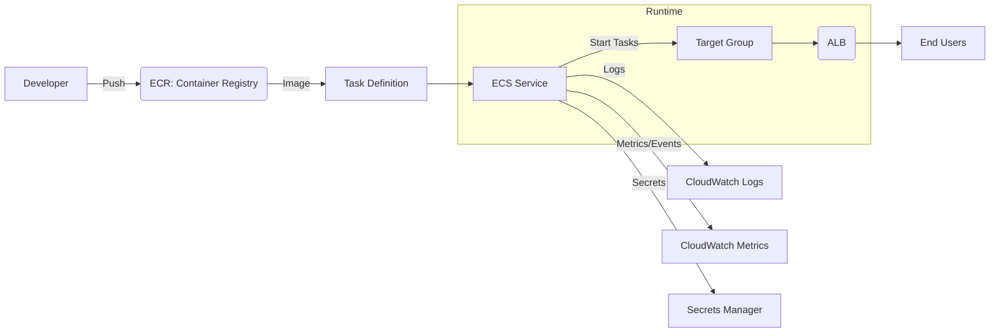
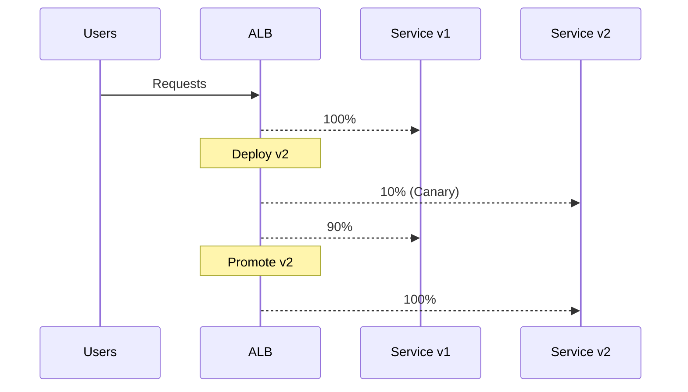

# ECS란?

**ECS(Amazon Elastic Container Service)**는 **Docker 컨테이너를 관리·배포·운영**하기 위한 **완전관리형 오케스트레이션 서비스**입니다. 사용자는 컨트롤 플레인(스케줄러·상태관리)을 직접 운영하지 않고, **태스크(Task)**와 **서비스(Service)** 단위로 애플리케이션을 정의·확장·배포할 수 있습니다.

* **런타임 옵션**: **Fargate(서버리스)** 또는 **EC2(셀프 매니지드 호스트)**
* **통합성**: ECR, ALB/NLB, CloudWatch Logs/Metrics, IAM, Secrets Manager, Parameter Store 등과 긴밀 연동

---

# ECS의 핵심 개념

## 1) **클러스터 (Cluster)**

* 컨테이너를 실행할 수 있는 **논리적 그룹**
* Fargate/EC2 어느 쪽이든 한 클러스터 안에서 운영 가능(권장: 용도별 분리)

## 2) **태스크 정의 (Task Definition)**

* 컨테이너 실행을 위한 **청사진(템플릿)**
* Docker 이미지, vCPU/메모리, 포트, 환경 변수, 로깅, 볼륨, 헬스체크 등을 선언
* 실행 시점에는 **Task Execution Role**(이미지 pull·로그 전송)과 **Task Role**(앱 런타임 권한) 구분이 중요

## 3) **태스크 (Task)**

* 태스크 정의를 바탕으로 생성되는 **실행 인스턴스**(컨테이너 집합)
* 배치/크론성 작업은 **RunTask**로 일시 실행 가능

## 4) **서비스 (Service)**

* 지정한 **Desired Count**를 항시 유지하는 컨트롤러
* **롤링/블루그린 배포**, **Auto Healing**, **오토스케일링**(Service Auto Scaling) 지원
* ALB/NLB와 연동해 트래픽 분산

## 5) **런타임 옵션: Fargate vs EC2**

| 옵션          | 설명                                        |
| ----------- | ----------------------------------------- |
| **Fargate** | 서버리스. 인프라(호스트) 관리 없이 컨테이너 단위 실행           |
| **EC2**     | 사용자가 직접 EC2 인스턴스(AMI·패치·커널) 관리 후 클러스터에 등록 |

---

# ECS 작동 흐름 한눈에 보기

1. **컨테이너 이미지 준비**: ECR 또는 Docker Hub에 Push
2. **Task Definition 작성**: 이미지·리소스·포트·환경 변수·로그 설정
3. **Service 생성**: 런타임(Fargate/EC2), 네트워크, 로드밸런서 연동 설정
4. **배포 전략 선택**: 롤링/블루그린(코드디플로이) 등
5. **운영**: 오토스케일링, 모니터링, 로깅, 롤백

## 아키텍처 다이어그램 (Mermaid)



---

# 기본 구성 예시

## Task Definition (요약 예시)

```json
{
  "family": "myapp-task",
  "networkMode": "awsvpc",
  "requiresCompatibilities": ["FARGATE"],
  "cpu": "256",
  "memory": "512",
  "executionRoleArn": "arn:aws:iam::111122223333:role/ecsTaskExecutionRole",
  "taskRoleArn": "arn:aws:iam::111122223333:role/myappTaskRole",
  "containerDefinitions": [
    {
      "name": "web",
      "image": "111122223333.dkr.ecr.ap-northeast-2.amazonaws.com/myapp:web-1.0.0",
      "portMappings": [{ "containerPort": 80, "protocol": "tcp" }],
      "essential": true,
      "environment": [
        {"name": "SPRING_PROFILES_ACTIVE", "value": "prod"}
      ],
      "secrets": [
        {"name": "DB_PASSWORD", "valueFrom": "arn:aws:secretsmanager:ap-northeast-2:111122223333:secret:myapp/db-pass"}
      ],
      "logConfiguration": {
        "logDriver": "awslogs",
        "options": {
          "awslogs-group": "/ecs/myapp",
          "awslogs-region": "ap-northeast-2",
          "awslogs-stream-prefix": "web"
        }
      },
      "healthCheck": {
        "command": ["CMD-SHELL", "curl -fsS http://localhost/actuator/health || exit 1"],
        "interval": 30,
        "timeout": 5,
        "retries": 3,
        "startPeriod": 60
      }
    }
  ]
}
```

## Fargate 단발성 실행 (RunTask)

```bash
aws ecs run-task \
  --launch-type FARGATE \
  --cluster my-cluster \
  --task-definition myapp-task:3 \
  --network-configuration "awsvpcConfiguration={subnets=[subnet-aaa,subnet-bbb],securityGroups=[sg-xxx],assignPublicIp=DISABLED}"
```

## Fargate 서비스 생성 (예시)

```bash
aws ecs create-service \
  --cluster my-cluster \
  --service-name myapp-svc \
  --task-definition myapp-task:3 \
  --desired-count 2 \
  --launch-type FARGATE \
  --network-configuration "awsvpcConfiguration={subnets=[subnet-aaa,subnet-bbb],securityGroups=[sg-xxx],assignPublicIp=DISABLED}" \
  --load-balancers "targetGroupArn=arn:aws:elasticloadbalancing:ap-northeast-2:111122223333:targetgroup/myapp-tg/abc,containerName=web,containerPort=80" \
  --health-check-grace-period-seconds 120
```

> 💡 **핵심 설정 포인트**
>
> * `executionRoleArn` vs `taskRoleArn` 역할 구분
> * `awsvpc` 네트워킹 + 전용 **ENI** 생성, 보안그룹·서브넷 필수
> * 헬스체크 **startPeriod**로 초기 워밍업 고려, ALB **Health Check**와 합쳐 충분한 유예시간 권장

---

# ALB 연동 & 헬스체크 팁

* **ALB Target Group**: HTTP(80) 또는 HTTPS(443), 경로 기반 라우팅 가능
* **ALB Health Check**: 경로 `/actuator/health` 등으로 설정, **Healthy Threshold/Interval** 조절
* ECS 컨테이너 헬스체크(내부)와 ALB 헬스체크(외부) **둘 다** 성공해야 안정적
* 배포 시 `--health-check-grace-period-seconds`로 초기 부팅 지연 대응

---

# 배포 전략

* **롤링 배포**: 기본. 신규 태스크를 점진적으로 올리고 구버전 내려감
* **블루/그린(Blue/Green)**: **CodeDeploy**와 연동해 트래픽 스위치·자동 롤백
* **Canary(퍼센트 전환)**: 가중치 라우팅(복수 Target Group)으로 점진 전환



---

# 오토스케일링 (Service Auto Scaling)

* **Target Tracking**: 평균 CPU 50% 등 목표치 유지
* **Step Scaling**: 임계값 기반 단계적 증가/감소
* **Scheduled Scaling**: 시간대별 패턴 대응

> 권장: **CPU/Memory** + **ALB RequestCountPerTarget** 조합으로 과적합 방지

---

# 보안·권한·시크릿

* **IAM 최소권한 원칙**: Execution Role(이미지 Pull, 로그)과 Task Role(런타임 API 접근) 분리
* **시크릿 관리**: Secrets Manager/Parameter Store를 `secrets`로 주입
* **이미지 고정**: `:latest` 대신 **태그+다이제스트**(예: `web@sha256:...`)
* **VPC 보안그룹**: ALB→ECS(80/443), ECS→DB(5432 등) 최소 개방
* **Egress 통제**: 아웃바운드 필요 도메인만 허용(VPC 엔드포인트로 KMS/ECR/Logs 사설 통신)

---

# 운영 팁 & 모니터링

* **로그**: CloudWatch Logs 그룹 분리(`/ecs/<svc>`), 수명주기(Lifecycle) 정책
* **메트릭**: CPU/Memory, ALB 5xx/Target SurgeQueue, `ServiceDesired/Running` 추적
* **디플로이 옵션**: `force-new-deployment`로 태스크 재시작
* **디버깅**: `aws ecs execute-command`(SSM)로 컨테이너 쉘 접속
* **비용**: Fargate는 vCPU/Memory 과금, EC2는 인스턴스·스팟·RI로 최적화

---

# Fargate 자세히 보기

## 정의

**AWS Fargate**는 서버를 직접 프로비저닝하지 않고 **컨테이너를 서버리스로 실행**하기 위한 런타임 엔진입니다. **ECS** 또는 **EKS**의 실행 기반으로 사용됩니다.

## 핵심 특징

| 항목        | 설명                                 |
| --------- | ---------------------------------- |
| 서버리스 컨테이너 | EC2 인스턴스 관리 없음 (패치/커널/스케일링 자동)     |
| 과금        | vCPU·메모리 초 단위 과금                   |
| 확장성       | Desired Count/Auto Scaling으로 간편 확장 |
| 네트워킹      | 태스크당 고유 ENI, 보안그룹/서브넷 지정           |
| 연동        | ECS/EKS, CloudWatch, IAM, ALB/NLB  |

## 아키텍처 개념도

```
[Task Definition] --(ECS)--> [Fargate] --(ENI/VPC)--> [ALB/NLB] -- Users
                                 |--> CloudWatch Logs
                                 |--> IAM/Secrets
```

## 사용 흐름 (ECS 기준)

```
1) ECR에 이미지 Push → 2) Task Definition 등록 → 3) Service 생성(Fargate) → 4) Auto Scaling/ALB 설정 → 5) 로그/메트릭 관찰
```

## 장점/제약 요약

| 구분    | Fargate 장점         | Fargate 제약               |
| ----- | ------------------ | ------------------------ |
| 운영    | 서버 관리 불필요          | 커널/에이전트 제어 불가            |
| 비용    | 세분화 과금(작은 워크로드 유리) | 대규모 트래픽 시 EC2 대비 비쌀 수 있음 |
| 네트워크  | 태스크별 ENI로 격리 우수    | 고정 EIP 직접 지정 불가          |
| 특수 HW | -                  | GPU, EBS 직접 연결 등 제약      |

---

# ECS Fargate vs ECS EC2 비교

| 항목        | ECS Fargate      | ECS EC2                 |
| --------- | ---------------- | ----------------------- |
| 인프라 관리    | 불필요(완전관리)        | 필요(AMI/패치/ASG)          |
| 서버 접근     | 불가(호스트 접근 없음)    | 가능(SSH, 에이전트 설치)        |
| 과금        | vCPU/Memory 사용량  | 인스턴스 단위(온디맨드/스팟/RI)     |
| 스케일링      | 태스크 단위 간단        | 태스크+EC2 용량 동시 관리        |
| 특수 환경     | 제한적              | GPU/고성능/커널 튜닝 가능        |
| IP 제어     | 동적 IP            | EIP 가능                  |
| 시작 속도     | 빠름               | 상대적으로 느림                |
| 모니터링 에이전트 | 제한               | 자유(Datadog/FluentBit 등) |
| 초기 셋업     | 단순               | 상대적으로 복잡                |
| 비용 절감     | Savings Plans 일부 | 스팟/RI 등 다양              |

---

# 선택 가이드

| 상황                    | 추천        |
| --------------------- | --------- |
| 빠르게 시작·운영단 최소화        |  Fargate |
| GPU/고성능·세부 제어·비용 최적화  |  EC2     |
| DevOps 자동화/고정 인프라 불필요 |  Fargate |
| 기존 EC2/온프렘 연계·맞춤 모니터링 |  EC2     |
| 적은 수의 태스크·이벤트성 배치     |  Fargate |
| 수백 태스크 상시 운영·스팟 절감    |  EC2     |

---

# 체크리스트

* [ ] **이미지 태그 전략**: `:latest` 지양, 버전+커밋 SHA/다이제스트 고정
* [ ] **헬스체크**: 애플리케이션 준비 시간에 맞게 `startPeriod`/ALB 설정
* [ ] **시크릿 주입**: Secrets Manager/Parameter Store + KMS
* [ ] **권한 분리**: Task Execution Role ↔ Task Role 최소권한
* [ ] **오토스케일링**: Target Tracking + RequestCountPerTarget
* [ ] **관찰성**: Logs/metrics/alarms 대시보드화, 배포 알림(이벤트브릿지·SNS)
* [ ] **네트워크**: 프라이빗 서브넷 + VPC 엔드포인트(ECR/KMS/Logs)
* [ ] **배포 전략**: 롤백 버튼(이전 리비전), 블루/그린 준비

---

# 트러블슈팅 빠른 가이드

* **컨테이너가 반복 재시작**: 헬스체크 경로/포트 확인 → `startPeriod` 확대 → 앱 로그 확인
* **서비스가 UNHEALTHY**: ALB Health Check 설정(경로/간격/타임아웃) + 보안그룹 인바운드 확인
* **이미지 Pull 실패**: Execution Role에 ECR 권한, VPC 엔드포인트(ECR/Logs) 여부
* **DB 연결 실패**: 보안그룹(출/입), 서브넷 라우팅(NAT/Endpoint), 시크릿 주입 값 확인
* **배포 지연/중단**: 용량 부족(EC2 용량/서브넷 IP), 서비스 배포 파라미터(최소/최대 비율) 조정

---

# 마무리

ECS는 **운영 복잡도를 줄이면서 컨테이너 워크로드를 안정적으로 배포**할 수 있는 선택지입니다.

* **간단·민첩**이 목표라면 **Fargate**,
* **세부 제어/비용 최적화·특수 요구**가 있다면 **EC2**가 적합합니다.

