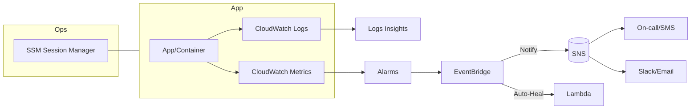

> 이 글은 AWS 관측성(Observability)의 3요소 **Metrics·Logs·Traces** 중 CloudWatch가 담당하는 **Metrics/Logs**와, 운영 자동화를 위한 **Alarms·EventBridge·SNS**, 무에이전트 원격접속을 지원하는 **SSM Agent**까지 정리한 글입니다. (예시는 서울 리전 `ap-northeast-2` 기준)

---

# CloudWatch 핵심 개념

| 구성 요소                 | 설명                                                              |
| --------------------- | --------------------------------------------------------------- |
| **Metric (지표)**       | 리소스에서 수집된 수치 데이터 (예: CPU 사용률, 메모리, 네트워크 등)                      |
| **Log (로그)**          | 애플리케이션, Lambda, VPC Flow Logs, API Gateway 등에서 수집되는 텍스트/JSON 로그 |
| **Dashboard**         | 커스텀 시각화 도구 — 여러 메트릭을 한눈에 모니터링                                   |
| **Alarm (경보)**        | 특정 조건 충족 시 경보 생성 → 알림 또는 자동 조치 (예: Auto Scaling)                |
| **Insights**          | 로그를 쿼리 기반으로 분석 (CloudWatch Logs Insights)                       |
| **Event (이벤트)**       | 리소스 상태 변화, 스케줄 등을 감지해 대응 (EventBridge/CloudWatch Events)        |
| **Anomaly Detection** | 머신러닝 기반 비정상 패턴 감지로 오탐 줄이기                                       |

> 💡 **Tip**: 메트릭은 정량, 로그는 정성. **메트릭으로 감지하고, 로그로 원인 파악**하는 흐름을 표준으로 만드세요.

---

# 주요 기능

## 1) 지표 수집 및 시각화 (Metrics)

* **EC2, RDS, S3, Lambda, ALB, ECS** 등 대부분의 서비스와 통합
* 기본 지표 외 **Custom Metrics**(애플리케이션 지표) 전송 가능
* 집계(Avg/Max/Min/Sum), 기간(1분/5분/10초 등) 설정
* **Metric Math**로 지표 간 연산 (예: `5xxRate = Sum(HTTP5xx)/Sum(RequestCount)`)

## 2) 로그 수집 및 분석 (Logs)

* 소스: EC2(CloudWatch Agent), Lambda, ECS/EKS, API Gateway, VPC Flow Logs 등
* **Log Group / Log Stream** 계층 구조, **보존기간(Retention)** 설정 필수
* 필터 패턴, 구독 필터(실시간 파이프라인), 지표 필터(로그→메트릭 변환)

## 3) 로그 인사이트 (CloudWatch Logs Insights)

SQL 유사 문법으로 대규모 로그를 빠르게 쿼리/집계/시각화합니다.

```sql
-- 최근 20건
fields @timestamp, @message
| sort @timestamp desc
| limit 20
```

```sql
-- ERROR 키워드 포함 로그 50건
fields @timestamp, @message
| filter @message like /ERROR/
| sort @timestamp desc
| limit 50
```

```sql
-- 1시간 단위 이벤트 수
stats count(*) as cnt by bin(1h)
```

```sql
-- JSON 로그에서 statusCode별 카운트
parse @message /\"statusCode\":(?<status>\d+)/
| stats count(*) as c by status
| sort c desc
```

```sql
-- p95 지연시간 (ms)
fields latency
| filter ispresent(latency)
| stats pct(latency,95) as p95, avg(latency) as avg by bin(5m)
```

> **구조적(JSON) 로깅**을 권장합니다. 파싱 없이 `fields status, path, latency`처럼 즉시 분석 가능.

## 4) 경보 설정 (Alarms)

* 예: CPUUtilization > 80% **5분 연속** → `ALARM`
* 액션: **SNS 알림**, **Auto Scaling**, **EC2 재부팅**, **Systems Manager Automation** 등
* **Composite Alarm**으로 다중 조건 결합, **Anomaly Detection**으로 비정상 패턴 자동 추적

## 5) 대시보드 (Dashboard)

* 여러 서비스 지표를 한 화면에 시각화 (라인/스택/게이지/수치/텍스트 등)
* 대시보드 JSON(Infra as Code)로 내보내기/버전 관리 권장

## 6) 이벤트 대응 (EventBridge)

* 일정/상태 변화/서비스 이벤트 → **Lambda/SQS/SNS/Step Functions** 트리거
* 예: `ECS Service Deployment State Change` → 슬랙 알림

---

# 대시보드 만들기

## 방법 ① 콘솔

1. **CloudWatch → Dashboards → \[Create dashboard]**
2. 이름 예: `Prod-Monitoring`
3. 위젯(Line/Number/Gauge/Stacked Area/Text 등) 선택 → **Configure**에서 메트릭 지정

## 방법 ② JSON(IaC)

대시보드를 코드로 관리하면 재현/복구가 쉬워집니다.

```json
{
  "widgets": [
    {
      "type": "metric",
      "width": 12,
      "height": 6,
      "properties": {
        "metrics": [
          [ "AWS/EC2", "CPUUtilization", "InstanceId", "i-0123456789abcdef0" ]
        ],
        "stat": "Average",
        "period": 60,
        "title": "EC2 CPU Avg (1m)"
      }
    }
  ]
}
```

```bash
# 적용 (대시보드 이름: Prod-Monitoring)
aws cloudwatch put-dashboard \
  --dashboard-name Prod-Monitoring \
  --dashboard-body file://dashboard.json
```

### 위젯 추천 예시

| 목적            | 위젯 설정                                                           |
| ------------- | --------------------------------------------------------------- |
| **EC2 CPU**   | Line → `AWS/EC2` → `CPUUtilization`(Per-Instance)               |
| **Lambda 오류** | Number → `AWS/Lambda` → `Errors`                                |
| **RDS 연결 수**  | Gauge → `AWS/RDS` → `DatabaseConnections`                       |
| **ECS 요청 수**  | Stacked Area → `AWS/ApplicationELB` → `RequestCount`(Target 기준) |

---

# 알람(Alarm) — 만들고, 연결하고, 자동화하기

## 1) 기본 알람 (CLI)

```bash
aws cloudwatch put-metric-alarm \
  --alarm-name ec2-high-cpu \
  --metric-name CPUUtilization \
  --namespace AWS/EC2 \
  --statistic Average \
  --period 60 \
  --threshold 80 \
  --comparison-operator GreaterThanThreshold \
  --evaluation-periods 5 \
  --dimensions Name=InstanceId,Value=i-0123456789abcdef0 \
  --alarm-actions arn:aws:sns:ap-northeast-2:111122223333:ops-alerts
```

## 2) 이상탐지(Anomaly Detection) 알람

```bash
aws cloudwatch put-anomaly-detector \
  --metric-name RequestCount \
  --namespace AWS/ApplicationELB \
  --statistic Sum \
  --dimensions Name=LoadBalancer,Value=app/my-alb/abc

aws cloudwatch put-metric-alarm \
  --alarm-name alb-req-anomaly \
  --comparison-operator GreaterThanUpperThreshold \
  --threshold-metric-id ad1 \
  --evaluation-periods 3 \
  --metrics '[
    {"Id":"m1","MetricStat":{"Metric":{"Namespace":"AWS/ApplicationELB","MetricName":"RequestCount","Dimensions":[{"Name":"LoadBalancer","Value":"app/my-alb/abc"}]},"Period":60,"Stat":"Sum"}},
    {"Id":"ad1","Expression":"ANOMALY_DETECTION_BAND(m1, 2)","Label":"anomaly-band","ReturnData":true}
  ]' \
  --alarm-actions arn:aws:sns:ap-northeast-2:111122223333:ops-alerts
```

## 3) 합성(Composite) 알람 예시

* 조건: **CPU>80%** **AND** **5xxRate>1%** 일 때만 알림
* 개별 알람 2개를 만들고, Composite 알람에서 `ALARM(ALARM1) AND ALARM(ALARM2)` 표현식 사용

---

# EventBridge — 알람과 이벤트를 자동화로 연결

```json
{
  "source": ["aws.cloudwatch"],
  "detail-type": ["CloudWatch Alarm State Change"],
  "detail": {
    "state": { "value": ["ALARM"] },
    "alarmName": ["ec2-high-cpu"]
  }
}
```

이 규칙으로 **Lambda, SNS, SQS, ChatOps(슬랙 웹훅)** 등을 호출해 **자동 롤백/치료** 또는 **풍부한 알림**을 구현합니다.

```bash
aws events put-rule \
  --name on-alarm-ec2-cpu \
  --event-pattern file://rule.json

aws events put-targets \
  --rule on-alarm-ec2-cpu \
  --targets 'TargetId'='notify',"Arn"='arn:aws:sns:ap-northeast-2:111122223333:ops-alerts'
```

---

# Logs Insights — 현업에서 바로 쓰는 쿼리 모음

## 1) 에러 비율(분 단위)

```sql
fields @timestamp, @message
| parse @message /\"status\":(?<status>\d+)/
| stats sum(if(status >= 500, 1, 0)) as e, count(*) as t by bin(1m)
| display (e*100.0/t) as error_rate
```

## 2) 가장 느린 엔드포인트 Top 10

```sql
fields path, latency
| filter ispresent(path) and ispresent(latency)
| stats pct(latency,95) as p95 by path
| sort p95 desc
| limit 10
```

## 3) ECS JSON 로그 파싱 예시

```sql
fields @timestamp, @message
| parse @message /\"level\":\"(?<level>\w+)\",\"msg\":\"(?<msg>.*?)\",\"traceId\":\"(?<trace>.*?)\"/
| filter level in ["ERROR","WARN"]
| sort @timestamp desc
| limit 50
```

> ⚠️ **비용 주의**: Logs Insights는 **스캔한 바이트** 기준 과금. **시간 범위 축소 + 구체적 필터 + 필요한 필드만** 출력하세요.

---

# CloudWatch Agent — OS 메트릭/로그 수집

EC2에 CloudWatch Agent를 설치하면 메모리/디스크 등 **OS 레벨 메트릭**과 **애플리케이션 로그**를 보낼 수 있습니다.

`/opt/aws/amazon-cloudwatch-agent/bin/config.json` 예시:

```json
{
  "metrics": {
    "append_dimensions": { "InstanceId": "${aws:InstanceId}" },
    "aggregation_dimensions": [["InstanceId"]],
    "metrics_collected": {
      "mem": { "measurement": ["mem_used_percent"], "metrics_collection_interval": 60 },
      "disk": { "measurement": ["used_percent"], "resources": ["*"], "metrics_collection_interval": 60 }
    }
  },
  "logs": {
    "logs_collected": {
      "files": {
        "collect_list": [
          {"file_path": "/var/log/messages", "log_group_name": "/ec2/messages", "log_stream_name": "{instance_id}"}
        ]
      }
    }
  }
}
```

적용:

```bash
sudo /opt/aws/amazon-cloudwatch-agent/bin/amazon-cloudwatch-agent-ctl \
  -a fetch-config -m ec2 -c file:/opt/aws/amazon-cloudwatch-agent/bin/config.json -s
```

---

# SSM Agent — SSH 없이도 운영하는 법

## 1) SSM Agent란?

EC2와 **AWS Systems Manager** 간 통신을 담당하는 소프트웨어.

* **Run Command**(원격 명령), **Session Manager**(브라우저/CLI 셸), **Patch/Inventory**, **자동화** 등을 지원합니다.

## 2) Amazon Linux 2023 — 설치/확인

```bash
# 상태 확인
systemctl status amazon-ssm-agent

# 설치
sudo dnf install -y amazon-ssm-agent

# 부팅 자동시작 + 즉시 시작
sudo systemctl enable amazon-ssm-agent
sudo systemctl start amazon-ssm-agent
```

## 3) IAM Role

* EC2 인스턴스 프로파일에 **`AmazonSSMManagedInstanceCore`** 필수
* CloudWatch Agent 연동 시 **`CloudWatchAgentServerPolicy`** 추가

역할 적용 후 문제 시:

```bash
sudo systemctl restart amazon-ssm-agent
```

## 4) (선택) 프라이빗 전용 구성

인터넷 없이 사용하려면 **VPC 엔드포인트(Interface)**를 생성하세요:

* `com.amazonaws.ap-northeast-2.ssm`
* `com.amazonaws.ap-northeast-2.ec2messages`
* `com.amazonaws.ap-northeast-2.ssmmessages`
* (CloudWatch/Logs/KMS도 필요 시 추가)

> 세션 로그는 **S3/CloudWatch Logs**로 아카이빙(SSM 설정)하면 추적성이 좋아집니다.

---

# SNS — 알람과 사람/시스템을 잇는 허브

## 주요 개념

* **Topic**: 메시지 발행/구독의 논리 채널
* **Pub/Sub**: Publisher가 Topic에 게시 → 모든 Subscriber가 수신
* **구독자 유형**: Email, SMS, HTTP(S), **SQS**, **Lambda**, 모바일 푸시 등
* **필터 정책**: 메시지 속성으로 구독자별 선별 수신
* **암호화**: KMS 기반 at-rest 암호화, HTTPS/TLS in-transit
* **FIFO Topic**(정확히 한 번, 순서 보장) 지원

## 사용 예 — 주문 처리/운영 알림

* Topic: `ops-alerts`
* 구독자: Slack Webhook Lambda, on-call SMS, SQS(후속 처리)
* CloudWatch Alarm/EventBridge → **SNS Publish**로 연결

## CLI 빠른 시작

```bash
# 토픽 생성
aws sns create-topic --name ops-alerts

# 이메일 구독
aws sns subscribe \
  --topic-arn arn:aws:sns:ap-northeast-2:111122223333:ops-alerts \
  --protocol email --notification-endpoint you@example.com

# 발행
aws sns publish \
  --topic-arn arn:aws:sns:ap-northeast-2:111122223333:ops-alerts \
  --message '{"service":"api","severity":"CRITICAL","msg":"5xx spike"}' \
  --message-attributes '{"severity":{"DataType":"String","StringValue":"CRITICAL"}}'
```

## Java 예시 (SDK v2)

```groovy
// build.gradle
implementation 'software.amazon.awssdk:sns:2.25.4'
```

```java
import software.amazon.awssdk.auth.credentials.DefaultCredentialsProvider;
import software.amazon.awssdk.regions.Region;
import software.amazon.awssdk.services.sns.SnsClient;
import software.amazon.awssdk.services.sns.model.PublishRequest;
import software.amazon.awssdk.services.sns.model.PublishResponse;

public class SnsPushExample {
  public static void main(String[] args) {
    SnsClient sns = SnsClient.builder()
        .region(Region.AP_NORTHEAST_2)
        .credentialsProvider(DefaultCredentialsProvider.create())
        .build();

    String topicArn = "arn:aws:sns:ap-northeast-2:111122223333:ops-alerts";
    String messageJson = "{\n  \"default\": \"기본 메시지\",\n  \"GCM\": \"{ \\\"notification\\\": { \\\"title\\\": \\\"알림 제목\\\", \\\"body\\\": \\\"알림 내용\\\" } }\"\n}";

    PublishRequest req = PublishRequest.builder()
        .messageStructure("json")
        .message(messageJson)
        .topicArn(topicArn)
        .build();

    PublishResponse res = sns.publish(req);
    System.out.println("메시지 전송: " + res.messageId());
  }
}
```

> 팁: **토픽 정책(Topic Policy)**으로 발행/구독 주체 제한, **구독 필터 정책**으로 알림 과다를 줄이세요.

---

# 요금 개요 & 최적화 팁

| 항목           | 과금 포인트              | 절감 팁                                          |
| ------------ | ------------------- | --------------------------------------------- |
| **Metrics**  | 사용자 지정 메트릭 수/보존     | 불필요 지표 제거, 집계 주기 1→5분 완화                      |
| **Logs**     | 수집/저장/아카이브/조회(인사이트) | 보존기간 단축, 아카이브(S3 Glacier), JSON 압축, 파티션 기반 쿼리 |
| **Alarms**   | 알람 개수/주기            | Composite/Anomaly로 오탐 감소, 중복 알림 억제            |
| **Insights** | 스캔 바이트              | 시간 창 축소, 구체적 필터/필드 제한                         |
| **SNS**      | 전송량/대상(SMS 비쌈)      | 이메일/Slack 우선, SMS는 임계치↑/온콜 전용                 |

---

# 체크리스트

* [ ] 대시보드 JSON을 **Git에 버전 관리** (IaC)
* [ ] **Anomaly Detection**과 **Composite Alarm**으로 알림 품질 개선
* [ ] 애플리케이션 **구조적(JSON) 로깅** 채택 → Logs Insights 생산성 ↑
* [ ] CloudWatch Agent로 **메모리/디스크** 메트릭 추가 수집
* [ ] **SSM Session Manager** 기본 접속 경로로 표준화(SSH 금지)
* [ ] EventBridge로 **알람→자동 치료/티켓팅** 연결
* [ ] 보존기간·압축·아카이브로 **로그 비용 최적화**

---

# 전체 흐름도 (Mermaid)



---

# 마무리

CloudWatch·SSM·SNS·EventBridge를 묶으면 **감지(Detect) → 진단(Diagnose) → 알림(Notify) → 조치(Remedy)**의 루프를 만들 수 있습니다.
