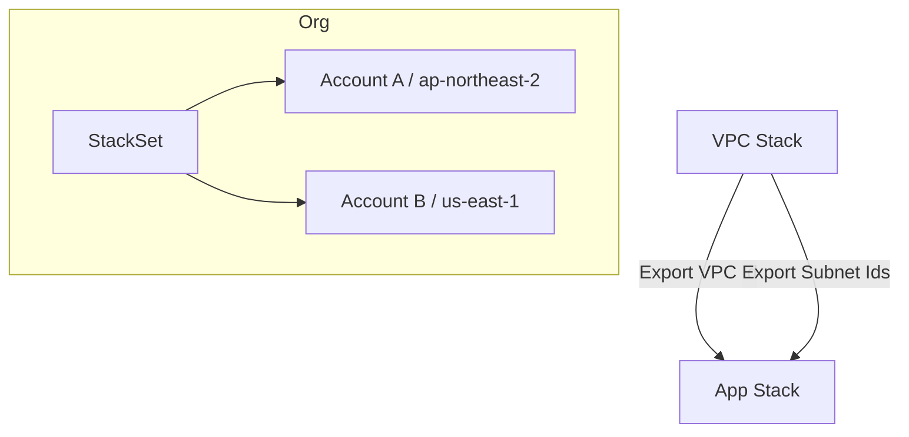

# CloudFormation 한 줄 정의

**CloudFormation**은 AWS 인프라를 **YAML/JSON 템플릿으로 선언**하고, **반복 가능하게 생성/변경/삭제**하는 **Infrastructure as Code(IaC)** 서비스입니다. 콘솔 수동 작업을 코드로 치환하여 **재현성, 추적성, 자동 롤백**을 확보합니다.

---

# 언제, 왜 쓰나?

* **인프라 자동화**: 버튼/스크립트 한 번으로 동일한 인프라를 생성
* **재현 가능한 배포**: `dev/stage/prod` 환경을 동일 템플릿으로 일관되게 구성
* **버전 관리**: Git으로 템플릿 변경 이력 추적, 코드 리뷰 가능
* **안정성**: 변경 전 **Change Set** 미리보기, 오류 시 **자동 롤백**
* **의존성 관리**: VPC→서브넷→보안그룹→EC2 순서 등 **생성/삭제 순서를 자동 계산**

---

# 핵심 구성요소 & 용어

| 용어                                        | 의미                        |
| ----------------------------------------- | ------------------------- |
| **Template**                              | 리소스 정의 파일(YAML/JSON)      |
| **Stack**                                 | 템플릿 실행으로 만들어진 **리소스 집합**  |
| **Change Set**                            | 업데이트 전에 **무엇이 바뀌는지 미리보기** |
| **StackSet**                              | 여러 **계정/리전**에 동시에 배포      |
| **Nested Stack**                          | 템플릿을 쪼개 **모듈화/재사용**       |
| **Parameters/Outputs**                    | 외부 입력/스택 간 값 전달           |
| **Exports/Imports**                       | 스택 간 교차 참조(예: VPC ID 공유)  |
| **Drift Detection**                       | 콘솔 등 **수동 변경**을 탐지        |
| **Stack Policy / Termination Protection** | 실수/삭제로부터 리소스 보호           |

---

# 템플릿 구조 빠르게 보기

```yaml
AWSTemplateFormatVersion: '2010-09-09'
Description: VPC + S3 예시
Parameters:              # (선택) 사용자 입력값 정의
  Env:
    Type: String
    Default: dev
    AllowedValues: [dev, stage, prod]
Mappings:                # (선택) 리전·환경별 값 매핑
  RegionMap:
    ap-northeast-2:
      Ami: ami-008e20914908f5345
Conditions:              # (선택) 조건부 생성
  IsProd: !Equals [!Ref Env, prod]
Resources:               # (필수) 생성할 리소스
  MyBucket:
    Type: AWS::S3::Bucket
    Properties:
      BucketName: !Sub "minji-${Env}-${AWS::Region}-${AWS::AccountId}"
      BucketEncryption:
        ServerSideEncryptionConfiguration:
          - ServerSideEncryptionByDefault: { SSEAlgorithm: AES256 }
      PublicAccessBlockConfiguration:
        BlockPublicAcls: true
        BlockPublicPolicy: true
        IgnorePublicAcls: true
        RestrictPublicBuckets: true
      Tags:
        - Key: Project
          Value: Kickytime
Outputs:                 # (선택) 결과값 출력
  BucketName:
    Value: !Ref MyBucket
    Export: { Name: !Sub "${AWS::StackName}:BucketName" }
```

---

# Intrinsic Functions(내장 함수) 치트시트

| 함수                 | 설명               | 예시                                              |
| ------------------ | ---------------- | ----------------------------------------------- |
| `!Ref`             | 파라미터/리소스 값 참조    | `!Ref MyBucket`                                 |
| `!Sub`             | 문자열 치환           | `!Sub "${Env}-${AWS::Region}"`                  |
| `!GetAtt`          | 리소스 속성 접근        | `!GetAtt MyALB.DNSName`                         |
| `!Join`            | 문자열 결합           | `!Join ['-', ['a','b','c']]`                    |
| `!FindInMap`       | Mappings 조회      | `!FindInMap [RegionMap, !Ref AWS::Region, Ami]` |
| `!If`/`!Equals`    | 조건               | `!If [IsProd, 3, 1]`                            |
| `!ImportValue`     | 다른 스택의 Export 참조 | `!ImportValue vpc:Id`                           |
| `!Select`/`!Split` | 목록/문자열 처리        | `!Select [0, !GetAZs '']`                       |
| `!Cidr`            | CIDR 블록 생성       | `!Cidr [10.0.0.0/16, 2, 8]`                     |

> **Tip**: `AWS::AccountId`, `AWS::Region`, `AWS::Partition` 등 **Pseudo Parameters**를 적극 활용하면 템플릿을 범용화할 수 있습니다.

---

# 사용 흐름(콘솔·CLI 공통)

1. **템플릿 작성/검증**

```bash
aws cloudformation validate-template \
  --template-body file://main.yaml
```

2. **스택 생성**

```bash
aws cloudformation create-stack \
  --stack-name app-dev \
  --template-body file://main.yaml \
  --parameters ParameterKey=Env,ParameterValue=dev \
  --capabilities CAPABILITY_NAMED_IAM
```

3. **업데이트 전 미리보기(Change Set)**

```bash
aws cloudformation create-change-set \
  --stack-name app-dev \
  --change-set-name plan-2025-08-31 \
  --template-body file://main.yaml
aws cloudformation describe-change-set --stack-name app-dev --change-set-name plan-2025-08-31
aws cloudformation execute-change-set --stack-name app-dev --change-set-name plan-2025-08-31
```

4. **삭제**

```bash
aws cloudformation delete-stack --stack-name app-dev
```

---

# 안전한 업데이트와 데이터 보호

* **Change Set**으로 영향도 미리 확인(특히 `Replacement: True` 여부)
* **DeletionPolicy/UpdateReplacePolicy**로 데이터 보존

  * `Retain` / `Snapshot` / `Delete`
  * 예) RDS, S3, EFS에 `DeletionPolicy: Snapshot|Retain` 권장
* **Rollback Triggers**: 업데이트 중 임계 알람(ALARM) 발생 시 자동 롤백
* **Stack Policy**: 특정 리소스 업데이트 금지(실수 방지)
* **Termination Protection**: 스택 삭제 차단

예시 — 스냅샷 보존:

```yaml
Resources:
  MyDB:
    Type: AWS::RDS::DBInstance
    DeletionPolicy: Snapshot
    UpdateReplacePolicy: Snapshot
    Properties: { DBInstanceClass: db.t3.micro, Engine: postgres }
```

---

# 운영을 편하게 하는 기능들

* **Drift Detection**: 콘솔/CLI 수동 변경을 탐지해 코드-실체 불일치 해결
* **Resource Import**: 기존 리소스를 스택으로 "가져오기"
* **Exports/Imports**: 네트워크 등 공용 자원을 베이스 스택에서 제공
* **Nested Stack**: 팀/도메인별 모듈로 분리해 재사용
* **StackSet**: 멀티 계정/리전에 조직 표준을 일괄 배포

Mermaid로 본 구조:



---

# 보안·규정·거버넌스 팁

* **IAM 최소권한**: 스택 실행 역할에 필요한 권한만 부여, `CAPABILITY_NAMED_IAM` 명시
* **KMS**: S3 버킷, RDS, EBS 등 **암호화 기본값** 적용
* **S3 템플릿 보관**: 템플릿은 전용 버킷에 저장(버전관리·서버사이드 암호화)
* **TLS 강제**: 버킷 정책으로 `aws:SecureTransport = true` 강제
* **Parameter Types**: `AWS::SSM::Parameter::Value<String>`로 시크릿/설정 주입(민감정보는 Secrets Manager 권장)

예시 — TLS 강제 버킷 정책:

```yaml
Resources:
  SecureBucket:
    Type: AWS::S3::Bucket
    Properties:
      PublicAccessBlockConfiguration:
        BlockPublicAcls: true
        BlockPublicPolicy: true
        IgnorePublicAcls: true
        RestrictPublicBuckets: true
  SecureBucketPolicy:
    Type: AWS::S3::BucketPolicy
    Properties:
      Bucket: !Ref SecureBucket
      PolicyDocument:
        Version: '2012-10-17'
        Statement:
          - Sid: EnforceTLS
            Effect: Deny
            Principal: '*'
            Action: 's3:*'
            Resource:
              - !Sub '${SecureBucket.Arn}/*'
              - !GetAtt SecureBucket.Arn
            Condition:
              Bool:
                aws:SecureTransport: false
```

---

# CI/CD 연동(코드로 배포)

* **S3 + CloudFormation Deploy**: 템플릿/아티팩트를 S3에 올리고 `aws cloudformation deploy` 사용
* **CodePipeline**: 소스(깃)→빌드(CodeBuild)→**CloudFormation 액션**으로 스택 생성/업데이트
* **`cloudformation package`**: 템플릿 내 로컬 경로(예: Lambda zip)를 S3로 업로드 후 템플릿 변환

```bash
aws cloudformation package \
  --template-file template.yaml \
  --s3-bucket minji-artifacts \
  --output-template-file packaged.yaml

aws cloudformation deploy \
  --template-file packaged.yaml \
  --stack-name app-prod \
  --capabilities CAPABILITY_NAMED_IAM
```

> 서버리스라면 `Transform: AWS::Serverless-2016-10-31`(SAM)로 간결한 정의가 가능하며, 배포 시 CloudFormation으로 **자동 변환**됩니다.

---

# 예제 모음

## (A) EC2 + 보안그룹 + KeyName 파라미터

```yaml
Parameters:
  KeyName:
    Type: AWS::EC2::KeyPair::KeyName
  InstanceType:
    Type: String
    Default: t3.micro
Resources:
  SG:
    Type: AWS::EC2::SecurityGroup
    Properties:
      GroupDescription: Allow SSH
      SecurityGroupIngress:
        - IpProtocol: tcp
          FromPort: 22
          ToPort: 22
          CidrIp: 0.0.0.0/0
  EC2:
    Type: AWS::EC2::Instance
    Properties:
      ImageId: ami-008e20914908f5345
      InstanceType: !Ref InstanceType
      KeyName: !Ref KeyName
      SecurityGroupIds: [!Ref SG]
      Tags:
        - Key: Name
          Value: !Sub "${AWS::StackName}-instance"
```

## (B) ALB TargetGroup + 헬스체크(요약)

```yaml
Resources:
  TG:
    Type: AWS::ElasticLoadBalancingV2::TargetGroup
    Properties:
      VpcId: !ImportValue vpc:Id
      Port: 80
      Protocol: HTTP
      HealthCheckPath: /actuator/health
      TargetType: ip
```

## (C) 서버리스 함수(SAM Transform 요약)

```yaml
Transform: AWS::Serverless-2016-10-31
Resources:
  HelloFn:
    Type: AWS::Serverless::Function
    Properties:
      CodeUri: src/
      Handler: app.handler
      Runtime: python3.12
      Events:
        Api:
          Type: Api
          Properties: { Path: /hello, Method: get }
```

---

# 자주 겪는 이슈 & 트러블슈팅

* **`Resource is not in state stackUpdateComplete`**: 이전 작업이 끝날 때까지 대기 → 이벤트 탭 확인
* **`DELETE_FAILED` on S3**: 버킷이 비어있지 않음 → 수명주기/람다로 비우거나 `DeletionPolicy: Retain`
* **`InsufficientCapabilities`**: IAM 리소스 생성인데 `--capabilities` 누락
* **교차 참조 Import 실패**: Export 이름 충돌/미존재 → `aws cloudformation list-exports`로 확인
* **Drift 검출**: 콘솔/CLI로 **Detect drift** 실행 후 재조정

---

# 체크리스트

* [ ] 템플릿 **validate** & cfn-lint 검사
* [ ] 민감 리소스에 **DeletionPolicy/UpdateReplacePolicy** 지정
* [ ] **Change Set**로 영향도 미리보기
* [ ] **Exports/Imports**로 공통 인프라 재사용
* [ ] **Stack Policy**와 **Termination Protection** 활성화
* [ ] **Drift Detection** 주기 운영
* [ ] 대시보드/알람과 **배포 파이프라인** 연계

---

# 마무리

CloudFormation은 **AWS 인프라를 표준화·자동화**하고, 변경 과정을 **안전하게** 만들기 위한 핵심 도구입니다.
