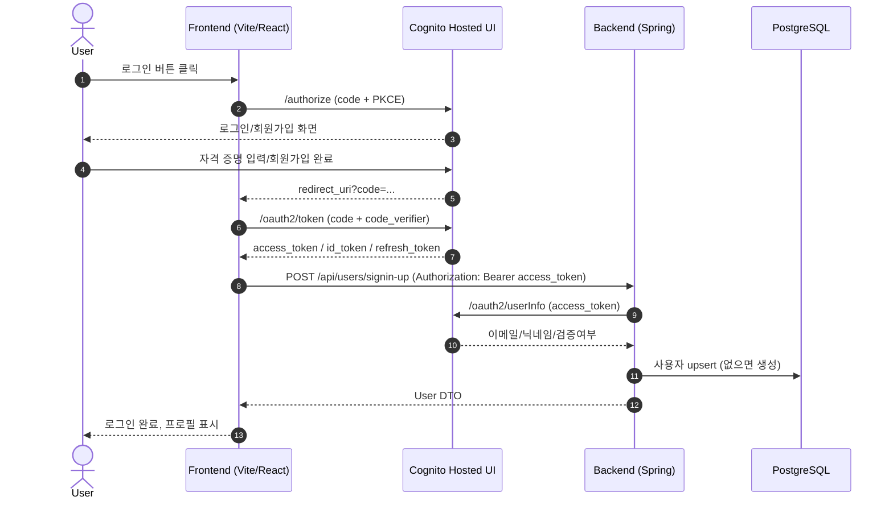

> **요약**: 프론트는 Cognito **Hosted UI + Authorization Code with PKCE**로 로그인/회원가입을 처리하고, 백엔드는 **Spring Security Resource Server**로 **access token(JWT)** 을 검증합니다. 최초 로그인 시 **/api/users/signin-up** 으로 사용자 정보를 동기화(upsert)하여 DB에 저장했습니다.

---

## 1) 프로젝트 개요

* **서비스**: 풋살 매칭 플랫폼(Kickytime)
* **인증**: AWS **Cognito Hosted UI** (로그인/회원가입)
* **백엔드**: Spring Boot 3.5.4, JPA, PostgreSQL
* **프론트엔드**: React + Vite + TypeScript
* **배포**: S3 + CloudFront(웹), ALB → ECS Fargate/EC2(API), RDS(PostgreSQL)

---

## 2) 핵심 기능 (인증 관점)

1. Hosted UI에서 **회원가입 / 로그인**
2. 콜백에서 **Authorization Code ↔ Token** 교환(**PKCE** 사용)
3. 프론트가 **access_token** 을 저장 후 API 호출 시 `Authorization: Bearer <token>` 헤더 첨부
4. 백엔드(Spring)에서 **JWT 검증**(issuer, signature, `token_use="access"`)
5. 최초 로그인 시 `/api/users/signin-up` 으로 **Cognito UserInfo** 호출 → DB **upsert**

---

## 3) 아키텍처 개요

{: .w-75 }
_CloudFront+S3(정적 웹) → ALB → ECS/EC2(API), 사설 서브넷의 RDS. 백엔드는 NAT를 통해 Cognito JWK/UserInfo 등 퍼블릭 엔드포인트에 접근._

* **프론트**: S3 정적 호스팅 + CloudFront 캐싱
* **백엔드**: ALB 뒤 ECS Fargate(일부 API) + EC2 ASG(일부 API)
* **DB**: RDS(PostgreSQL) 프라이빗 서브넷
* **아웃바운드**: NAT Gateway 경유로 Cognito JWK/Hosted UI/Token/UserInfo 접근

---

## 4) 인증 흐름 상세 (시퀀스)



### 4-1. 실제 화면 예시

{: .w-75 }
_사용자가 실제로 보게 되는 로그인 화면_

{: .w-75 }
_신규 사용자를 위한 회원가입 화면_

---

## 5) 백엔드 구현

### 5-1. 의존성(Gradle)

```gradle
implementation 'org.springframework.boot:spring-boot-starter-web'
implementation 'org.springframework.boot:spring-boot-starter-security'
implementation 'org.springframework.boot:spring-boot-starter-oauth2-resource-server'
implementation 'org.springframework.boot:spring-boot-starter-data-jpa'
implementation 'org.springframework.boot:spring-boot-starter-actuator'
implementation 'org.springdoc:springdoc-openapi-starter-webmvc-ui:2.6.0'
runtimeOnly   'org.postgresql:postgresql'
implementation 'software.amazon.awssdk:cognitoidentityprovider:2.x'
```

### 5-2. 보안 설정 (JWT Resource Server)

```java
@Configuration
public class SecurityConfig {
  @Value("${spring.security.oauth2.resourceserver.jwt.issuer-uri}")
  private String issuerUri;

  @Bean
  SecurityFilterChain filter(HttpSecurity http) throws Exception {
    http
      .csrf(AbstractHttpConfigurer::disable)
      .authorizeHttpRequests(reg -> reg
        .requestMatchers("/actuator/health", "/swagger-ui/**", "/v3/api-docs/**").permitAll()
        .anyRequest().authenticated())
      .oauth2ResourceServer(oauth2 -> oauth2
        .jwt(Customizer.withDefaults()))
      .httpBasic(AbstractHttpConfigurer::disable);
    return http.build();
  }

  @Bean
  JwtDecoder accessTokenDecoder() {
    NimbusJwtDecoder decoder = JwtDecoders.fromIssuerLocation(issuerUri);
    OAuth2TokenValidator<Jwt> withIssuer = JwtValidators.createDefaultWithIssuer(issuerUri);
    OAuth2TokenValidator<Jwt> tokenUseIsAccess = new TokenUseValidator("access");
    decoder.setJwtValidator(new DelegatingOAuth2TokenValidator<>(withIssuer, tokenUseIsAccess));
    return decoder;
  }
}
```

`TokenUseValidator` 는 Cognito 토큰 클레임 `token_use` 가 `access` 인지 확인합니다.

```java
public class TokenUseValidator implements OAuth2TokenValidator<Jwt> {
  private final String expected;
  public TokenUseValidator(String expected) { this.expected = expected; }
  public OAuth2TokenValidatorResult validate(Jwt token) {
    return expected.equals(token.getClaimAsString("token_use"))
      ? OAuth2TokenValidatorResult.success()
      : OAuth2TokenValidatorResult.failure(new OAuth2Error("invalid_token","Invalid token_use",null));
  }
}
```

### 5-3. 사용자 동기화 API

* **엔드포인트**: `POST /api/users/signin-up`
* **동작**: `@AuthenticationPrincipal Jwt` 로 access token을 받고, Cognito **UserInfo** API를 호출하여 이메일/닉네임/검증 여부를 얻은 뒤, DB에 **find-or-create(upsert)**

```java
@RestController
@RequestMapping("/api/users")
@RequiredArgsConstructor
public class UserController {
  private final UserService userService;
  private final CognitoUserInfoClient userInfoClient;

  @PostMapping("/signin-up")
  public User signinUp(@AuthenticationPrincipal Jwt accessToken) {
    String sub = accessToken.getClaimAsString("sub");
    var info = userInfoClient.fetch(accessToken.getTokenValue());
    boolean verified = Boolean.TRUE.equals(info.emailVerified());
    return userService.findOrCreateUser(sub, info.email(), info.nickname(), verified);
  }

  @GetMapping("/me")
  public UserDto me(@AuthenticationPrincipal Jwt jwt) {
    return userService.getByCognitoSub(jwt.getClaimAsString("sub"));
  }
}
```

`CognitoUserInfoClient` 는 `Authorization: Bearer <access_token>` 로 `/oauth2/userInfo` 를 호출합니다.

```java
@Component
public class CognitoUserInfoClient {
  private final RestClient rest = RestClient.builder().build();
  public record UserInfo(String email, String nickname, @JsonProperty("email_verified") Boolean emailVerified) {}
  public UserInfo fetch(String accessToken) {
    return rest.get().uri(userInfoUri)
      .header(HttpHeaders.AUTHORIZATION, "Bearer "+accessToken)
      .retrieve().body(UserInfo.class);
  }
}
```

### 5-4. 엔티티 설계(요지)

* **users**: `id, email(고유), nickname(고유), cognito_sub, email_verified, role(USER/ADMIN), image_url, rank(BEGINNER/INTERMEDIATE/MASTER), created_at, updated_at`
* **matches**: `id, location, match_time, max_players, match_status(OPEN/FULL/CLOSED/CANCELED), created_by`
* **match\_participants**: `UNIQUE(match_id, user_id)` 로 **중복 참여 방지**

---

## 6) 프론트엔드 구현

### 6-1. 환경 변수 (.env)

```dotenv
# API
VITE_API_BASE_URL=https://api.kickytime.nextcloudlab.com/api/

# Cognito
VITE_COGNITO_DOMAIN=https://<your-domain>.auth.ap-northeast-2.amazoncognito.com
VITE_COGNITO_CLIENT_ID=xxxxxxxxxxxxxxxxxxxx
VITE_COGNITO_REDIRECT_URI=https://kickytime.nextcloudlab.com/auth/callback
```

### 6-2. Hosted UI 이동 + PKCE

```ts
// src/auth/hostedUi.ts
import { COGNITO } from './config';
import { createPkce } from './pkce';

function buildAuthorizeUrl(path: 'login'|'signup', challenge: string) {
  const u = new URL(`${COGNITO.hostedUiDomain}/${path}`);
  u.searchParams.set('response_type', 'code');
  u.searchParams.set('client_id', COGNITO.clientId);
  u.searchParams.set('redirect_uri', COGNITO.redirectUri);
  u.searchParams.set('scope', COGNITO.scopes.join(' '));
  u.searchParams.set('code_challenge_method', 'S256');
  u.searchParams.set('code_challenge', challenge);
  return u.toString();
}

export async function goLogin()  { const {challenge} = await createPkce(); window.location.href = buildAuthorizeUrl('login',  challenge); }
export async function goSignup() { const {challenge} = await createPkce(); window.location.href = buildAuthorizeUrl('signup', challenge); }
```

```ts
// src/auth/pkce.ts
export async function createPkce() {
  const verifier  = randomString();
  const challenge = base64url(await sha256(verifier));
  sessionStorage.setItem('pkce_verifier', verifier);
  return { verifier, challenge };
}
```

### 6-3. 콜백에서 토큰 교환 + 사용자 동기화

```ts
// src/auth/callback.ts (요지)
export async function handleAuthCallback() {
  const code = new URL(window.location.href).searchParams.get('code');
  const verifier = sessionStorage.getItem('pkce_verifier')!;

  const body = new URLSearchParams({
    grant_type: 'authorization_code',
    client_id: COGNITO.clientId,
    code_verifier: verifier,
    code: code!,
    redirect_uri: COGNITO.redirectUri,
  });

  const tokenRes = await fetch(`${COGNITO.hostedUiDomain}/oauth2/token`, {
    method: 'POST', headers: { 'Content-Type': 'application/x-www-form-urlencoded' }, body
  });
  const { access_token, id_token, refresh_token } = await tokenRes.json();
  localStorage.setItem('access_token', access_token);
  localStorage.setItem('id_token', id_token);
  if (refresh_token) localStorage.setItem('refresh_token', refresh_token);

  // 최초 로그인 → 서버에 upsert
  await api.post('users/signin-up');
  const me = (await api.get('users/me')).data;
  useAuthStore.getState().setUser(me);
}
```

### 6-4. Axios 인스턴스

```ts
// src/api/axiosInstance.ts (요지)
export const api = axios.create({ baseURL: import.meta.env.VITE_API_BASE_URL, timeout: 10_000 });
api.interceptors.request.use((config) => {
  const token = localStorage.getItem('access_token');
  if (token) config.headers.Authorization = `Bearer ${token}`;
  return config;
});
api.interceptors.response.use(
  (r) => r,
  (err) => {
    if (err.response?.status === 401) {
      useAuthStore.getState().clearTokens?.();
    }
    return Promise.reject(err);
  }
);
```

---

## 7) 환경 설정

### 7-1. 백엔드 `application-prod.yml`

```yaml
spring:
  datasource:
    url: ${DB_URL}
    username: ${DB_USERNAME}
    password: ${DB_PASSWORD}
  jpa:
    hibernate:
      ddl-auto: none
    show-sql: false
  security:
    oauth2:
      resourceserver:
        jwt:
          issuer-uri: https://cognito-idp.ap-northeast-2.amazonaws.com/<USER_POOL_ID>

app:
  cognito:
    region: ap-northeast-2
    user-info-uri: https://<your-domain>.auth.ap-northeast-2.amazoncognito.com/oauth2/userInfo
  cors:
    allowed-origins: "https://kickytime.nextcloudlab.com, http://localhost:5173"
server:
  port: 8080
```

> 프라이빗 서브넷의 백엔드는 JWK(`/oauth2/jwks`), `issuer-uri` 등을 호출해야 하므로 **NAT** 또는 프록시 아웃바운드가 필요합니다.

### 7-2. 프론트엔드 `.env`

```dotenv
VITE_API_BASE_URL=https://api.kickytime.nextcloudlab.com/api/
VITE_COGNITO_DOMAIN=https://<your-domain>.auth.ap-northeast-2.amazoncognito.com
VITE_COGNITO_CLIENT_ID=xxxxxxxxxxxxxxxxxxxx
VITE_COGNITO_REDIRECT_URI=https://kickytime.nextcloudlab.com/auth/callback
```

---

## 8) 보안 고려사항 (진행 중 체크리스트)

* [x] **access token만** 서버에 보냄 (`id_token`은 프론트 전용 표시용)
* [x] `token_use=access` **검증**
* [x] CORS: 출처(origin) 정확히 지정(슬래시 금지), `credentials` 필요 시 옵션 분리
* [x] HTTPS 강제 (ALB/CloudFront)
* [x] 서버 로그에 **토큰/개인정보 미출력**
* [ ] **aud(client_id)**, **scope** 추가 검증 (고객 앱 클라이언트 오용 차단)
* [ ] 토큰 저장소를 **메모리/HttpOnly 쿠키** 기반으로 전환(BFF 패턴) → XSS 리스크 감소
* [ ] **Refresh Token Rotation** + 만료 임박 시 **Silent Refresh** 처리

---

## 9) 성능 최적화 메모

* JWK 키셋은 Spring이 캐싱하므로 재시도/네트워크 실패 시 백오프 설정(기본값 사용)
* `/api/users/signin-up` 는 최초 1회만 호출 → 이후 `/me` 캐싱(프론트 상태관리 사용)
* CloudFront 캐시 정책: 정적 리소스에 적절한 TTL/invalidations

---

## 10) 테스트 전략

* **단위 테스트**: 서비스 레이어(H2 메모리 DB) 중심
* **application-test.yml**

  * `OAuth2ResourceServerAutoConfiguration` **exclude** (원격 JWK 호출 방지)
  * H2 in-memory DB, `ddl-auto: create-drop`
* **통합 테스트**: Swagger/OpenAPI 문서 기반 시나리오, `/me` 401/200 경계 테스트

---

## 11) 프론트엔드 테스트

* 로그인 버튼 → Cognito redirect URL 생성(PKCE 챌린지 포함) 테스트
* 콜백 파서: `code` 유효성, 에러 분기 처리
* Axios 인터셉터: 토큰 부재/만료 시 처리(401 핸들링)

---

## 12) 향후 개선 방향

1. **BFF(Backend for Frontend)** 도입: 토큰을 서버 측 쿠키로 관리, 프론트에는 세션만 노출
2. **권한 모델** 확장: `ROLE_ADMIN` + `@PreAuthorize` 정책, 매칭 운영 API 분리
3. **감사로그/모니터링**: 로그인/가입 이벤트(성공/실패) 지표, CloudWatch + Grafana 대시보드
4. **소셜 로그인 연동**: Cognito Identity Provider(Google/Kakao 등) 추가
5. **테스트 강화**: MockWebServer로 UserInfo/Token 엔드포인트 행위 테스트

---

## 13) 내가 배운 것 (학습 포인트)

* **Spring Security OAuth2**: JWT 기반 인증 구현 
* **PKCE**: 보안이 강화된 OAuth2 인증 흐름 
* **보안**: JWT 토큰 검증과 CORS 설정
* **AWS Cognito**: 완전 관리형 사용자 인증 서비스 활용 
* **인프라 연계**: 프라이빗 백엔드가 퍼블릭 인증 서비스(Cognito)에 접근하려면 **NAT** 가 필요함
* **프론트 인증 상태관리**: Zustand/axios 인터셉터로 인증 수명주기 관리

> 본 문서의 코드 스니펫은 Kickytime 저장소의 일부를 요약/정리한 것입니다.
