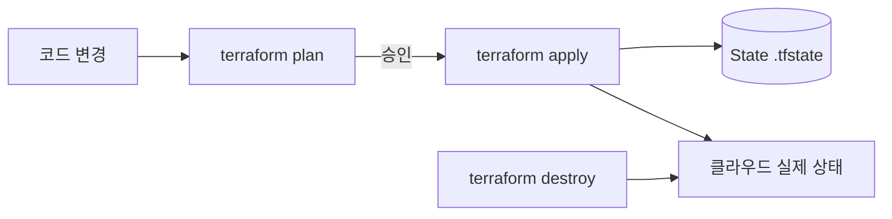
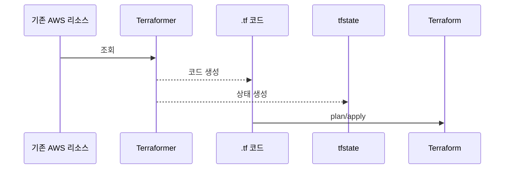

# 1. Terraform 소개

## 개념

* Terraform은 **인프라를 코드로 관리**하는 오픈소스 도구(IaC).
* AWS, Azure, GCP 등 **멀티 클라우드** 지원.
* 선언형 문법: “원하는 상태”만 정의하면 **Plan→Apply**로 맞춰줌.

## 주요 특징

* 멀티 프로바이더
* 리소스 간 **의존성 자동 추론**
* **상태(state)** 파일로 실제 리소스와 코드 동기화
* 워크플로우: **plan → apply → destroy**



---

# 2. Terraform 설치 및 초기 설정

## 실습 ①: 설치

**macOS**

```bash
brew tap hashicorp/tap
brew install hashicorp/tap/terraform
terraform -version
```

**Windows**

* Chocolatey: `choco install terraform`
* Scoop: `scoop install terraform`
* 또는 공식 다운로드(압축 해제 후 PATH 등록)

> AWS 사용 시 **AWS CLI**와 자격 증명(`~/.aws/credentials`) 준비 권장.

---

# 3. Terraform 구성 요소 이해

## 폴더/파일 구조(권장)

```
.
├── main.tf        # 핵심 리소스 정의
├── variables.tf   # 변수 선언
├── outputs.tf     # 출력 정의
├── terraform.tfvars  # 변수값(옵션)
└── terraform.tfstate # 상태 파일(자동 생성)
```

## 주요 블록

```hcl
provider "aws" {
  region = "ap-northeast-2"
}

resource "aws_instance" "example" {
  ami           = "ami-0abcdef1234567890"
  instance_type = "t2.micro"
}
```

* **provider**: 어떤 클라우드/서비스에 연결할지 정의
* **resource**: 실제로 생성/변경/삭제할 대상
* **module**: 리소스 묶음(재사용 단위)

> 보너스: `required_providers`, `required_version`를 `terraform` 블록에 명시해 버전 고정 권장.

```hcl
terraform {
  required_version = ">= 1.6"
  required_providers {
    aws = { source = "hashicorp/aws", version = "~> 5.0" }
  }
}
```

---

# 4. 실습: EC2 인스턴스 생성

AMI 찾기(옵션):

```bash
aws ec2 describe-images \
  --owners amazon \
  --filters "Name=name,Values=amzn2-ami-hvm-*-x86_64-gp2" "Name=state,Values=available" \
  --query "Images[*].[ImageId,CreationDate]" \
  --region ap-northeast-2 \
  --output table | sort -k2
```

### 실습 ②: 최소 예제

**`main.tf`**

```hcl
provider "aws" {
  region = "ap-northeast-2"
}

resource "aws_instance" "web" {
  ami           = "ami-0d6889d14c69512e9"
  instance_type = "t2.micro"
  tags = { Name = "Terraform-Web-minji" }
}
```

실행:

```bash
terraform init
terraform plan
terraform apply    # yes 입력
terraform destroy
terraform destroy -target=aws_instance.web
```

---

# 5. 변수와 출력

### 실습 ③: 변수화된 EC2

**`variables.tf`**

```hcl
variable "instance_type" { default = "t2.micro" }
variable "ami_id" { description = "EC2 AMI ID" }
```

**`main.tf`**

```hcl
provider "aws" { region = "ap-northeast-2" }

resource "aws_instance" "web" {
  ami           = var.ami_id
  instance_type = var.instance_type
  tags = { Name = "Terraform-Web-minji" }
}
```

적용:

```bash
terraform apply -var="ami_id=ami-0d6889d14c69512e9"
```

**출력 예시(`outputs.tf`)**

```hcl
output "instance_id" { value = aws_instance.web.id }
output "public_ip"  { value = aws_instance.web.public_ip }
```

---

# 6. 상태 파일과 백엔드

* `.tfstate`는 **현재 인프라의 스냅샷**. plan/apply 시 **코드·클라우드·상태** 3자 비교로 변경 계산.
* 팀 협업 시 **원격 백엔드**(S3 권장) + **DynamoDB 락** 사용.

```hcl
terraform {
  backend "s3" {
    bucket         = "my-terraform-state"
    key            = "prod/terraform.tfstate"
    region         = "ap-northeast-2"
    dynamodb_table = "terraform-lock"
    encrypt        = true
  }
}
```

> 민감정보가 상태에 담길 수 있으므로 **접근 제어/암호화** 필수.
> 워크스페이스(`terraform workspace`)로 환경 분리도 고려.

상태 예시 일부:

```json
{
  "resources": [
    { "type": "aws_instance", "name": "web", "instances": [ { "attributes": { "id": "i-123...", "public_ip": "13.125.0.1" } } ] }
  ]
}
```

---

# 7. 모듈 개념 및 실습

### 실습 ④: 모듈화된 VPC

**`main.tf`**

```hcl
provider "aws" { region = "ap-northeast-2" }

module "my_vpc" {
  source     = "./modules/vpc"
  vpc_name   = "my-minji-vpc"
  cidr_block = "10.15.0.0/16"
}
```

**`modules/vpc/main.tf`**

```hcl
resource "aws_vpc" "this" {
  cidr_block           = var.cidr_block
  enable_dns_support   = true
  enable_dns_hostnames = true
  tags = { Name = var.vpc_name }
}

resource "aws_subnet" "public" {
  count                   = length(var.public_subnet_cidrs)
  vpc_id                  = aws_vpc.this.id
  cidr_block              = var.public_subnet_cidrs[count.index]
  availability_zone       = element(var.availability_zones, count.index)
  map_public_ip_on_launch = true
  tags = { Name = "${var.vpc_name}-public-${count.index + 1}" }
}
```

> 모듈은 **디렉터리/깃/Registry**에서 소스 지정 가능. 사내 공용 모듈을 표준화하면 생산성이 급상승.

---

# 8. 실습: 보안 그룹 + EC2 구성

```hcl
resource "aws_security_group" "web_sg" {
  name        = "web-sg"
  description = "Allow HTTP"
  ingress { from_port = 80, to_port = 80, protocol = "tcp", cidr_blocks = ["0.0.0.0/0"] }
}

resource "aws_instance" "web" {
  ami             = var.ami_id
  instance_type   = var.instance_type
  security_groups = [aws_security_group.web_sg.name]
}
```

---

# 9. 기타 CLI/개념 요약

| 명령                   | 설명                                |
| -------------------- | --------------------------------- |
| `terraform fmt`      | 포맷 정리                             |
| `terraform validate` | 문법 유효성 검사                         |
| `terraform plan`     | 변경 계획 미리보기                        |
| `terraform apply`    | 변경 적용                             |
| `terraform destroy`  | 리소스 삭제                            |
| `terraform output`   | 출력 조회                             |
| `terraform state`    | 상태 수동 조작(고급)                      |
| `terraform taint`    | 리소스 재생성 표시(권장: `apply -replace=`) |

---

# HCL 빠르게 이해하기

* **HCL(HashiCorp Configuration Language)**: 선언형, 읽기 쉬운 DSL. `.tf` 확장자.
* 블록/키-값/주석 지원, JSON 호환.

```hcl
resource "aws_instance" "web" {
  ami           = "ami-0abcdef1234567890"
  instance_type = "t2.micro"
  tags = { Name = "MyServer" }
}
```

---

# Terraform 흐름 제어(표현식)

| 제어            | 설명           | 예시                                               |
| ------------- | ------------ | ------------------------------------------------ |
| 조건            | 삼항 연산자       | `var.is_prod ? "t3.medium" : "t2.micro"`         |
| 반복(count)     | 개수 기반 리소스 반복 | `count = 3`                                      |
| 반복(for\_each) | 집합/맵 기반 반복   | `for_each = toset(["dev","prod"])`               |
| for 표현식       | 리스트/맵 변환     | `[for n in ["web","db"] : upper(n)]`             |
| 동적 블록         | 블록 반복 렌더링    | `dynamic "ingress" { for_each = var.rules ... }` |

예시:

```hcl
resource "aws_s3_bucket" "b" {
  for_each = toset(["dev","stage","prod"])
  bucket   = "my-bucket-${each.key}"
}
```

---

# 데이터 소스/로컬/출력 문법 스니펫

```hcl
data "aws_ami" "al2" {
  most_recent = true
  owners      = ["amazon"]
  filter { name = "name"; values = ["amzn2-ami-hvm-*-x86_64-gp2"] }
}

locals { name_tag = "webserver-${var.environment}" }

output "instance_id" { value = aws_instance.web.id }
```

---

# 조건/유틸 함수 모음 + 실습

| 함수                  | 용도          | 예시                                            |
| ------------------- | ----------- | --------------------------------------------- |
| `lookup(map,k,def)` | 키 없을 때 기본값  | `lookup(var.ami_map, var.env, "ami-default")` |
| `contains(list,v)`  | 포함 여부       | `contains(["dev","prod"], var.env)`           |
| `length(x)`         | 길이          | `length(var.regions)`                         |
| `compact(list)`     | 빈값 제거       | `compact(var.regions)`                        |
| `coalesce(a,b,...)` | null 아님 첫 값 | `coalesce(var.opt, "default")`                |
| `can(expr)`         | 오류 여부       | `can(var.map["k"])`                           |
| `try(a,b,...)`      | 오류 건너뛰고 다음  | `try(var.map["k"], "default")`                |
| `anytrue/alltrue`   | 불리언 평가      | `anytrue([false,true])`                       |

**연습 템플릿(`main.tf`)**

```hcl
variable "env" { type = string, default = "staging" }
variable "ami_map" { type = map(string), default = { dev="ami-aaa111", staging="ami-bbb222", prod="ami-ccc333" } }
variable "regions" { type = list(string), default = ["ap-northeast-2", "us-west-2", ""] }
variable "optional_value" { type = string, default = "" }

output "selected_ami" { value = lookup(var.ami_map, var.env, "ami-default") }
output "is_ap_allowed" { value = contains(var.regions, "ap-northeast-2") }
output "region_count" { value = length(var.regions) }
output "clean_regions" { value = compact(var.regions) }
output "final_value" { value = coalesce(var.optional_value, "기본값") }
output "safe_lookup" { value = can(var.ami_map["local"]) ? var.ami_map["local"] : "없음" }
output "safe_try" { value = try(var.ami_map["local"], "기본값") }
```

실행:

```bash
terraform init && terraform apply
```

예상 출력:

```
selected_ami = "ami-bbb222"
is_ap_allowed = true
region_count  = 3
clean_regions = ["ap-northeast-2","us-west-2"]
final_value   = "기본값"
safe_lookup   = "없음"
safe_try      = "기본값"
```

---

# Provider/Resource/Module 심화

## provider — 어떤 클라우드와 연결할지

```hcl
provider "aws" {
  region  = "ap-northeast-2"
  profile = "default"
}
# 멀티 리전/계정
provider "aws" { alias = "us" region = "us-east-1" }
```

## resource — 실제로 만들 대상

```hcl
resource "aws_instance" "web" {
  ami           = "ami-0abcdef1234567890"
  instance_type = "t2.micro"
}
```

## module — 재사용 가능한 묶음

```hcl
module "vpc" {
  source     = "terraform-aws-modules/vpc/aws"
  version    = "4.0.2"
  name       = "minji"
  cidr_block = "10.0.0.0/16"
}
```

---

# 콘솔 인프라 → Terraform 코드로 마이그레이션

## 목표

> 현재 **콘솔로 만든 리소스**를 **Terraform 코드**로 가져와 이후엔 코드로 관리.

## Terraformer 사용(권장)

설치(macOS):

```bash
brew install terraformer
```

AWS 자격 증명(`~/.aws/credentials`) 준비 후 실행:

```bash
# 특정 리소스만
terraformer import aws --resources=s3,ec2,iam --regions=ap-northeast-2
# 모든 리소스(시간 오래 걸림)
terraformer import aws --resources=all --regions=ap-northeast-2
```

결과: `generated/`에 `main.tf`, `variables.tf`, `outputs.tf`, `terraform.tfstate` 생성.

### 주의/후처리

* 일부 리소스는 누락/불완전할 수 있음 → **수정/변수화/참조 연결** 필요
* 미지원 리소스는 **terraform import**로 상태만 연결 후 코드 수기 작성

```bash
terraform import aws_instance.my_ec2 i-0ab1c2d3e4f5g6h7
```



---

# 베스트 프랙티스 & 체크리스트

* [ ] **버전 고정**: provider/CLI 버전 잠금(`.terraform.lock.hcl`)
* [ ] **원격 백엔드** + **DynamoDB 락**
* [ ] **환경 분리**: 워크스페이스 또는 디렉터리 분리
* [ ] **모듈화/변수화**로 재사용성·가독성 향상
* [ ] **CI**에서 `fmt`/`validate`/`plan` 자동화 (선택: `tflint`, `checkov`)
* [ ] `-replace=`로 안전한 재생성, **수동 변경 금지**(Drift 최소화)
* [ ] 시크릿은 **변수/SSM/Secrets Manager**로 주입, 상태/코드에 평문 금지

---

# 마무리

Terraform은 선언형 IaC 도구로 **재현성/표준화/자동화**를 이끌어 줍니다.
