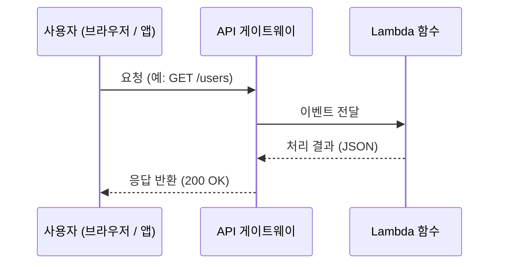
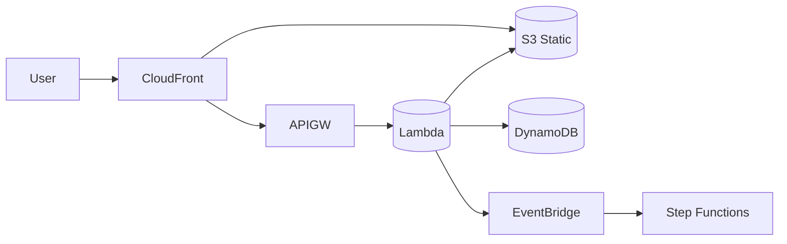

# 기본 개념

## 1) 서버리스(Serverless)의 의미

* “서버가 없다”가 아니라, **서버(인프라) 관리를 AWS가 대신한다**는 뜻입니다.
* 프로비저닝·패치·확장·로드밸런싱 등을 **관리형 형태로 자동 처리**합니다.
* 사용자는 **비즈니스 로직(코드)**에 집중합니다.

## 2) 이벤트 기반 아키텍처

* 함수/워크플로가 **이벤트(파일 업로드, HTTP 요청, 스케줄, DB 변경 등)**에 의해 실행됩니다.
* 예: 사용자가 이미지를 업로드하면 자동으로 **썸네일 생성** → S3 저장.

---

# 주요 구성 요소

## 1) AWS Lambda — 서버리스 컴퓨팅의 핵심

* **이벤트가 발생하면 자동으로 실행되는 함수 단위 런타임**.
* 요청 수·실행 시간·메모리에 비례해 **사용한 만큼 과금**.
* 다양한 이벤트 소스(S3, API Gateway, EventBridge, DynamoDB Streams 등)와 연동.



### Lambda 한눈에 보기

| 항목      | 값/개념                                         |
| ------- | -------------------------------------------- |
| 실행 시간   | 최대 **15분**                                   |
| 메모리/CPU | 메모리 구성에 **비례**해 vCPU 할당(자동)                  |
| 임시 스토리지 | `/tmp` 기본 512MB, **최대 10GB** 구성 가능           |
| 동시 실행   | 기본 지역 한도 존재(요청으로 상향 가능), **예약/프로비저닝 동시성** 지원 |
| 네트워킹    | VPC 연결 가능(프라이빗 자원 접근)                        |
| 배포 형태   | ZIP 또는 **컨테이너 이미지**                          |

> **콜드 스타트 완화**: 작은 패키지, 경량 런타임, VPC 최적화, **프로비저닝 동시성** 활용.

---

## 2) Amazon API Gateway — 서버리스 API 프런트도어

* HTTP/REST/WebSocket API 제공. 인증·인가·스테이지·모니터링·캐싱·할당량/속도제한 등 **API 수명주기** 관리.
* **HTTP API**는 경량·저비용, **REST API**는 기능 풍부, **WebSocket**은 양방향 실시간 통신.

```mermaid
flowchart LR
  User[외부 사용자] -->|/order| APIGW[API Gateway]
  APIGW --> Auth[[인증/인가 서비스]]
  APIGW --> Order[[주문 서비스(Lambda)]]
  APIGW --> Payment[[결제 서비스(Lambda)]]
```

### 핵심 기능

* 라우팅(경로·메서드·헤더/쿼리 기반), **CORS**, 요청/응답 변환, 스테이지(dev/test/prod), **사용량 계획/키**, **캐싱**, **CloudWatch**와 로깅/지표 통합.
* 인증: **IAM**, **Cognito**, **API Key**, **Lambda Authorizer**.

---

## 3) Amazon S3 — 정적 호스팅·파일 저장소

* 정적 웹사이트 호스팅(보통 **CloudFront**와 결합), 파일 업로드 트리거로 **Lambda 이벤트** 발생.
* 버전 관리, 수명주기, 이벤트 알림, 서버사이드 암호화(KMS) 지원.

## 4) Amazon DynamoDB — 서버리스 NoSQL DB

* 완전관리형 키-값/문서 DB. **온디맨드(자동 확장)** 또는 프로비저닝 모드.
* TTL, 스트림(DynamoDB Streams), 조건부 업데이트, 강력한 **수평 확장**.

## 5) AWS Step Functions — 워크플로 오케스트레이션

* 서비스 간 호출/분기/재시도/대기/병렬을 **상태 기계**로 정의.
* **Standard/Express** 타입 선택(지속시간·트래픽 특성에 따라).

## 6) EventBridge / SNS / SQS — 이벤트 & 메시징

* **EventBridge**: 이벤트 버스·규칙로 다양한 서비스 이벤트 라우팅/스케줄(크론) 처리.
* **SNS**: 퍼브/섭 브로드캐스트(Email/SMS/HTTP/SQS/Lambda 등).
* **SQS**: 큐(표준/FIFO)로 **비동기 처리·버퍼링** 및 **DLQ** 지원.

---

# 장점

| 장점           | 설명                       |
| ------------ | ------------------------ |
| **서버 관리 없음** | OS·패치·스케일링·LB를 AWS가 담당   |
| **비용 효율**    | 요청 수·실행 시간 기준 과금(유휴 비용↓) |
| **자동 확장**    | 급증 트래픽에도 수평 확장           |
| **빠른 실험/배포** | 작은 단위(함수/워크플로)로 잦은 배포    |
| **모듈화**      | 서비스 경계가 명확해 유지보수 용이      |

# 단점

| 단점          | 설명                   |
| ----------- | -------------------- |
| **콜드 스타트**  | 오랜 미호출 후 첫 호출 지연 가능  |
| **관측성 난이도** | 분산 추적·로그 상관관계 필요     |
| **상태 관리**   | 외부 DB/스토리지 의존(설계 필요) |
| **제약**      | 실행시간·패키지·동시성 등 한도 존재 |

---

# 대표 사용 사례

* 이미지 처리(썸네일/워터마크)
* 실시간 알림/채팅·웹소켓
* IoT/스트리밍 데이터 전처리
* 서버리스 **REST/GraphQL** 백엔드
* 자동화 워크플로(업로드→분석→보고)
* 정적 웹사이트 + 백엔드 API(S3 + CloudFront + API Gateway + Lambda)



---

# Lambda 자세히 보기

## 동작 방식

1. 코드를 업로드(ZIP/이미지) → 2) 이벤트 수신(예: API 호출/S3 업로드/스케줄) → 3) 함수 실행 → 4) 종료/대기(자원 반납).

## 구성 요소

| 구성          | 설명                                          |
| ----------- | ------------------------------------------- |
| **Handler** | 진입점(예: `index.handler`)                     |
| **Event**   | 트리거가 전달하는 페이로드(JSON 등)                      |
| **Context** | 남은 시간·request ID 등 실행 정보                    |
| **Trigger** | API GW, S3, SQS, EventBridge, DDB Streams 등 |
| **Role**    | 다른 리소스 접근을 위한 **IAM 역할**                    |

## 지원 런타임

Node.js / Python / Java / Go / .NET / Ruby / **Custom runtime(컨테이너)**

## 제약·설정 팁

* 메모리 높일수록 **CPU·네트워크**도 함께 증가 → 성능/비용 균형 최적화
* **프로비저닝 동시성**으로 콜드 스타트 완화, **예약 동시성**으로 폭주 보호
* **/tmp 10GB**까지 확장 가능(대용량 임시 작업)
* **DLQ/재시도**: 비동기 트리거 실패 시 SNS/SQS로 보관, 재처리 전략 설계
* **VPC 연결**: DB/내부 HTTP 접근 시 필요(서브넷/SG/엔드포인트 구성)

## 보안 팁

* 최소권한 **IAM 역할**(실행 역할 vs 애플리케이션 역할 분리)
* 시크릿은 **Secrets Manager/SSM**에서 주입(환경변수 암호화)
* **KMS**로 데이터 암호화, CloudWatch 로그 보존·마스킹 정책

## 예제 코드 (Python)

```python
# file: app.py
import json

def lambda_handler(event, context):
    name = event.get("name", "World")
    return {"statusCode": 200, "body": json.dumps({"message": f"Hello, {name}!"})}
```

---

# API Gateway 자세히 보기

## 주요 기능 요약

* **API 유형**: REST / HTTP / WebSocket
* **인증/인가**: IAM, Cognito, API Key, **Lambda Authorizer**
* **라우팅**: 경로/메서드/조건 매핑 + **요청/응답 변환**(맵핑 템플릿)
* **보호**: 속도제한·할당량·WAF 연동·캐싱·사용자 플랜
* **운영**: 스테이지(dev/test/prod), **CloudWatch 지표/로그**, 배포 버전

## 체크리스트

* [ ] **CORS** 정확히 설정(메서드·헤더·오리진)
* [ ] 에러 매핑(4xx/5xx), 표준 에러 포맷(JSON)
* [ ] **사용량 계획**(API Key)과 **스로틀**로 남용 방지
* [ ] **WAF/Shield**로 보안 강화, **전송 암호화(TLS)** 강제
* [ ] 커스텀 도메인 + 스테이지 경로로 깔끔한 URL 제공

---

# 이벤트·메시징 패턴

| 소스     | 중개              | 소비자                   | 용도            |
| ------ | --------------- | --------------------- | ------------- |
| S3 업로드 | EventBridge     | Lambda                | 이미지 처리/ETL    |
| API 호출 | API Gateway     | Lambda                | 동기 HTTP 응답    |
| 배치 스케줄 | EventBridge(크론) | Lambda/Step Functions | 데이터 파이프라인     |
| 주문 생성  | SNS             | SQS/Lambda/Email      | 다수 시스템 브로드캐스트 |
| 백엔드 폭주 | API GW → SQS    | Lambda                | 스파이크 흡수(비동기)  |

> **Idempotency**(중복 실행 안전)와 **재시도/백오프**를 설계에 포함하세요.

---

# 관측성(Observability)

* **CloudWatch Logs/Metrics**: 구조적(JSON) 로깅, 지표 대시보드, 경보(Alarms)
* **X-Ray**: 트레이싱으로 병목/지연 구간 확인
* **로그 상관관계**: request ID·trace ID를 전파
* **DLQ/대기열 모니터링**: 실패 누적·대기시간 지표 경보

---

# 비용 전략

* **함수 실행 시간/메모리** 최적화(짧고 굵게) → 불필요 I/O 최소화
* **HTTP API** 우선(단순한 경우, REST보다 저렴)
* 빈번한 동기 호출은 **캐시·압축**으로 절감
* **NAT 게이트웨이** 트래픽 비용 고려(VPC 내부 통신 설계, VPC 엔드포인트 활용)

---

# 배포 옵션(요약)

* **AWS SAM**: 서버리스 친화 템플릿(CloudFormation 변환)
* **AWS CDK**: 코드로 인프라 정의(TypeScript/Python 등)
* **Serverless Framework**: 멀티클라우드 서버리스 배포 도구

### SAM 템플릿 스니펫

```yaml
Transform: AWS::Serverless-2016-10-31
Resources:
  HelloApi:
    Type: AWS::Serverless::Function
    Properties:
      CodeUri: src/
      Handler: app.lambda_handler
      Runtime: python3.12
      Events:
        Api:
          Type: Api
          Properties: { Path: /hello, Method: get }
```

---

# 실사용 시나리오 예시

## 1) S3 업로드 → 이미지 썸네일 생성

1. 사용자가 `raw/` 경로로 이미지 업로드(S3)
2. S3 이벤트 → Lambda 트리거
3. Lambda가 썸네일 생성 후 `thumb/`에 저장
4. 메타데이터를 DynamoDB에 기록(검색/만료 관리)

## 2) 주문 API(동기) + 백오피스 처리(비동기)

* API Gateway → Lambda(주문 접수, 200 즉시 반환)
* 내부 처리는 SNS/SQS로 브로드캐스트/버퍼 → 다른 Lambda들이 비동기로 처리
* 장애 시 DLQ로 재처리

## 3) 배치/스케줄

* EventBridge 규칙(크론) → Lambda/Step Functions 호출 → 리포트 생성·S3 업로드·알림 전송

---

# 도입 체크리스트

* [ ] 이벤트 소스/소비자 목록과 **재시도·DLQ** 정책 정의
* [ ] **Idempotency 키**(요청 ID/해시) 설계
* [ ] **보안**: 최소권한 IAM, 시크릿 관리(Secrets Manager/SSM), KMS
* [ ] **관측성**: 구조적 로그, 대시보드, 알람, 트레이싱
* [ ] **성능**: 콜드 스타트 대응, 패키지 크기/의존성 관리, 네트워크 지연 최소화
* [ ] **비용**: 호출 패턴·데이터 전송·NAT 비용 점검
* [ ] **배포**: IaC(SAM/CDK)로 재현 가능한 파이프라인 구성

---

# 요약

* **Serverless = 코드에 집중 + 인프라 자동화**.
* 핵심 조합: **Lambda + API Gateway + S3 + DynamoDB + EventBridge/SNS/SQS + Step Functions**.
* 장점(민첩/확장/비용)과 제약(콜드 스타트/관측성)을 이해하고, **이벤트·재시도·보안·관측성**을 표준화하면 안정적으로 운영할 수 있습니다.
