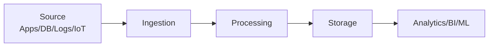
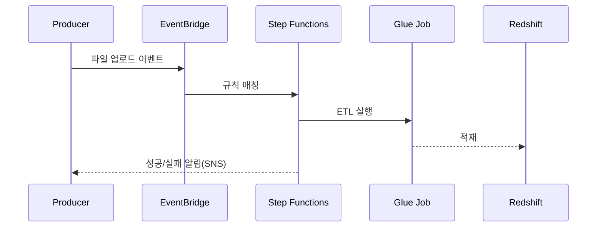

# 데이터 파이프라인이란?

**데이터 파이프라인**은 다양한 소스에서 데이터를 **수집 → 정제/변환 → 저장 → 분석** 가능한 형태로 만드는 일련의 처리 과정입니다. 핵심 목표는 **신뢰도 높은 데이터**를 **적시에, 적절한 비용**으로 제공하는 것.



---

# AWS에서 구성 가능한 데이터 파이프라인 요소

## 1) 데이터 수집 (Ingestion)

* **Amazon Kinesis**: 고속 **실시간 스트리밍** 수집(KDS/KDF/Kinesis Video).
* **Amazon MSK**: **관리형 Kafka**로 대규모 스트림 수집/브로커링.
* **Amazon S3**: 파일 업로드, 로그 저장(CloudTrail/ALB/CF Logs 등) **데이터 레이크**의 중심.
* **AWS DMS**: RDBMS → S3/Redshift 등 **마이그레이션/CDC**(Change Data Capture).

## 2) 데이터 처리/변환 (Processing / Transformation)

* **AWS Glue**: 서버리스 **ETL**(Spark 기반). Glue Studio, Glue Data Quality, Job Bookmark.
* **AWS Lambda**: 이벤트 기반 **경량 변환**/정규화/라우팅.
* **Amazon EMR**: Hadoop/Spark/Hive/Presto/Trino/Flink 등 **빅데이터 프레임워크**.
* **AWS Step Functions**: 다단계 처리 **워크플로 오케스트레이션**.

## 3) 저장 (Storage)

* **Amazon S3**: 원시(Raw)·정제(Curated)·서빙(Serving) 레이어 구성.
* **Amazon Redshift**: **데이터 웨어하우스**(컬럼식, MPP).
* **Amazon RDS / Aurora**: 관계형 저장(운영 데이터, 서빙 뷰).
* **Amazon DynamoDB**: NoSQL 키-값/문서 저장.

## 4) 분석/시각화

* **Amazon Athena**: S3 데이터를 **SQL로 즉시** 질의(서버리스).
* **Amazon QuickSight**: **BI 대시보드**.
* **Redshift Spectrum**: Redshift에서 S3 **외부 테이블** 직접 분석.

## 5) 스케줄링·오케스트레이션

* **Amazon EventBridge**: 이벤트 기반 트리거/스케줄(크론) 라우팅.
* **AWS Step Functions**: 상태 전이/분기/재시도/병렬 등 **오케스트레이션 표준**.
* **MWAA(Managed Airflow)**: **Apache Airflow** 관리형.
* *(레거시)* **AWS Data Pipeline**: 현재는 권장하지 않음 → Step Functions/Glue로 대체.

---

# 레퍼런스 아키텍처

## A. 배치 ETL (S3 ↔ Glue ↔ Athena/Redshift)

```mermaid
flowchart LR
  Raw[S3 Raw] --> Glue[Glue ETL]
  Glue --> Curated[S3 Curated (Parquet/Partitioned)]
  Curated --> Athena[Athena/Glue Catalog]
  Curated --> RS[Redshift COPY/External]
  Athena --> QS[QuickSight]
  RS --> QS
```

## B. 실시간 스트리밍 (Kinesis/MSK)

```mermaid
flowchart LR
  K[Kinesis/MSK] --> L[Lambda/Glue Streaming/Spark]
  L --> S3[S3 Data Lake]
  L --> RS[Redshift (Firehose)]
  S3 --> Athena
  RS --> QS[BI]
```

## C. CDC 파이프라인 (RDS → DMS → S3/Redshift)

```mermaid
flowchart LR
  RDS[RDS/Aurora] --> DMS[DMS (Full + CDC)]
  DMS --> S3[S3 Raw]
  S3 --> Glue
  Glue --> RS[Redshift]
```

## D. 오케스트레이션(이벤트 드리븐)



---

# 코드 스니펫 모음

## 1) Glue PySpark: JSON → Parquet 파티셔닝

```python
import sys
from awsglue.context import GlueContext
from awsglue.utils import getResolvedOptions
from pyspark.context import SparkContext
from pyspark.sql.functions import col, to_date

args = getResolvedOptions(sys.argv, ["JOB_NAME", "src", "dst"])
sc = SparkContext()
glue = GlueContext(sc)
spark = glue.spark_session

# Raw JSON 읽기
raw = spark.read.json(args["src"])  # s3://bucket/raw/...

# 스키마 정제 & 파티션 키 생성
curated = (raw
  .withColumn("event_date", to_date(col("timestamp")))
  .select("user_id", "action", "amount", "event_date"))

# Parquet+압축으로 파티셔닝 저장
(curated.write
  .mode("overwrite")
  .partitionBy("event_date")
  .parquet(args["dst"]))  # s3://bucket/curated/events/
```

## 2) Athena: 외부 테이블 & 파티션

```sql
CREATE EXTERNAL TABLE IF NOT EXISTS events (
  user_id string,
  action  string,
  amount  double
)
PARTITIONED BY (event_date date)
STORED AS PARQUET
LOCATION 's3://bucket/curated/events/';

MSCK REPAIR TABLE events; -- 신규 파티션 인식

-- 집계 예시
SELECT event_date, action, COUNT(*) AS cnt, SUM(amount) AS amt
FROM events
WHERE event_date BETWEEN DATE '2025-08-01' AND DATE '2025-08-31'
GROUP BY event_date, action
ORDER BY event_date;
```

## 3) Redshift COPY (S3 → Redshift)

```sql
COPY public.events
FROM 's3://bucket/curated/events/'
IAM_ROLE 'arn:aws:iam::123456789012:role/MyRedshiftRole'
FORMAT AS PARQUET;
```

## 4) EMR: 클러스터 생성(Spark)

```bash
aws emr create-cluster \
  --name "SparkETL" \
  --release-label emr-6.13.0 \
  --applications Name=Spark \
  --ec2-attributes KeyName=my-key \
  --instance-type m5.xlarge \
  --instance-count 3 \
  --use-default-roles
```

## 5) EventBridge Rule (S3 업로드 트리거)

```json
{
  "source": ["aws.s3"],
  "detail-type": ["Object Created"],
  "detail": { "bucket": { "name": ["my-upload-bucket"] } }
}
```

## 6) Step Functions 상태 기계(요약)

```json
{
  "Comment": "ETL Orchestration",
  "StartAt": "RunGlue",
  "States": {
    "RunGlue": {
      "Type": "Task",
      "Resource": "arn:aws:states:::glue:startJobRun",
      "Parameters": {"JobName": "etl-events"},
      "Retry": [{"ErrorEquals": ["Glue.AWSGlueException"], "MaxAttempts": 3}],
      "Next": "LoadToRedshift"
    },
    "LoadToRedshift": {
      "Type": "Task",
      "Resource": "arn:aws:states:::aws-sdk:redshift-data:executeStatement",
      "Parameters": {"Sql": "CALL sp_load_events();"},
      "End": true
    }
  }
}
```

---

# 컴퓨팅 엔진 한눈 정리: Hadoop vs Spark

| 항목    | **Hadoop(MapReduce)** | **Spark**                   |
| ----- | --------------------- | --------------------------- |
| 처리 방식 | 디스크 기반 **배치**         | **인메모리** + 배치/스트리밍          |
| 속도    | 상대적으로 느림              | 수십 배 빠름(메모리 캐시)             |
| 실시간   | 미지원                   | **Spark Streaming**(마이크로배치) |
| 사용처   | 대규모 배치, 장기 저장(HDFS)   | ETL, 분석, ML, 실시간 처리         |
| 스토리지  | 주로 HDFS               | HDFS/S3/다양                  |

> 실제 운영에서는 **S3 + Spark** 조합이 흔하다하고 하며, 배치는 Glue/EMR, 실시간은 Kinesis/MSK + Spark/Lambda로 구성한다고 함.

---

# Athena 깊게 보기

* **서버리스 SQL**: S3 데이터를 즉시 조회.
* **포맷**: Parquet/ORC(열 지향) + 압축(Gzip/Snappy)로 **스캔량↓ → 비용↓**.
* **Glue Data Catalog**로 테이블/스키마 관리.
* **활용**: 로그 분석(CloudFront/ALB/VPC/CloudTrail), 데이터 레이크 ad-hoc 분석, BI 소스.

예제 쿼리(상태 코드 분포):

```sql
SELECT status_code, COUNT(*) AS cnt
FROM access_logs
GROUP BY status_code
ORDER BY cnt DESC;
```

---

# EMR 요약

* **완전관리형 빅데이터 플랫폼**: Spark/Hive/Presto/Trino/Flink.
* \*\*S3 연동(EMRFS)\*\*으로 데이터 레이크 직접 처리.
* **Auto Scaling**·작업 종료 시 **Terminate**로 비용 절감. *(EMR Serverless도 고려)*

---

# Redshift 요약

* **컬럼 지향 + MPP** DW. BI/집계 쿼리에 강함.
* **배포 스타일**(`KEY/ALL/EVEN`)·**SORT KEY**·**압축**으로 성능 최적화.
* **Spectrum**으로 S3 외부 테이블 분석.

적재 예:

```sql
COPY sales FROM 's3://my-data-bucket/sales.csv'
IAM_ROLE 'arn:aws:iam::123456789012:role/MyRedshiftRole'
CSV IGNOREHEADER 1;
```

---

# EventBridge 요약

* **서버리스 이벤트 버스**: AWS·SaaS·커스텀 이벤트 라우팅.
* **규칙**으로 필터 → **타겟**(Lambda/SQS/SFN/Kinesis 등)으로 전달.
* **아카이브/리플레이**·스케줄·스키마 레지스트리 지원.

Lambda 타겟 예시(Python):

```python
def lambda_handler(event, context):
    bucket = event['detail']['bucket']['name']
    key = event['detail']['object']['key']
    print(f"File uploaded: s3://{bucket}/{key}")
```

---

# 설계 시 고려사항

| 항목            | 가이드                                                    |
| ------------- | ------------------------------------------------------ |
| **데이터량**      | 대용량 배치 → Glue/EMR, 실시간 대량 → MSK/Kinesis + Spark/Lambda |
| **실시간 vs 배치** | 지연 허용도에 따라 흐름 분리(람다/스파크 스트리밍 vs Glue 배치)               |
| **워크플로 복잡성**  | 복잡도 ↑ → Step Functions/MWAA로 오케스트레이션                   |
| **스키마**       | **스키마 온 리드**(Athena) vs **스키마 온 라이트**(Redshift) 선택     |
| **형식**        | Parquet/ORC + 압축 + 파티셔닝(`year=YYYY/month=MM/day=DD`)   |
| **데이터 품질**    | Glue Data Quality/Deequ, 계약 기반(Schema Registry)        |
| **보안**        | KMS 암호화(S3/Redshift), VPC 엔드포인트, 최소권한 IAM, 액세스 로깅      |
| **비용**        | 스캔량 절감(파티션/열 지향/압축), 스토리지 수명주기(Glacier), NAT 비용 절감     |

---

# AWS Data Pipeline vs 대체 서비스

| 항목    | **AWS Data Pipeline** | **대체(권장)**                                 |
| ----- | --------------------- | ------------------------------------------ |
| 상태 관리 | 기본적                   | Step Functions가 **유연/가시성↑**                |
| 유연성   | 낮음                    | Glue/Lambda/EMR 조합 자유                      |
| 확장성   | 제한                    | 서비스별 **자동 확장**                             |
| 권장도   | ❌                     | **Glue + EventBridge/Step Functions** 권장 |

---

# 운영·모니터링 체크리스트

* [ ] **CloudWatch** 대시보드/알람(지표, 오류율, DLQ 적체)
* [ ] **X-Ray/추적 ID**로 분산 추적(요청 상관관계)
* [ ] **재시도/백오프** 정책 + **Idempotency** 키 설계
* [ ] **Glue Job Bookmark**로 증분 처리
* [ ] **데이터 카탈로그** 일원화(Glue Catalog/Lake Formation)
* [ ] **S3 수명주기**로 아카이브/삭제 자동화

---

# 요약

* 데이터 파이프라인은 **수집→변환→저장→분석** 입니다.
* AWS에서는 **Kinesis/MSK, S3, Glue/EMR/Lambda, Redshift/Athena, EventBridge/Step Functions/MWAA**를 조합해 목적에 맞는 파이프라인을 구축합니다.
* **스키마·품질·보안·비용**을 초기에 표준화하면, 확장 가능한 **데이터 레이크/웨어하우스** 환경을 빠르게 안정화할 수 있습니다.
