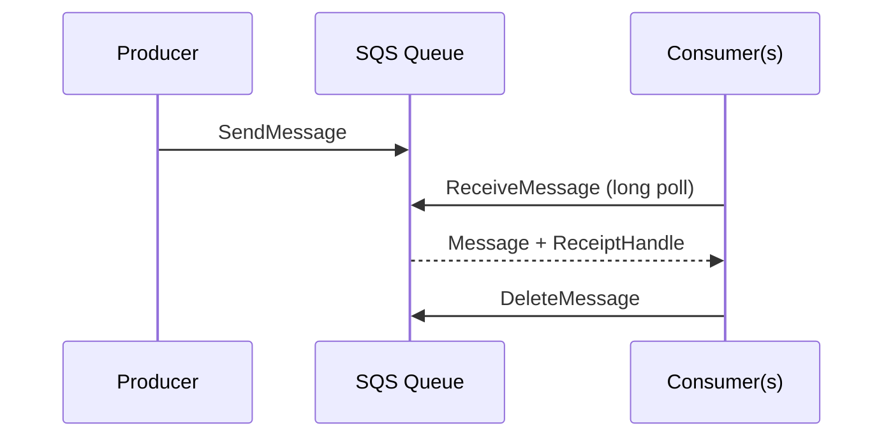
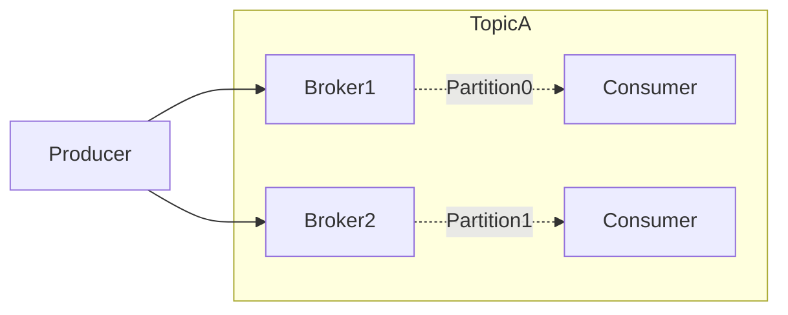

# AWS SQS

## 1. SQS 개요

### 정의

* **SQS**는 AWS에서 제공하는 **완전관리형 메시지 큐 서비스**입니다.
* 애플리케이션, 마이크로서비스, 서버리스 기능 간 **비동기 통신**을 가능하게 합니다.
* 메시지를 안전하게 저장하고, 소비자가 처리할 때까지 유지합니다.



---

## 2. SQS의 주요 특징

| 항목        | 설명                             |
| --------- | ------------------------------ |
| **완전관리형** | 서버, 인프라 관리 불필요                 |
| **확장성**   | 초당 수천\~수만 개 메시지 처리 가능          |
| **보안**    | IAM 권한 제어, KMS 암호화(전송/저장)      |
| **내결함성**  | 여러 AZ에 복제 저장                   |
| **유형**    | **표준 큐(Standard)**, **FIFO 큐** |

### 표준 큐 (Standard Queue)

* **최대 처리량**, **최소 1회 이상** 전달(중복 가능성 O)
* 순서 보장이 필요 없을 때 사용

### FIFO 큐

* **순서 보장**, **정확히 1회** 전달语 (*exactly-once processing* 목표)
* TPS 제한(기본 **3000 msg/sec with batching**)
* 필수 속성: `MessageGroupId` (그룹별 순서 보장), 선택: `MessageDeduplicationId`

---

## 3. 동작 방식 (핵심 개념)

1. **Producer**: 메시지 전송
2. **Queue**: 메시지 저장
3. **Consumer**: 메시지 수신 및 처리
4. **Visibility Timeout**: 처리 중 다른 Consumer가 같은 메시지를 읽지 못하도록 잠금
5. 처리 완료 후 **DeleteMessage**로 큐에서 삭제

> **Idempotency** 키/디듀플리케이션으로 중복 전송/재시도에도 안전하게 설계 필요

---

## 4. 사용 사례

* 마이크로서비스 간 비동기 통신
* 이벤트 버퍼링(스파이크 완충)
* 비동기 작업 처리(이미지 처리, 로그 적재)
* 서버리스 워크플로우(Lambda, Step Functions)와 결합

---

## 5. 실습 예제

### 5.1 큐 생성 (CLI)

```bash
aws sqs create-queue --queue-name my-queue
```

출력 예:

```json
{
  "QueueUrl": "https://sqs.ap-northeast-2.amazonaws.com/123456789012/my-queue"
}
```

### 5.2 Python (boto3)

```python
import boto3

# SQS 클라이언트 생성
sqs = boto3.client('sqs', region_name='ap-northeast-2')
queue_url = 'https://sqs.ap-northeast-2.amazonaws.com/123456789012/my-queue'

# 1) 메시지 전송
sqs.send_message(QueueUrl=queue_url, MessageBody='Hello from SQS!')

# 2) 메시지 수신 (Long Polling 권장)
messages = sqs.receive_message(
    QueueUrl=queue_url,
    MaxNumberOfMessages=1,
    WaitTimeSeconds=10  # 0보다 크게(1~20) 설정해 비용 절감 & 빈폴링 방지
)

for message in messages.get('Messages', []):
    print(f"Received: {message['Body']}")
    # 3) 처리 후 삭제
    sqs.delete_message(
        QueueUrl=queue_url,
        ReceiptHandle=message['ReceiptHandle']
    )
```

### 5.3 Lambda 연동

* **SQS → Lambda** 트리거 설정 가능(배치 사이즈/동시성 조절)
* 대량 처리 시 자동 병렬화, **DLQ(Dead-Letter Queue)** 연동으로 실패 메시지 보존

---

## 6. SQS vs SNS

| 항목    | **SQS**              | **SNS**              |
| ----- | -------------------- | -------------------- |
| 모델    | 메시지 **큐**(Pull)      | **Pub/Sub**(Push)    |
| 소비자 수 | 여러 Consumer 가능(각자 큐) | 여러 Subscriber에 동시 푸시 |
| 순서 보장 | FIFO 큐에서 보장          | 보장 안 함               |

---

## 7. 운영 팁 & 주의 사항

* **메시지 보존 기간**: 기본 4일(최대 14일)
* **Visibility Timeout**: 처리시간보다 **조금 길게** (짧으면 중복 처리 위험)
* **Long Polling**(1\~20초) 활성화로 빈폴링/비용 절감
* **배치 처리**: `SendMessageBatch`/`ReceiveMessage` 다건 처리로 **TPS/비용 최적화**
* **DLQ** & **재시도 정책**: 실패 누적 시 격리 → 원인 분석/리플레이
* **FIFO**: `MessageGroupId` 설계, **스루풋 제한** 확인

---

## (부록) Java 예제 (Gradle + AWS SDK v2)

### 1) `build.gradle`

```gradle
plugins { id 'java' }

group = 'com.example'
version = '1.0-SNAPSHOT'

repositories { mavenCentral() }

dependencies {
  implementation 'software.amazon.awssdk:sqs:2.25.38'
}

java {
  toolchain { languageVersion = JavaLanguageVersion.of(17) }
}
```

### 2) `src/main/java/com/example/SqsSendExample.java`

```java
package com.example;

import software.amazon.awssdk.regions.Region;
import software.amazon.awssdk.services.sqs.SqsClient;
import software.amazon.awssdk.services.sqs.model.SendMessageRequest;
import software.amazon.awssdk.services.sqs.model.SendMessageResponse;

public class SqsSendExample {
  public static void main(String[] args) {
    SqsClient sqsClient = SqsClient.builder()
        .region(Region.AP_NORTHEAST_2)
        .build();

    String queueUrl = "https://sqs.ap-northeast-2.amazonaws.com/123456789012/my-queue";

    try {
      SendMessageRequest sendMsgRequest = SendMessageRequest.builder()
          .queueUrl(queueUrl)
          .messageBody("Hello from Java SQS with Gradle!")
          .delaySeconds(0)
          .build();

      SendMessageResponse response = sqsClient.sendMessage(sendMsgRequest);
      System.out.println("Message sent! ID: " + response.messageId());
    } finally {
      sqsClient.close();
    }
  }
}
```

### 3) 실행

```bash
gradle build
# (application 플러그인 추가 시) gradle run
```

### 4) FIFO 큐 전송 예시

```java
SendMessageRequest req = SendMessageRequest.builder()
  .queueUrl(queueUrl)
  .messageBody("Hello FIFO Queue")
  .messageGroupId("group1") // 필수
  .build();
```

---

# Redis & Amazon ElastiCache for Redis

## 1. Redis란?

### 개념

* **Redis**(REmote DIctionary Server)는 **오픈소스 인메모리 데이터 저장소**.
* Key-Value 기반, 다양한 자료구조(String, List, Set, Sorted Set, Hash, Stream 등) 지원.
* **매우 빠른** 읽기/쓰기(밀리초) 성능.

### 특징

1. 고속 처리 · 2) 다양한 자료구조 · 3) **퍼시스턴스**(RDB/AOF) · 4) **Pub/Sub** · 5) 복제/클러스터링

### 주요 사용 사례

* 세션 저장소, 캐시, 실시간 순위/카운팅, 메시지 큐/알림, IoT 수집 등

---

## 2. Amazon ElastiCache for Redis

### 개념

* AWS에서 제공하는 **관리형 Redis**.
* 설치/운영/패치/백업/모니터링/확장을 AWS가 담당.

### 장점

* **서버 관리 불필요**, **Multi-AZ 자동 장애복구**, **보안 통합(VPC/SG/IAM/KMS/TLS)**,
* **클러스터 모드(샤딩)**, CloudWatch 모니터링, 백업/스냅샷, Global Datastore(멀티리전)

### 사용 예시

* 세션 스토어, 캐시 계층(RDS/DynamoDB 앞), 실시간 분석, Pub/Sub 알림

---

## 3. 비교 요약

| 항목    | **Redis OSS** | **ElastiCache for Redis** |
| ----- | ------------- | ------------------------- |
| 설치/운영 | 직접 관리         | AWS가 관리                   |
| 확장    | 수동 튜닝         | 콘솔/CLI 자동 확장(클러스터 모드)     |
| 백업    | 직접 구현         | 자동 스냅샷/복구                 |
| 보안    | 직접 구성         | VPC/SG/IAM/KMS/TLS        |
| 가용성   | 수동 구성         | Multi-AZ + 자동 페일오버        |

---

## 4. 시작하기 (요약)

1. 콘솔에서 **Redis 클러스터 생성**(엔진·배포 모드·AZ 선택)
2. 보안그룹/서브넷 설정 → 엔드포인트 확인
3. 애플리케이션에서 연결

**Python 예시**

```python
import redis
r = redis.Redis(host='your-redis-endpoint.amazonaws.com', port=6379, decode_responses=True)
r.set('user:1', 'Jaden')
print(r.get('user:1'))
```

---

## [실습]

### 1) 저장 (`redis_save.py`)

```python
import os, json, redis
try:
  from dotenv import load_dotenv; load_dotenv()
except ModuleNotFoundError:
  pass
REDIS_HOST = os.getenv("REDIS_HOST", "my-redis.xxxxxx.apn2.cache.amazonaws.com")
REDIS_PORT = int(os.getenv("REDIS_PORT", "6379"))
r = redis.Redis(host=REDIS_HOST, port=REDIS_PORT, decode_responses=True, socket_timeout=5)

def save_data(key: str, value: dict):
  try:
    r.set(key, json.dumps(value))
    print(f"[OK] 저장: {key} -> {value}")
  except redis.exceptions.RedisError as e:
    print(f"[ERROR] Redis 저장 실패: {e}")

if __name__ == "__main__":
  save_data("user:1", {"name": "Jaden", "role": "admin"})
```

### 2) 조회 (`redis_get.py`)

```python
import os, json, redis
try:
  from dotenv import load_dotenv; load_dotenv()
except ModuleNotFoundError:
  pass
REDIS_HOST = os.getenv("REDIS_HOST", "my-redis.xxxxxx.apn2.cache.amazonaws.com")
REDIS_PORT = int(os.getenv("REDIS_PORT", "6379"))
r = redis.Redis(host=REDIS_HOST, port=REDIS_PORT, decode_responses=True, socket_timeout=5)

def get_data(key: str):
  try:
    value = r.get(key)
    if value:
      print(f"[OK] 조회: {key} -> {json.loads(value)}"); return json.loads(value)
    print(f"[WARN] 없음: {key}"); return None
  except redis.exceptions.RedisError as e:
    print(f"[ERROR] Redis 조회 실패: {e}"); return None

if __name__ == "__main__":
  get_data("user:1")
```

**환경변수(.env)**

```
REDIS_HOST=my-redis.xxxxxx.apn2.cache.amazonaws.com
REDIS_PORT=6379
```

> Lambda에서 사용 시 `redis` 패키지를 **Layer**로 추가 필요. 캐시는 **cache-aside** 패턴, 만료(TTL), **eviction 정책**(allkeys-lru 등)까지 함께 설계 필요

---

# Apache Kafka

## 1. Kafka란?

* 오픈소스 **분산 스트리밍 플랫폼**.
* 실시간 데이터 **발행/구독(Pub/Sub)**.
* 고가용성·확장성·내결함성, 초당 **수백만 메시지** 처리.

## 2. 핵심 아키텍처

| 구성 요소               | 설명                                  |
| ------------------- | ----------------------------------- |
| **Producer**        | 데이터를 Kafka로 보내는 클라이언트               |
| **Broker**          | Kafka 서버(메시지 저장/제공)                 |
| **Topic**           | 메시지 카테고리(채널)                        |
| **Partition**       | 병렬성 향상을 위한 물리 분할 단위(파티션별 **순서 보장**) |
| **Consumer**        | 메시지 구독/처리                           |
| **Consumer Group**  | 소비자 병렬 처리와 부하분산 단위                  |
| **ZooKeeper/KRaft** | 메타데이터·컨트롤러 관리(신규 버전은 **KRaft**)     |



### 메시지 전달 보장

* **At-least-once**(기본, 중복 가능)
* **At-most-once**(손실 가능)
* **Exactly-once**(설정 복잡, idempotent + transactional)

---

## 3. 실습 빠른 흐름

### Docker(로컬)

* Zookeeper + Kafka 실행 → Topic 생성 → Producer/Consumer로 송수신

### Kafka CLI 예시

```bash
# 토픽 생성
kafka-topics.sh --create --topic test --bootstrap-server localhost:9092 --partitions 3
# 전송
kafka-console-producer.sh --topic test --bootstrap-server localhost:9092
# 수신
kafka-console-consumer.sh --topic test --bootstrap-server localhost:9092 --from-beginning
```

---

## 4. 설계·튜닝 핵심

* **Partitions**: 병렬성/처리량 스케일. 너무 많으면 오버헤드↑
* **Replication**: 가용성(리더/팔로워). 일반적으로 **RF=3**
* Producer: `acks=all`, `linger.ms`, `batch.size`, `compression.type`
* Consumer: **오프셋 커밋**(auto/manual), **리밸런싱** 대비 설계
* 토픽 **정책**: `retention.ms`, **log compaction** (키 최신 상태 유지)
* **Idempotent producer** + **Transactions**로 EOS 달성

---

## (옵션) EC2에 Kafka 직접 설치

### 1) EC2 준비

* AMI: **Amazon Linux 2023**, t3.medium(≥4GB), 20GB+
* SG: 22(SSH), 9092(Kafka), 2181(ZK)

```bash
ssh -i my-key.pem ec2-user@<EC2-PUBLIC-IP>
```

### 2) Java 설치

```bash
sudo dnf update -y
sudo dnf install -y java-17-amazon-corretto
java -version
```

### 3) Kafka 다운로드

```bash
wget https://downloads.apache.org/kafka/3.7.0/kafka_2.13-3.7.0.tgz
tar -xzf kafka_2.13-3.7.0.tgz
sudo mv kafka_2.13-3.7.0 /opt/kafka
sudo chown -R ec2-user:ec2-user /opt/kafka
```

### 4) 외부 접속 설정

```bash
nano /opt/kafka/config/server.properties
# EC2 퍼블릭 IP로
advertised.listeners=PLAINTEXT://<EC2-PUBLIC-IP>:9092
```

### 5) 실행

```bash
# 터미널 1
/opt/kafka/bin/zookeeper-server-start.sh /opt/kafka/config/zookeeper.properties
# 터미널 2
/opt/kafka/bin/kafka-server-start.sh /opt/kafka/config/server.properties
```

### 6) 토픽·송수신

```bash
/opt/kafka/bin/kafka-topics.sh --create --topic test-topic --bootstrap-server localhost:9092 --partitions 1 --replication-factor 1
/opt/kafka/bin/kafka-console-producer.sh --topic test-topic --bootstrap-server localhost:9092
/opt/kafka/bin/kafka-console-consumer.sh --topic test-topic --from-beginning --bootstrap-server localhost:9092
```

### 7) systemd 등록(선택)

`/etc/systemd/system/zookeeper.service`, `/etc/systemd/system/kafka.service` 작성 → `systemctl enable --now zookeeper kafka`

> 운영 환경에선 **프로비저닝·패치·모니터링** 부담이 큼. 가능하면 **AWS MSK**를 권장.

---

# AWS MSK (Managed Streaming for Apache Kafka)

## MSK란?

**Amazon MSK**는 AWS의 **완전관리형 Kafka** 서비스입니다. 설치/운영/패치/모니터링을 AWS가 담당하여, Kafka를 **안정적이고 확장 가능**하게 운영할 수 있습니다.

## 왜 MSK인가?

| 항목      | 전통적 Kafka(EC2)     | **AWS MSK**             |
| ------- | ------------------ | ----------------------- |
| 설치/구성   | 수동                 | 자동 프로비저닝                |
| 클러스터 관리 | 직접 운영              | 완전관리형(패치/장애조치/스케일)      |
| 모니터링    | 별도 구성              | **CloudWatch** 통합       |
| 보안      | SSL/IAM/mTLS 직접 구성 | **VPC/IAM/KMS/TLS** 일체형 |
| 업그레이드   | 직접                 | 자동/선택 업그레이드             |

## MSK Standard vs MSK Serverless

| 항목 | **MSK Standard** | **MSK Serverless** |
| -- | ---------------- | ------------------ |
| 구성 | EC2 기반 브로커       | 완전 추상화(브로커 비가시)    |
| 확장 | 수동(브로커 수)        | **자동 확장**          |
| 과금 | 인스턴스/스토리지/전송     | **처리량(입출력)** 기준    |
| 대상 | 예측 가능한 워크로드      | 트래픽 변동/초기 개발       |
| 지연 | 낮음               | 상대적으로 높을 수 있음      |

## 과금 개요

* **Standard**: 브로커 EC2 시간 + EBS + 네트워크
* **Serverless**: **메시지 처리량 기반** (input+output)

## 보안

* VPC 내부 통신(프라이빗), **TLS**, **KMS 암호화**, **IAM 인증**(Serverless 필수), **SCRAM/mTLS**(Provisioned 옵션)

---

## 클라이언트 연결 (IAM 인증, Serverless 예)

### 1) 의존성(JAR)

```bash
# Java 17 + Kafka 3.7.0 가정
MSK_IAM_VER=2.0.3
curl -L -o libs/aws-msk-iam-auth-${MSK_IAM_VER}-all.jar \
  https://repo1.maven.org/maven2/software/amazon/msk/aws-msk-iam-auth/${MSK_IAM_VER}/aws-msk-iam-auth-${MSK_IAM_VER}-all.jar
```

### 2) `client-iam.properties`

```
security.protocol=SASL_SSL
sasl.mechanism=AWS_MSK_IAM
sasl.jaas.config=software.amazon.msk.auth.iam.IAMLoginModule required;
sasl.client.callback.handler.class=software.amazon.msk.auth.iam.IAMClientCallbackHandler
ssl.endpoint.identification.algorithm=https
```

> IAM 권한: 최소 `kafka-cluster:Connect`, `DescribeCluster`; 토픽 R/W는 `DescribeTopic`, `ReadData`, `WriteData` 추가.

### 3) 네트워크 점검

```bash
nc -vz <bootstrap-host> 9098
# 또는
openssl s_client -connect <bootstrap-host>:9098 -servername <bootstrap-host> </dev/null
```

### 4) CLI 사용

```bash
# 브로커 API 버전
bin/kafka-broker-api-versions.sh \
  --bootstrap-server boot-xxxx.kafka-serverless.ap-northeast-2.amazonaws.com:9098 \
  --command-config client-iam.properties

# 토픽 목록
bin/kafka-topics.sh \
  --bootstrap-server boot-xxxx:9098 \
  --command-config client-iam.properties \
  --list

# Producer / Consumer
bin/kafka-console-producer.sh \
  --bootstrap-server <bootstrap>:9098 \
  --producer.config client-iam.properties \
  --topic demo-topic

bin/kafka-console-consumer.sh \
  --bootstrap-server <bootstrap>:9098 \
  --consumer.config client-iam.properties \
  --topic demo-topic --from-beginning
```

---

## 실무 시나리오

* **마이크로서비스 이벤트 스트리밍**(서비스 간 비동기 통신)
* **로그/클릭스트림 수집** → S3 데이터 레이크 → Glue/EMR 분석
* **CDC(Change Data Capture)**: Debezium → MSK → 소비자(ETL/서빙)

---

## Kafka Connect 한눈에

* **Source Connector**: 외부 시스템 → Kafka (예: MySQL → Kafka)
* **Sink Connector**: Kafka → 외부 시스템 (예: Kafka → S3/Elasticsearch/Redshift)
* 반복 구현 없이 **연결/스케줄/에러 처리**를 표준화

---

# 아키텍처 비교 요약

| 요구 사항                      | 추천                           |
| -------------------------- | ---------------------------- |
| **단순 비동기 처리/버퍼링**          | **SQS** + Lambda/EC2         |
| **고속 캐시/세션/실시간 카운팅**       | **Redis(ElastiCache)**       |
| **대규모 스트리밍/재생·보관/정확한 처리语** | **Kafka / AWS MSK**          |
| **완전관리 Kafka**             | **MSK(Serverless/Standard)** |

---

# 체크리스트

* **SQS**: Long Polling, DLQ, Visibility Timeout 튜닝, 배치 크기/동시성 최적화, Idempotency 키
* **Redis**: TTL/eviction 정책, 캐시 미스 전략(cache-aside), 장애/재시작 시 warm-up, 모니터링(CPU/mem/evicted\_keys)
* **Kafka/MSK**: 파티션/복제계수, acks=all, idempotent producer, 컨슈머 오프셋 관리, 토픽 보관/컴팩션 정책, CloudWatch/Alert
* **보안**: KMS/TLS/IAM 최소권한, VPC 엔드포인트, 시크릿 관리(Secrets Manager/Parameter Store)

---

# 마무리

* **SQS**는 단순하고 탄탄한 **메시지 큐**로 비동기화를 쉽게 합니다.
* **Redis(ElastiCache)**는 **초저지연 캐시/데이터 구조**로 성능을 끌어올립니다.
* **Kafka**는 **대규모 스트리밍/재생 가능**한 로그 기반 플랫폼이며, 이를 운영형으로 쓰려면 **MSK**가 좋은 선택지입니다.
