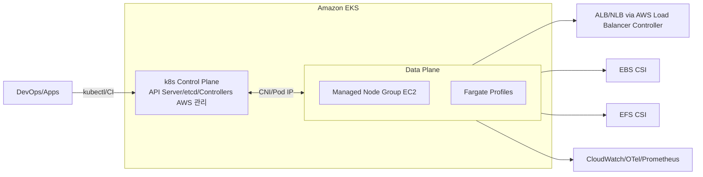

쿠버네티스(Kubernetes, K8s)는 컨테이너 애플리케이션의 **배포·확장·운영을 자동화**하는 표준 플랫폼입니다. AWS에서는 이 쿠버네티스를 완전관리형으로 제공하는 **Amazon EKS(Elastic Kubernetes Service)**를 통해, 제어plane 운영 부담 없이 안전하고 일관된 클러스터를 구축·운영할 수 있습니다.

이 글은 다음을 모두 담습니다.

* K8s 핵심 개념 & 아키텍처
* **EKS 아키텍처와 실전 구성 요소** (네트워킹, 스토리지, 보안, 오토스케일링, 관측성)
* **eksctl로 EKS 빠른 구축** + 필수 애드온 설치 예시
* **EC2에서 kubeadm로 단일 노드 실습**(학습용) — 제공된 스크립트 보완 버전 포함
* 체크리스트/트러블슈팅 꿀팁

---

# 1) 쿠버네티스 한눈에 보기

## 왜 쿠버네티스인가?

* **자동 배포/롤백**: 롤링 업데이트, 실패 시 자동 롤백
* **오토스케일**: 트래픽 증가에 자동 대응 (HPA/VPA/Cluster Autoscaler)
* **자기 치유**: 비정상 Pod 자동 교체/재시작
* **서비스 디스커버리/로드밸런싱**: 서비스 단위로 안정적인 접근
* **스토리지/시크릿 관리**: 다양한 스토리지·비밀 관리 연계

## 기본 오브젝트

* **Pod**(최소 실행 단위), **Deployment**(배포전략), **Service**(내/외부 노출), **ConfigMap/Secret**, **Ingress**, **Namespace** 등

## 아키텍처 요약

```text
[ Control Plane ]
 ├─ kube-apiserver   (모든 요청 관문)
 ├─ etcd             (상태 저장 KV 스토어)
 ├─ scheduler        (Pod 배치 결정)
 └─ controller-mgr   (원하는 상태 유지)

[ Worker Node ]
 ├─ kubelet          (노드 에이전트)
 ├─ kube-proxy       (서비스 네트워킹)
 └─ Container Runtime(containerd 등)
      └─ Pods → Containers
```

---

# 2) EKS 핵심 개념

## EKS 아키텍처(요약 다이어그램)



### Control Plane

* **완전관리형**: 고가용성, 자동 패치/백업. VPC 외부에 AWS가 운영.

### Data Plane(선택)

* **Managed Node Group(EC2)**: 버전/AMI 롤링, 온디맨드·스팟 혼합 가능
* **Fargate**: 서버리스 Pod 실행(노드 운영 無), 빌드·잡·저부하 워크로드에 적합

### Add-ons(관리형/수동)

* **VPC CNI, CoreDNS, kube-proxy**를 *Managed Add-on*으로 버전 고정/업그레이드 관리
* 필수 애드온: **EBS/EFS CSI, AWS Load Balancer Controller, Metrics Server, (선택) Karpenter/Cluster Autoscaler, OpenTelemetry/Prometheus**

---

# 3) EKS 네트워킹 제대로 이해하기

## VPC CNI (aws-node)

* **Pod에 VPC IP를 직접 할당**. 노드 ENI/Prefix Delegation 설정에 따라 Pod 수용량이 달라짐.
* 고밀도 환경은 **Prefix Delegation 활성화** 및 **보조 CIDR**로 여유 확보 권장.

## 보안그룹

* **Cluster Security Group**(제어plane↔노드), **Node SG**, (선택)**Security Group for Pods**로 세분화 가능.

## 외부 노출

* **Service Type**: ClusterIP / NodePort / LoadBalancer(NLB/ALB)
* **Ingress + AWS Load Balancer Controller**로 L7 라우팅(도메인·경로 기반) 권장

```yaml
apiVersion: networking.k8s.io/v1
kind: Ingress
metadata:
  name: web
  annotations:
    kubernetes.io/ingress.class: alb
    alb.ingress.kubernetes.io/scheme: internet-facing
spec:
  rules:
    - http:
        paths:
          - path: /
            pathType: Prefix
            backend:
              service:
                name: web
                port: { number: 80 }
```

---

# 4) 스토리지 전략

## EBS CSI (블록)

* StatefulSet, DB 등 **AZ 종속** 워크로드에 적합. StorageClass로 동적 프로비저닝.

```yaml
apiVersion: storage.k8s.io/v1
kind: StorageClass
metadata:
  name: gp3
provisioner: ebs.csi.aws.com
parameters:
  type: gp3
reclaimPolicy: Delete
allowVolumeExpansion: true
volumeBindingMode: WaitForFirstConsumer
```

## EFS CSI (공유)

* 다수 Pod가 공유 읽기/쓰기 필요 시 적합(웹 자산 등). **AZ 무관 공유**.

---

# 5) 권한·보안

## 인증/인가

* **aws-iam-authenticator**: IAM 사용자/역할을 K8s RBAC에 매핑(`aws-auth` ConfigMap)
* **IRSA(IAM Roles for Service Accounts)**: Pod에 **세분화된 IAM 권한** 부여(비밀키 無)

```yaml
apiVersion: v1
kind: ServiceAccount
metadata:
  name: s3-reader
  annotations:
    eks.amazonaws.com/role-arn: arn:aws:iam::<ACC>:role/sa-s3-read
---
apiVersion: apps/v1
kind: Deployment
metadata:
  name: app
spec:
  template:
    spec:
      serviceAccountName: s3-reader
```

## Pod 보안

* **Pod Security Admission**(Baseline/Restricted), SecurityContext(cap drop, runAsNonRoot)
* **Secrets Store CSI + AWS Secrets Manager**로 시크릿 마운트
* **프라이빗 클러스터** & API 엔드포인트 제한, ECR 프라이빗

---

# 6) 오토스케일링

| 계층  | 도구                     | 포인트                              |
| --- | ---------------------- | -------------------------------- |
| Pod | **HPA**                | CPU/메모리/외부 지표 기반 레플리카 증감         |
| Pod | **VPA**                | 컨테이너 리소스 권장치 산출/적용               |
| 노드  | **Cluster Autoscaler** | 노드그룹 증감(빈패드/스케줄 실패 시)            |
| 노드  | **Karpenter**          | 워크로드 기반 즉시 노드 프로비저닝·정리(비용/속도 유리) |

---

# 7) 관측성·로깅

* **CloudWatch Container Insights**: 메트릭/로그 수집(에이전트/EMF)
* **Prometheus/Grafana**: 메트릭 표준(AMP/AMG 관리형도 선택지)
* **OpenTelemetry**: 추적/로그/메트릭 통합 파이프라인 (X-Ray/OTLP)

---

# 8) 업그레이드 전략

1. **Control Plane** 버전 업(콘솔/CLI)
2. **Managed Node Group** 롤링 업데이트(AMI/버전)
3. **Add-on**(VPC CNI, CoreDNS, kube-proxy, CSI) 순서대로

> *워크로드 중단 최소화*를 위해 블루그린 노드그룹, 서지 업그레이드, PDB/PDB 고려

---

# 9) 비용 최적화 팁

* **스팟 + 온디맨드 혼합** 노드그룹, **Karpenter로 인스턴스 선택 자동화**
* HPA/CA로 과도한 프로비저닝 방지, 적절한 **리소스 리밋/리퀘스트**
* **ALB/NLB/데이터 전송** 비용 체킹, **EBS gp3** 전환

---

# 10) 실습: eksctl로 EKS 빠르게 만들기

> **사전 준비**: AWS CLI, eksctl, kubectl 설치 및 자격증명, 기본 VPC(또는 지정 VPC/Subnet)

## 10-1) 클러스터 정의 파일

```yaml
# eksctl-cluster.yaml
apiVersion: eksctl.io/v1alpha5
kind: ClusterConfig
metadata:
  name: minji-eks
  region: ap-northeast-2
  version: "1.29"
vpc:
  # 기존 VPC/서브넷을 지정하려면 여기 매핑
managedNodeGroups:
  - name: mng-spot
    instanceTypes: ["m5.large","m5a.large","c6i.large"]
    desiredCapacity: 2
    minSize: 1
    maxSize: 5
    spot: true
    labels: { role: app }
addons:
  - name: vpc-cni
  - name: kube-proxy
  - name: coredns
iam:
  withOIDC: true
```

```bash
# 생성
eksctl create cluster -f eksctl-cluster.yaml

# 컨텍스트 확인
kubectl get nodes -o wide
```

## 10-2) 필수 애드온 설치

### AWS Load Balancer Controller(IRSA)

```bash
# IRSA용 IAM 정책/역할 생성 (eksctl 헬퍼 사용)
eksctl utils associate-iam-oidc-provider --region ap-northeast-2 --cluster minji-eks --approve
eksctl create iamserviceaccount \
  --cluster minji-eks \
  --namespace kube-system \
  --name aws-load-balancer-controller \
  --attach-policy-arn arn:aws:iam::aws:policy/ElasticLoadBalancingFullAccess \
  --approve

# Helm 설치	hel m repo add eks https://aws.github.io/eks-charts
helm install aws-load-balancer-controller eks/aws-load-balancer-controller \
  -n kube-system \
  --set clusterName=minji-eks \
  --set serviceAccount.create=false \
  --set serviceAccount.name=aws-load-balancer-controller
```

### EBS CSI Driver(관리형 Add-on 권장)

```bash
aws eks create-addon \
  --cluster-name minji-eks \
  --addon-name aws-ebs-csi-driver
```

### Metrics Server

```bash
kubectl apply -f https://github.com/kubernetes-sigs/metrics-server/releases/latest/download/components.yaml
```

> (선택) **Karpenter**로 노드 최적화, **AMP/AMG**로 관측성 관리형 전환 가능

## 10-3) 샘플 앱 배포/Ingress

```bash
kubectl create deployment web --image=nginx:1.27
kubectl expose deployment web --port 80 --type ClusterIP
```

```yaml
apiVersion: networking.k8s.io/v1
kind: Ingress
metadata:
  name: web
  annotations:
    kubernetes.io/ingress.class: alb
    alb.ingress.kubernetes.io/target-type: ip
spec:
  rules:
  - http:
      paths:
      - path: /
        pathType: Prefix
        backend:
          service:
            name: web
            port:
              number: 80
```

```bash
kubectl apply -f ingress.yaml
# 생성된 ALB 주소 확인 후 접속
kubectl get ingress web
```

---

# 11) (학습용) EC2에 kubeadm로 단일 노드 설치

> 목적: K8s 내부 동작을 손에 익히기 위한 **온프레미스 스타일** 실습. *운영은 EKS 권장*.

## 준비물

* EC2 **Amazon Linux 2023**, t3.medium 권장
* 보안그룹 인바운드: **SSH(22)**, **API 서버(6443)**, **NodePort(30000–32767)**
* `sudo` 권한 계정

## 필수 보완 사항 요약

1. **SELinux**: AL2023 기본 *permissive*. 필요 시 `sed`로 안전 변경, 무분별한 파일 덮어쓰기 금지.
2. **cgroup v2 + containerd SystemdCgroup**: `SystemdCgroup=true` 필수.
3. **Swap 비활성**: kubelet 호환성 위해 꺼두기 권장.
4. **Calico 호환**: v1.31\~v1.33 ⇄ v3.30 계열 안전.

## 정리된 설치 스크립트(수정본)

```bash
### 1) 커널 모듈/네트워크, SELinux, containerd
cat <<'EOF' | sudo tee /etc/modules-load.d/k8s.conf
overlay
br_netfilter
EOF
sudo modprobe overlay && sudo modprobe br_netfilter

cat <<'EOF' | sudo tee /etc/sysctl.d/99-kubernetes-cri.conf
net.bridge.bridge-nf-call-iptables=1
net.bridge.bridge-nf-call-ip6tables=1
net.ipv4.ip_forward=1
EOF
sudo sysctl --system

# SELinux 상태 확인(기본 permissive), 필요 시에만 안전 교체
getenforce || true
# sudo sed -i 's/^SELINUX=.*/SELINUX=permissive/' /etc/selinux/config
# sudo setenforce 0 || true

sudo dnf -y update && sudo dnf -y install containerd
sudo mkdir -p /etc/containerd
containerd config default | sudo tee /etc/containerd/config.toml >/dev/null
sudo sed -i 's/SystemdCgroup = false/SystemdCgroup = true/' /etc/containerd/config.toml
sudo systemctl enable --now containerd

# Swap 비활성
sudo swapoff -a
sudo sed -ri 's/^(\s*[^#].*\sswap\s)/# \1/' /etc/fstab
```

```bash
### 2) kubeadm/kubelet/kubectl 설치 (v1.33 예시)
cat <<'EOF' | sudo tee /etc/yum.repos.d/kubernetes.repo
[kubernetes]
name=Kubernetes
baseurl=https://pkgs.k8s.io/core:/stable:/v1.33/rpm/
enabled=1
gpgcheck=1
gpgkey=https://pkgs.k8s.io/core:/stable:/v1.33/rpm/repodata/repomd.xml.key
EOF
sudo dnf -y install kubelet kubeadm kubectl --disableexcludes=kubernetes
sudo systemctl enable kubelet
```

```bash
### 3) 컨트롤 플레인 초기화
sudo reboot
# 재접속 후, 단일 NIC가 아니면 --apiserver-advertise-address=<프라이빗IP> 추가
sudo kubeadm init --pod-network-cidr=192.168.0.0/16

mkdir -p $HOME/.kube
sudo cp -i /etc/kubernetes/admin.conf $HOME/.kube/config
sudo chown $(id -u):$(id -g) $HOME/.kube/config
```

```bash
### 4) Calico 설치 & 단일 노드 테인트 제거
kubectl apply -f https://raw.githubusercontent.com/projectcalico/calico/v3.30.2/manifests/calico.yaml
kubectl -n kube-system get pods -w
kubectl taint nodes --all node-role.kubernetes.io/control-plane- || true
```

```bash
### 5) 샘플 NGINX 배포/노출
kubectl create deployment web --image=nginx:1.27
kubectl expose deployment web --type=NodePort --port=80
kubectl get svc web -o wide
# 보안그룹에 30000–32767/tcp 열고 외부에서 http://<EC2_PUBLIC_IP>:<NODE_PORT>
```

### 빠른 점검 체크리스트

* `SystemdCgroup=true` 미적용 시 CNI/etcd CrashLoop → `containerd`·`kubelet` 재시작
* `kubectl get nodes`, `kubectl -n kube-system get pods`가 Ready/Running?
* NodePort 접근 불가 → 보안그룹/NACL/서브넷 라우팅 확인

---

# 12) 트러블슈팅 & 체크리스트

* **DNS 이슈**: CoreDNS Pending/Crash → 노드 IP/Pod CIDR 충돌, CNI 버전 맞춤
* **이미지 풀 실패**: ECR 권한/프라이빗 서브넷 NAT 확인
* **HPA 미동작**: Metrics Server 설치·TLS 옵션 확인
* **IRSA 안 먹힘**: OIDC Provider 연결, ServiceAccount annotation/정책 확인
* **ALB Ingress 실패**: 컨트롤러 이벤트, ACM 인증서, 서브넷 태깅(`kubernetes.io/role/elb`) 점검
