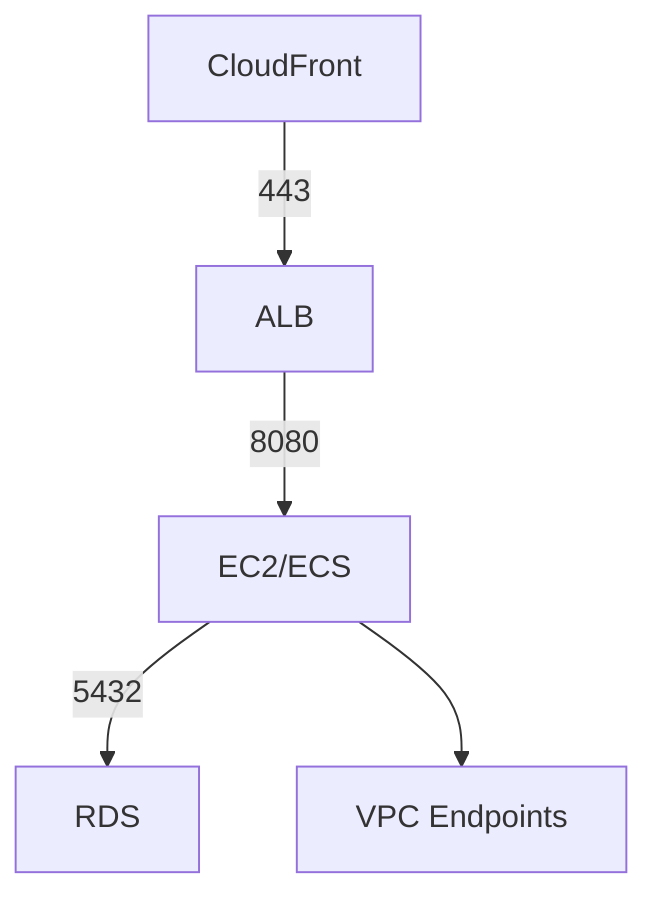

## 개요

이 글에서는 **Kickytime 프로젝트**를 AWS 환경에 배포하면서 구성한 네트워크 아키텍처, 보안 그룹, VPC 엔드포인트, IAM, KMS, RDS 접근 방식 등 **운영 인프라 측면**을 정리합니다. 단순히 동작하는 배포를 넘어, **보안성과 운영 효율성**을 함께 고려했습니다.

---

## 네트워크 아키텍처

첨부한 다이어그램은 VPC 내부 구성입니다.

* **퍼블릭 서브넷**: ALB, NAT 게이트웨이 배치
* **프라이빗 서브넷**: EC2(/api/matches*), ECS(/api/users*), RDS(PostgreSQL)
* **CloudFront → ALB → App(ECS/EC2) → RDS** 흐름
* 관리 트래픽은 **SSM Session Manager**와 **VPC 엔드포인트**를 통해 처리



---

## 보안 그룹 설정

서비스별 최소 권한 원칙(Least Privilege)을 적용했습니다.

| 이름                    | 대상        | 포트   | 소스                     | 설명                        |
| --------------------- | --------- | ---- | ---------------------- | ------------------------- |
| **kickytime-alb-sg**  | ALB       | 443  | CloudFront Prefix List | CloudFront → ALB 허용       |
|                       |           | 80   | 0.0.0.0/0              | HTTP → HTTPS 리다이렉트 용 (선택) |
| **kickytime-app-sg**  | EC2/ECS   | 8080 | ALB SG                 | ALB → App (헬스체크 포함)       |
| **kickytime-rds-sg**  | RDS       | 5432 | App SG                 | App → DB 접근 허용            |
| **kickytime-vpce-sg** | VPC 엔드포인트 | 443  | App SG                 | SSM/Logs/ECR/KMS 등 내부 통신  |

---

## VPC 엔드포인트 구성

프라이빗 서브넷 리소스들이 NAT 없이도 AWS 서비스에 접근할 수 있도록 **Interface Endpoint**를 생성했습니다.

* `com.amazonaws.ap-northeast-2.ecr.api`
* `com.amazonaws.ap-northeast-2.ecr.dkr`
* `com.amazonaws.ap-northeast-2.logs`
* `com.amazonaws.ap-northeast-2.secretsmanager`
* `com.amazonaws.ap-northeast-2.kms`
* `com.amazonaws.ap-northeast-2.ssm`
* `com.amazonaws.ap-northeast-2.ssmmessages`
* `com.amazonaws.ap-northeast-2.ec2messages`

이로써 App 서버가 **이미지 Pull, 로그 전송, 비밀 관리, KMS 암호화/복호화**를 모두 사설 네트워크 내에서 처리 가능하게 되었습니다.

---

## RDS 접근 (SSM 포트포워딩)

운영 환경에서는 RDS를 퍼블릭하게 노출하지 않고, SSM을 활용한 포트포워딩으로만 접근합니다.

```bash
aws ssm start-session \
  --region ap-northeast-2 \
  --target EC2인스턴스ID \
  --document-name AWS-StartPortForwardingSessionToRemoteHost \
  --parameters '{"host":["RDS엔드포인트"],"portNumber":["5432"],"localPortNumber":["55432"]}'
```

👉 이렇게 하면 **로컬의 55432 포트 ↔ RDS 5432**로 안전하게 연결됩니다.

---

## IAM 권한 관리

`kickytime 전용 IAM Role`을 생성해 리소스별 최소 권한을 부여했습니다.

* ECS Task Role → Secrets Manager에서 DB 비밀번호 조회
* EC2 Instance Role → SSM/CloudWatch Logs 권한
* Lambda/배포 Role → ECR, ECS, RDS 관리

모든 리소스는 **Project=Kickytime** 태그를 기반으로 IAM 정책과 CloudWatch 로그 그룹을 구분했습니다.

---

## KMS & Secrets Manager

* **KMS Customer Managed Key (CMK)** 생성 → `alias/kickytime-key`
* **RDS 비밀번호**는 Secrets Manager에 저장하고, App은 실행 시 해당 값을 조회
* RDS 암호화, S3 암호화에도 동일한 KMS 키 사용

이로써 데이터 보안과 키 관리가 중앙화되었습니다.

---

## 마무리

이번 배포 환경 구성에서 배운 점:

1. NAT 게이트웨이를 최소화하고 VPC 엔드포인트를 적극 활용하면 비용과 보안 모두 개선 가능
2. ALB → App → DB 흐름에 대해 보안 그룹을 계층적으로 설계하면 트래픽 제어가 명확해짐
3. IAM + KMS + Secrets Manager를 조합해 민감정보(비밀번호, 암호화 키)를 안전하게 관리할 수 있음
