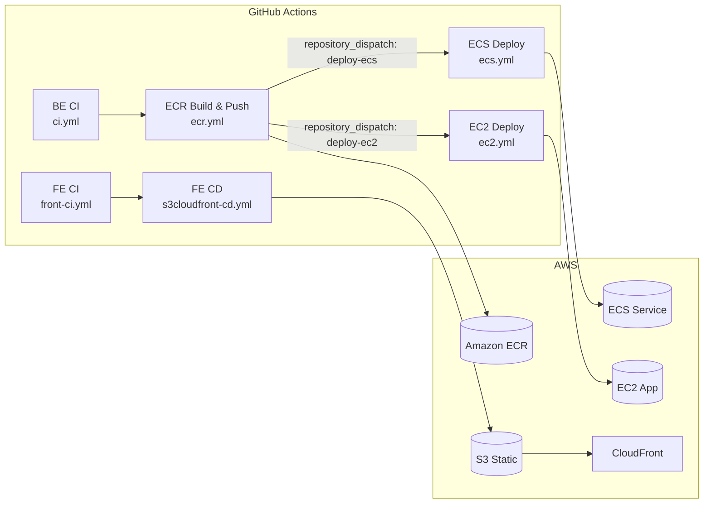

## 개요

이 글은 **Kickytime**의 CI/CD 파이프라인을 정리합니다. **GitHub Actions**에서 **OIDC(연합)** 로 IAM Role을 가정해 **ECR → ECS/EC2**, **S3 + CloudFront**까지 **완전 자동 배포**를 구현했습니다. 백엔드는 **멀티아키(amd64/arm64)** 이미지 빌드, **repository_dispatch**로 **ECR → (ECS/EC2) 파이프라인 연결**, 프론트는 **해시 자산은 장기 캐시, `index.html`만 무효화** 전략을 사용했습니다.

---

## 전체 흐름



---

## 1) 백엔드 CI — `ci.yml`

**트리거**: `push`, `pull_request` to `main`/`develop`
**핵심 단계**

* **JDK 17** 설정(`temurin`), `gradle/actions/setup-gradle@v4` 캐시 적용
* `./gradlew build` (Spotless/Checkstyle/테스트가 `check` 의존으로 함께 수행)
* 테스트 프로필 예시: `SPRING_PROFILES_ACTIVE=test`

> 목적은 *PR에 대한 품질 게이트*. 실패 시 ECR 빌드 파이프라인이 실행되지 않도록 방지합니다.

---

## 2) 백엔드 이미지 빌드/푸시 — `ecr.yml`

**트리거**: `push` to `main` (또는 수동 `workflow_dispatch`)

**핵심 포인트**

* **Buildx + QEMU**로 `linux/amd64, linux/arm64` 동시 빌드/푸시
* 태그 전략: `main` 커밋 기준 `YYYYMMDD-HHMM-<shortsha>` + `latest` (가정)
* **OIDC**로 `aws-actions/configure-aws-credentials@v4` → **로그인 없이 Role Assume**
* **ECR 로그인**: `aws-actions/amazon-ecr-login@v2`
* 푸시 성공 후 **두 갈래 파이프라인을 깨웁니다**:

  * `repository_dispatch: deploy-ecs`(ECS 배포)
  * `repository_dispatch: deploy-ec2`(EC2 롤링)

> 이 구조 덕분에 *빌드와 배포를 분리*하면서도,
> 빌드의 산출물(이미지 URI)을 **payload**로 안전하게 넘길 수 있습니다.

---

## 3) ECS 배포 — `ecs.yml`

**트리거**: `repository_dispatch: deploy-ecs` (ECR 파이프라인이 호출)

**동작 요약**

1. **게이트**: `payload.image_uri` 유효성 검사 → 없으면 중단
2. **현재 Task Definition 조회** → JSON 패치로 **컨테이너 이미지 교체**
3. **플랫폼 고정**: `runtimePlatform.cpuArchitecture=ARM64` 보정 (ARM Fargate 대비)
4. **새 Task Definition 등록** → **Service Update**
5. `aws ecs wait services-stable`로 **안정화 대기** 후 결과 요약 출력

```bash
# 핵심 스텝 요약 (의사 코드)
aws ecs describe-task-definition --task-definition $FAMILY > td.json
jq '.containerDefinitions[0].image = env.PAYLOAD_IMAGE_URI | .runtimePlatform.cpuArchitecture = "ARM64"' td.json > td-new.json
aws ecs register-task-definition --cli-input-json file://td-new.json > td-out.json
aws ecs update-service --cluster $CLUSTER --service $SERVICE --task-definition $(jq -r '.taskDefinition.taskDefinitionArn' td-out.json)
aws ecs wait services-stable --cluster $CLUSTER --services $SERVICE
```

> **롤백**은 간단합니다. 콘솔/CLI에서 **이전 리비전의 Task Definition**으로 `update-service`만 실행하면 됩니다.

---

## 4) EC2 롤링 배포 — `ec2.yml`

**트리거**: `repository_dispatch: deploy-ec2`

**대상 선택 로직**

* **태그로 타깃팅**: `Role=app`
* 상태 필터: `running` + **SSM 온라인** 교집합만 선별

**SSM 명령으로 배포**

* (필요시) **Docker 설치 & 기동**
* **ECR 로그인** 후 최신 이미지 `pull`
* 기존 컨테이너 종료 → 새 컨테이너 실행(`-p 8080:8080`)
* DB 연결 정보는 **GitHub Secrets**에서 주입
* `/actuator/health`로 **로컬 헬스체크 루프**

```bash
# SSM 문서에 전달되는 핵심 명령 (의사 코드)
REG=$(echo "$IMAGE" | cut -d/ -f1)
aws ecr get-login-password | docker login --username AWS --password-stdin $REG
docker rm -f kickytime || true
docker pull "$IMAGE"
docker run -d --name kickytime -p 8080:8080 \
  -e SPRING_DATASOURCE_URL="${{ secrets.DB_URL }}" \
  -e SPRING_DATASOURCE_USERNAME="${{ secrets.DB_USERNAME }}" \
  -e SPRING_DATASOURCE_PASSWORD="${{ secrets.DB_PASSWORD }}" \
  "$IMAGE"
for i in $(seq 1 60); do curl -fsS http://127.0.0.1:8080/actuator/health && break || sleep 2; done
```

> 이 방식은 **ASG + 로컬 컨테이너** 운영에 적합합니다.
> ALB 타겟 그룹 헬스체크 대기시간을 넉넉히 두는 게 안정적입니다.

---

## 5) 프론트엔드 CI — `ci.yml`

**트리거**: `push`/`pull_request` to `main`, `develop`

**핵심 단계**

* Node 설치(예: `setup-node@v4`), `npm ci` 캐시
* `npm run lint` + `npx tsc --noEmit`(타입 체크)
* `npm run build` (Vite)
* 산출물 `dist`(또는 `build`)를 **artifact**로 업로드 → CD에서 사용 가능

---

## 6) 프론트엔드 CD — `s3cloudfront-cd.yml`

**트리거**: `push` to `main` (또는 수동)

**전략**

* **해시된 정적 자산**은 장기 캐시: `cache-control: public,max-age=31536000,immutable`
* **`index.html`** 은 즉시 반영: `no-cache`로 업로드 후 **CloudFront 무효화**는 `"/index.html"`만

```bash
# 요약
aws s3 sync "$BUILD_DIR" s3://$S3_BUCKET \
  --delete --exclude "index.html" \
  --cache-control "public,max-age=31536000,immutable"
aws s3 cp "$BUILD_DIR/index.html" s3://$S3_BUCKET/index.html \
  --cache-control "no-cache" --content-type "text/html; charset=utf-8"
aws cloudfront create-invalidation --distribution-id $CF_DIST_ID --paths "/index.html"
```

> 결과적으로 사용자는 새 HTML을 즉시 받고, **해시 파일은 재사용** 되어 **비용/성능** 모두 이점이 있습니다.

---

## 7) 권한( IAM / OIDC ) 구성 요약

* GitHub → **OIDC Provider** 등록, 배포 전용 Role 예) `GithubActionsDeployRole`
* 신뢰 정책(Trust Policy): `sub`에 **리포/브랜치 제한**
* 권한 정책(예시)

  * **ECR**: `ecr:GetAuthorizationToken`, `ecr:BatchCheckLayerAvailability`, `ecr:PutImage`, `ecr:InitiateLayerUpload`...
  * **ECS**: `ecs:Describe*`, `ecs:RegisterTaskDefinition`, `ecs:UpdateService`, `iam:PassRole`
  * **EC2/SSM**: `ssm:SendCommand`, `ec2:DescribeInstances`
  * **S3/CloudFront**: `s3:*Object`, `cloudfront:CreateInvalidation`

> 모든 리소스는 `Project=Kickytime` 태그로 구분하여 **최소권한**을 유지했습니다.

---

## 8) Secrets & 변수

* `AWS_DEPLOY_ROLE_ARN` (필수) — OIDC로 가정할 Role
* `CLOUDFRONT_DISTRIBUTION_ID` — FE CD 전용
* (EC2) `DB_URL`, `DB_USERNAME`, `DB_PASSWORD` — 컨테이너 환경변수 주입
* `ECR_REPOSITORY` — 이미지 저장소명

> 워크플로 전역 `env`와 `secrets`를 적절히 분리해, **재사용성과 보안성**을 함께 확보했습니다.

---

## 9) 모범사례 & 트러블슈팅

**모범사례**

1. **빌드/배포 분리** + `repository_dispatch`로 느슨 결합
2. ECS는 **Task Definition 리비전 관리**로 손쉬운 롤백
3. FE 캐시 정책: 해시 자산 장기 캐시 + `index.html`만 무효화
4. EC2 롤링 시 **SSM 온라인 상태**만 타깃팅해 실패율 감소

**자주 만나는 이슈**

* *OIDC AssumeRole 실패*: 신뢰정책의 `aud`, `sub` 필드가 리포/환경과 일치하는지 확인
* *ECR 멀티아키 빌드 오류*: `setup-qemu-action` 누락 또는 docker buildx 미설정
* *ECS 업데이트 후 지연*: `deploymentConfiguration`의 최소/최대 비율, 서비스 안정화 대기(`wait services-stable`) 설정 확인
* *EC2 컨테이너가 즉시 종료*: 환경변수(DB URL 등) 누락, 포트 충돌, Health 경로 오타 점검
* *CloudFront 반영 지연*: 해시 파일을 무효화할 필요 없음. **`/index.html`만** 무효화했는지 확인

---

## 10) 향후 개선

* **ECS Blue/Green(CodeDeploy)**로 트래픽 무중단 전환
* 백엔드 **통합 테스트 컨테이너**(+ Testcontainers)로 CI 신뢰도 향상
* **EKS 배포 플로우** 추가(Helm + IRSA + GitHub OIDC)
* 환경별(man/dev/prod) **분리된 워크플로**와 보호 규칙(승인/필수 체크)

---

## 정리

* **CI**는 코드 품질을 보장하고, **ECR 파이프라인**이 산출 이미지를 표준화합니다.
* **ECS/EC2** 두 경로의 **자동 배포**로 상황에 맞는 운영을 선택할 수 있습니다.
* **S3+CloudFront**는 캐시 정책 최적화로 빠르고 비용 효율적인 FE 배포를 제공합니다.

> 같은 패턴을 다른 프로젝트에도 복제하기 쉽도록, 워크플로 파일을 **역할별로 분리**하고 **OIDC 기반**으로 통일한 것이 핵심입니다.
