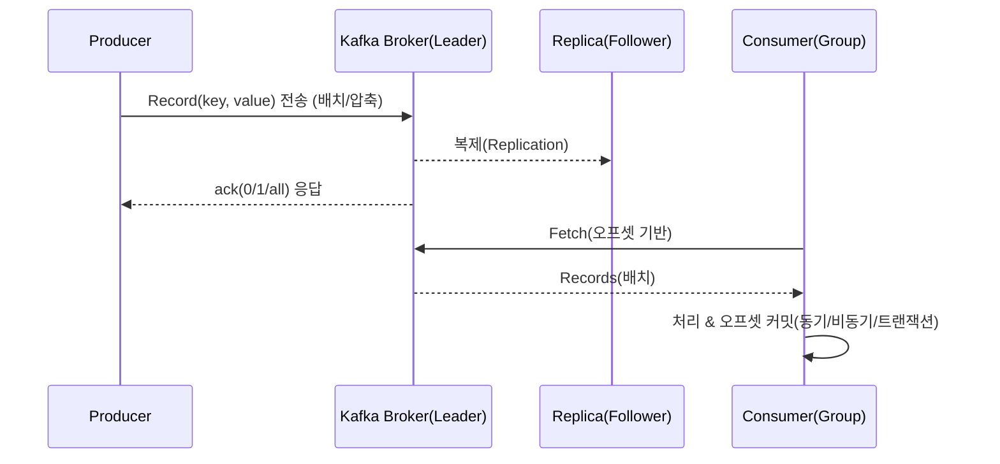
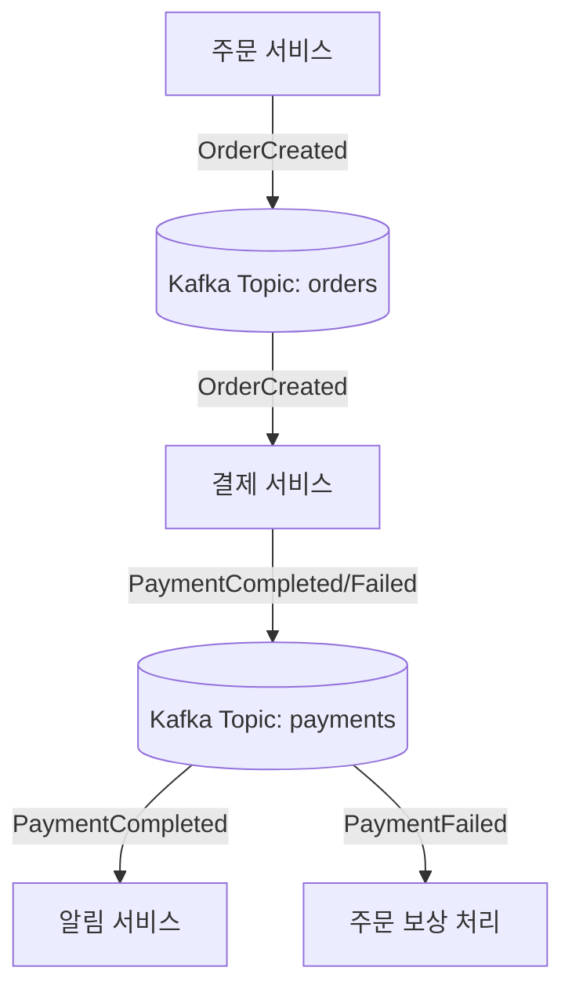

# 1) Kafka 사용 이유

서비스는 **데이터가 끊임없이 흐르는** 환경에서 돌아간다. 주문, 결제, 로그, 알림, IoT 이벤트까지 모두 ‘흐름(stream)’이다. REST로만 연결하면 **강결합·병목·스파이크 취약** 문제가 발생하기 쉽다. Kafka는 이를 **느슨하게 결합**하고 **고처리량**으로 흘려보내는 **분산 이벤트 로그**이자 **스트리밍 플랫폼**이다.

* **대체 무엇을 해결?**
  * 서비스 간 직접 호출(동기) 대신 **이벤트 발행/구독(비동기)**으로 의존을 줄임.
  * **순차적 디스크 쓰기 + 배치 전송**으로 네트워크/디스크 효율을 극대화.
  * **파티션 병렬성**으로 수평 확장에 강함.

# 2) Kafka 한 줄 정의 & 핵심 개념

* **정의:** Kafka는 **분산 로그 저장소**이자 **Pub/Sub 스트리밍 플랫폼**으로, 데이터를 **토픽(topic)**으로 분류하여 **파티션(partition)** 단위로 저장·전달.

* **핵심 용어 사전**
  * **Broker:** Kafka 서버 한 대. 여러 대가 모여 **클러스터**를 이룸.
  * **Topic:** 메시지 분류 단위(폴더 느낌). 내부는 여러 **파티션**으로 쪼개짐.
  * **Partition:** **정렬된 append-only 로그**. Kafka 확장성의 비밀. 각 파티션은 **리더/팔로워(복제본)**를 가짐.
  * **Producer / Consumer:** 메시지 **발행/구독** 애플리케이션.
  * **Consumer Group:** 같은 그룹의 컨슈머는 **파티션을 나눠서** 병렬 소비. 그룹 내 **한 파티션=한 컨슈머** 원칙(동시성 보장).
  * **Offset:** 파티션에서의 읽기 위치 포인터. 커밋 단위로 관리.
  * **Controller(KRaft):** 클러스터 메타데이터 관리를 담당(과거 ZooKeeper 역할 대체).
  * **ISR(In-Sync Replicas):** 리더와 충분히 동기화된 복제본 집합.

> **KRaft vs ZooKeeper**: 최근 Kafka는 **KRaft(내장 컨센서스)** 모드를 기본으로 발전 중. 기존 ZooKeeper 기반 운영과 개념은 유사하나, **운영 단순화**와 **일관된 메타데이터 관리**가 장점이다.
> {: .prompt-tip }

# 3) 데이터는 어떻게 흐를까?

**프로듀서→브로커→컨슈머** 흐름:

**핵심 포인트**
* **배치 전송**과 **압축(snappy/zstd 등)**으로 처리량↑, 네트워크 효율↑
* 디스크는 **순차 쓰기**(append-only)라 SSD/OS 페이지 캐시와 궁합이 좋음
* **sendfile(Zero-copy)** 등을 활용해 커널-유저 공간 복사 최소화

# 4) Kafka가 빠른 이유 (성능/확장 비결)

1. **파티션 병렬성**: 파티션 수를 늘리면 병렬 소비가 늘어나 처리량이 증가.
2. **Append-only 로그**: 랜덤 IO 대신 순차 IO → 디스크 효율 극대화.
3. **네트워크/메모리 최적화**: 배치, 압축, Zero-copy I/O.
4. **Scale-out**: 브로커 수평 확장, 파티션 리밸런싱으로 부하 분산.

> 병렬성과 순서를 동시에 원하면? **키 파티셔닝**으로 같은 키(예: 주문ID) 이벤트는 항상 같은 파티션으로 보내 **키 단위 순서**를 확보한다.
> {: .prompt-info }

# 5) 내구성 & 정확성 — ack·복제·Exactly-Once

**“메시지를 잃지 않고(내구성) 정확히 전달(정확성)하기 위한 안전장치”** 모음. 핵심은 ① 여러 대에 저장하고(**복제**), ② 얼마나 저장됐는지 확인받고(**ack**), ③ 충분히 동기화된 복제본 수를 강제하고(**MISR**), ④ 읽고 처리할 때 유실·중복을 어떻게 다룰지(**전달 보장**) 정하는 것

## 5.1 복제(Replication)

* **무엇?** 같은 메시지를 여러 브로커에 **복사**해 둠.
* **왜?** 한 대가 고장 나도 다른 곳에 있으니 **유실 방지**.
* **권장 값**: `replication.factor = 3` (3부 복제). 2부는 장애 1대로 위험, 3부부터 여유.
* **ISR(In‑Sync Replicas)**: 리더와 **충분히 동기화된 복제본** 집합. 리더 장애 시 ISR 안에서 새 리더 선출 → **서비스 연속성 확보**.

## 5.2 ack(확인 응답) 수준

> 택배 비유: “상자를 맡겼을 때 누구에게서 수령 확인을 받느냐”.

* `acks=0` **(속도 최우선)**: 확인 안 받고 보냄 → **가장 빠르지만 유실 위험↑**
* `acks=1` **(균형)**: **리더**가 받았다는 확인만 받음 → 성능/안전 균형
* `acks=all` 또는 `-1` **(안전 최우선)**: **ISR 전체**에 저장됐다는 확인 → **가장 안전**, 대신 지연·자원 소모↑

## 5.3 min.insync.replicas(MISR)

* **무엇?** `acks=all`일 때 “**최소 몇 개 복제본이 동기화돼 있어야 쓰기 허용할지**” 지정.
* **효과**: 이 값보다 적으면 아예 쓰기 거부 → 가용성보다 **데이터 일관성/내구성** 우선.
* **예시**: `replication.factor=3`, `min.insync.replicas=2` → 1대 고장나도 쓰기 가능. 2대 빠지면 새 쓰기 거부(읽기는 가능).

## 5.4 전달 보장 수준

* **At‑most‑once (최대 한 번)**: 유실 가능성 감수, **가장 빠름**. 모니터링/로그 등 일부 손실 허용 데이터에 적합.
* **At‑least‑once (최소 한 번)**: 재시도로 **중복 가능**. 대부분 **실무 기본값**.
* **Exactly‑once (정확히 한 번)**: **Idempotent Producer + Transactions + EOS(Exactly‑Once Semantics)**로 **중복·유실 없이** 전달. Kafka Streams/Connect에서 구현 쉬움.

> **주의**: Exactly‑once는 “Kafka 내부 파이프라인”에서의 현실적 보장. 외부 DB·캐시까지 완벽히 보장하려면 소비자 멱등 처리(UPSERT, 고유키)와 트랜잭션 설계 필요.
> {: .prompt-info }

## 5.5 상황별 권장 조합

* **로그/비핵심 이벤트**: `acks=1`, `replication.factor=3` → 성능·비용 균형
* **중요 업무(주문, 재고)**: `acks=all`, `replication.factor=3`, `min.insync.replicas=2` → 안전 우선
* **금융·결제/정산**: 위 설정 + **Exactly‑once** 고려 + 소비자 **멱등 처리/트랜잭션** 필수

> **팁**: 돈이 오가는 결제·정산 도메인은 `acks=all + replication.factor=3 + min.insync.replicas=2` 같은 보수적 설정이 기본. 부족한 처리량은 **브로커 수/하드웨어 확장**으로 보완 필요.
> {: .prompt-warning }

# 6) 토픽 설계 전략 — 파티션·보존·압축

* **파티션 수**: 소비자 동시성=파티션 수 상한. 과도한 파티션은 메타데이터/리밸런스 비용↑. **초기 보수적으로** 잡고 증가 전략.
* **키/순서**: 순서가 중요한 엔터티(주문ID/계좌ID 등)는 **키 지정** 필수.
* **보존 정책**

  * **시간/용량 기반 삭제**: `retention.ms` / `retention.bytes`
  * **Log Compaction**: 같은 키의 **최신 값만 유지**(상태 스냅샷/참조데이터에 적합)
* **세그먼트/인덱스**: `segment.bytes`, `segment.ms`로 파일 회전/압축 시점 제어

# 7) 컨슈머 설계 — 오프셋과 리밸런스

* **오프셋 커밋**
  * **동기 커밋**: 안정적이지만 지연 가능
  * **비동기 커밋**: 빠르지만 실패 시 위치 유실 위험
  * **트랜잭션 커밋**: 처리/출력과 **원자적**으로 맞춤(EOS)

* **리밸런스 전략**
  * **Range / RoundRobin / CooperativeSticky**: 재배치 방식 차이로 처리 중단 최소화.
  * **Static Membership**: 인스턴스 고유 ID로 **불필요한 리밸런스 감소**.
* **오토 스케일** 시 유의: 급격한 스케일 변화는 리밸런스 폭풍을 유발 → **점진 조정** 권장.

# 8) Kafka & MSA — 이벤트 기반으로 느슨하게

**동기식(REST)** 호출은 **호출 체인**이 길어질수록 장애 전파·대기시간이 누적됨. Kafka를 쓰면 **각 마이크로서비스가 이벤트를 발행/구독**하며 **시간·공간적으로 분리(decouple)**됨.

* **패턴**
  * **사가(Saga)**: 분산 트랜잭션을 **보상(취소) 이벤트**로 풀기
  * **코레오그래피 vs 오케스트레이션**: 각자 반응 vs 중앙 조정자
  * **아웃박스 + CDC(Debezium)**: DB 트랜잭션에 안전하게 이벤트 추출
  * **CQRS**: 읽기 모델을 별도 이벤트로 **물 흐르듯 갱신**

* **카프카를 쓰는 전형적 흐름(예: 주문→결제→알림)**

> 이 구조에서 **각 서비스는 서로의 존재를 몰라도** 이벤트만으로 협업함. **스파이크에도 버퍼링**이 되어 완충 효과가 생김. {: .prompt-tip }

# 9) Kafka Connect & Streams (간단 개념)

* **Kafka Connect**: DB, 파일, 클라우드 스토리지 등 **외부 시스템과의 연동**을 표준화하는 프레임워크. (예: Debezium MySQL CDC Source, S3 Sink)
* **Kafka Streams**: 애플리케이션 코드에 **스트림 처리 DSL**을 제공(윈도우/집계/조인/상태 저장). 마이크로서비스 안에서 가볍게 **실시간 변환/집계**를 구현할 수 있음.

# 10) 보안·운영·모니터링 체크리스트

**보안**
* 전송 암호화: **TLS(SSL)**
* 인증: **SASL/PLAIN, SCRAM, OAuthBearer** 등 환경에 맞게 선택
* 권한: **ACL**로 토픽·그룹·옵스 API 접근 제어

**모니터링(대표 지표)**
* **Under-Replicated Partitions(URP)**: 복제 지연/장애 신호
* **Consumer Lag**: 소비 지연, 백프레셔 판단
* **Request/Network Latency, I/O Utilization**
* **Broker Heap/GC, Page Cache Hit Ratio**

**용량/설계**
* **replication.factor=3**, **min.insync.replicas=2**, **acks=all**(중요 도메인)
* 디스크는 **NVMe SSD** 권장, 네트워크는 **10/25/40Gbps**급 고려
* 파티션 수·메시지 크기·압축율에 따른 **디스크/네트워크/CPU 예측** 필수

**장애/성능 이슈 대책**
* 대형 메시지(>1MB)는 **분할/외부 저장소** 고려
* 과도한 파티션은 **메타데이터 폭증/리밸런스 비용↑**
* **Retry/Backoff/Dead Letter Topic(DLT)**를 표준화

# 11) Kafka vs 다른 메시징 시스템

| 구분      | **Kafka**                       | RabbitMQ/ActiveMQ(전통 MQ) |
| ------- | ------------------------------- | ------------------------ |
| 핵심 모델   | 분산 **로그**(append-only), Pub/Sub | 큐 기반, 라우팅(Exchange)      |
| 처리량/확장  | **매우 높음**(파티션 병렬성)              | 보통(패턴 설계에 따라 다름)         |
| 순서 보장   | **파티션 내 순서**                    | 큐/컨슈머 설정에 따름             |
| 보존/재처리  | 오래 보존, **재처리 쉬움**               | 일반적으로 소비 후 삭제            |
| 스트리밍 처리 | Streams/ksqlDB 등 생태계            | 제한적(별도 프레임워크 필요)         |
| 운영 난이도  | **중~상**(스토리지/클러스터링)            | **하~중**                 |

> **요약**: 대규모 로그/이벤트 스트림, 재처리·리플레이, 실시간 파이프라인이면 Kafka. 단순 작업 큐/요청-응답은 MQ가 적합.
> {: .prompt-info }

# 12) 장단점 요약

**장점**
* 고처리량/저지연, 수평 확장성, 재처리/보존 용이, 풍부한 생태계(Connect/Streams)

**단점**
* 운영 복잡도(스토리지·복제·리밸런스), 디스크/네트워크 자원 소모 큼, 러닝 커브

# 13) 언제 쓰고, 언제 피할까?

**적합**
* 이벤트/로그 수집, 마이크로서비스 간 비동기 통신, 실시간 분석/집계, CDC 파이프라인, IoT 텔레메트리

**지양**
* 강한 동기식 트랜잭션(즉시 응답/일관성 필요)
* 메시지 수가 적고 단순한 작업 큐(오버 엔지니어링 위험)

# 14) TIP

* **주요 설정**
  * `replication.factor=3`, `min.insync.replicas=2`, `acks=all`
  * 메시지 순서 중요: **키 파티셔닝** + 파티션 수 계획
  * 재시도 표준화: **Retry 토픽 + DLT + Backoff**
  * 상태 동기화: 변경 이벤트는 **Outbox+CDC**로 안전하게 발행

* **컨슈머**
  * 처리 후 **오프셋 커밋**(예외 시 롤백/재시도 설계)
  * **Static Membership/Cooperative Rebalance**로 흔들림 최소화

* **스키마**
  * **스키마 레지스트리**(Avro/Protobuf/JSON Schema)로 **호환성·버전** 관리

# 15) 마무리

Kafka는 **데이터가 흐르는 시스템**을 만들기 위한 사실상의 표준 플랫폼이다. 핵심: **파티션으로 확장하고, 복제로 지키고, 이벤트로 느슨하게 연결**하는 것.
