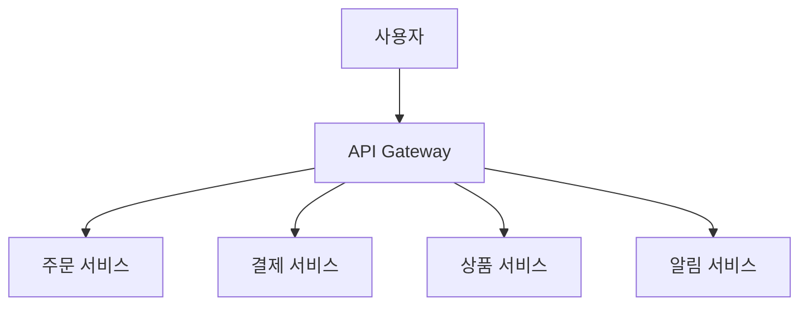

## 1. 들어가며

최근 **MSA(Microservices Architecture, 마이크로서비스 아키텍처)**라는 용어를 자주 접합니다. 과거에는 대부분의 애플리케이션이 **모놀리식(Monolithic)** 구조로 개발되었지만, 점점 더 복잡하고 빠르게 변화하는 비즈니스 환경에 대응하기 위해 MSA가 각광받고 있습니다.

---

## 2. MSA란 무엇인가?

**MSA**는 애플리케이션을 **여러 개의 작은 독립적인 서비스 단위**로 쪼개어 개발하고 운영하는 아키텍처 스타일입니다. 각 서비스는 특정한 비즈니스 기능을 담당하며, 독립적으로 배포·확장·운영될 수 있습니다.

예시) 이커머스 서비스:

* **주문 서비스(Order Service)**
* **결제 서비스(Payment Service)**
* **상품 서비스(Product Service)**
* **알림 서비스(Notification Service)**

이처럼 서비스를 쪼개면, 서로 다른 팀이 병렬로 개발할 수 있고, 특정 기능만 독립적으로 배포 및 확장할 수 있습니다.

---

## 3. MSA의 주요 특징

1. **독립적 배포**: 서비스 단위로 업데이트 가능 → 전체 시스템 중단 최소화
2. **유연한 확장성**: 특정 서비스만 필요에 따라 확장 (예: 주문 폭주 시 주문 서비스만 확장)
3. **자율적인 기술 스택**: 각 서비스마다 다른 언어/프레임워크 사용 가능
4. **작은 단위 팀 운영**: 서비스별 팀 구성 → 빠른 개발 사이클

---

## 4. MSA의 장단점

### 장점 — 왜/언제 도움이 되는가

* **민첩한 변경·배포(Agility)**
  * 서비스 경계를 기준으로 **부분 배포**(canary, blue‑green) 가능 → 전체 릴리스 리스크를 낮춤.
  * 기능 플래그와 함께 쓰면 실험(AB 테스트) 주기가 빨라짐.

* **장애 격리 & 회복 탄력성(Resilience)**
  * 서비스가 분리되어 있어 **블라스트 레디우스**(영향 범위)가 작음.
  * **Circuit Breaker, Bulkhead, Timeout, Retry(지수 백오프)** 같은 내결함성 패턴을 적용하기 수월.

* **선택적 확장(Scalability)**
  * 읽기 편중/쓰기 편중, CPU/메모리 병목 등 **서비스별 부하 특성**에 맞춰 개별 확장.
  * 예) 주문 폭주 시 `Order`만 확장, 정산 배치 작업은 야간에만 확장.

* **기술 다양성(Polyglot)**
  * 서비스별로 언어/프레임워크/스토리지 선택 가능. (예: 고성능 gRPC 서비스는 Go, 백오피스는 Spring)
  * 단, **플랫폼 가드레일**(빌드/배포/보안 표준)을 깔아두면 혼종화의 부작용을 줄일 수 있음.

* **조직 구조와의 정합(Team Autonomy)**
  * **도메인별 소유권**과 투 피자 팀(two‑pizza team) 운영이 쉬워져 병렬 개발이 가속.

* **보안·컴플라이언스 경계 분리**
  * PII/결제 등 민감 데이터가 있는 서비스는 **더 강한 통제**(네트워크/권한/암호화)를 적용하고, 나머지는 가볍게 운영 가능.

* **장기 비용 최적화(선택적 투자)**
  * 트래픽이 큰 서비스에만 캐시/큐/고사양 노드 등 **집중 투자**가 가능.

> MSA의 핵심 가치는 "**변경의 단위**"를 작게 만들어 **속도와 안정성**을 동시에 노리는 데 있음.
> {: .prompt-info }

### 단점 — 어디서 비용이 터지는지

* **분산 시스템 복잡성**
  * 네트워크 지연·부분 실패가 일상. **멱등성(Idempotency), 재시도 폭발 방지, 요청 상관관계 ID**가 필수.
  * 캐시·큐·스토리지 사이의 **일관성**(TTL/Invalidation) 관리 난이도 상승.

* **데이터 일관성(Strong vs. Eventual)**
  * 단일 DB의 ACID 트랜잭션을 잃음. 크로스 서비스 트랜잭션은 **Saga(보상 트랜잭션), Outbox/CDC, Event Sourcing** 등으로 보완.
  * 잘못 설계하면 **이중 결제/중복 처리** 같은 장애가 발생.

* **테스트·품질 보증 난이도**
  * 단위 테스트는 쉬워져도 **계약 테스트(Pact)**, **엔드투엔드 테스트** 설계·유지 비용이 큼.
  * 로컬 통합 환경을 위해 **Testcontainers**, 도커 컴포즈, 가짜 외부 시스템(Mock) 등이 필요.

* **배포/운영 오버헤드**
  * 서비스가 많아질수록 각 서비스마다 CI/CD(자동 배포 과정), 이미지 저장소, 코드로 관리하는 인프라(IaC), 비밀 관리, 권한 설정, 모니터링 같은 운영 요소도 늘어나서 관리할 일이 많아짐. 다만, 실제로는 각 서비스가 전부 따로 시스템을 만드는 게 아니라, 공용 플랫폼(표준 파이프라인·공용 레지스트리 등)을 마련해 두고 서비스마다 필요한 설정만 얹는 방식이 권장됨.
  * 쿠버네티스·서비스 메시 등은 강력하지만 **학습 곡선**과 **관리 비용**이 큼.

* **관찰 가능성(Observability) 비용**
  * 로그/메트릭/트레이스 3종을 통합하고 **Correlation ID**로 묶어야 함. 스토리지 비용과 인덱싱/쿼리 비용이 증가.

* **버전·호환성 관리**
  * 하위 호환을 깨면 전체 장애로 번짐. **API 버저닝**, **스키마 진화(Avro/Protobuf)** 전략이 필요.

* **성능 예측 어려움**
  * N개의 마이크로 호출이 **팬아웃**되면 테일 레이턴시가 커짐. 캐시/벌크 API/비동기화로 완충 필요.

* **조직 준비도**
  * DevOps/SRE 문화, 공용 플랫폼 팀(플랫폼 엔지니어링)이 없으면 **혼돈의 정원**이 되기 쉬움.

* **직접 비용 증가**
  * 네트워크 홉 증가, NAT/게이트웨이/메시 비용, 컨트롤 플레인 비용, 로그/메트릭 저장 비용 등이 **눈에 보이게** 늘어남.

### 의사결정 체크리스트

* **도메인 복잡도**가 높고 변경이 잦은가?
* **독립 배포**가 비즈니스적으로 중요한가? (시간 민감 릴리스/리스크 분리)
* **트래픽 편중**이 뚜렷한가? (부분 확장으로 이점?)
* 현재 **팀 규모/숙련도**로 운영 복잡성을 감당할 수 있는가?
* **관찰 가능성/보안/플랫폼 가드레일**을 갖출 수 있는가?
* **데이터 일관성 요구**(강/약)를 패턴으로 충족 가능한가?

### 모놀리식이 더 유리한 경우

* 작은 팀·짧은 기간의 **MVP/PoC**
* **강한 일관성**이 핵심 경쟁력인 업무 (단일 트랜잭션이 많음)
* 인프라/운영 역량이 아직 충분치 않을 때
* 기능 변화 속도가 낮고 서비스 범위가 단순할 때

### 안전하게 전환하는 방법(점진 분리)

* **Strangler Fig 패턴**: 모놀리스 외곽의 변경 빈도 높은 영역(예: 알림, 파일, 인증)부터 분리.
* **공유 DB → 서비스별 DB**로 이동 시, **CDC(체인지 데이터 캡처)**로 동기화하며 점진 분리.
* 초기에는 **API 게이트웨이**로 라우팅만 분리하고 트래픽/의존성을 관찰한 뒤 점진적으로 나눔.

---

## 5. 적용 시 고려사항

* **API Gateway**: 서비스 앞단에서 모든 요청을 받아 **인증**, **라우팅**, **로드밸런싱**, **레이트 리밋(요청 제한)**, **캐싱**, **요청/응답 변환**을 담당하는 관문 역할.

* **서비스 간 통신**:
  * **REST**: 가장 널리 쓰이는 HTTP 기반 통신 방식.
  * **gRPC**: 구글이 만든 고성능 통신 프레임워크, 이진 포맷으로 빠르고 효율적.
  * **메시지 큐(Kafka, RabbitMQ)**: 비동기 메시지 전달 시스템. 서비스 간 의존성을 줄이고 이벤트 기반 아키텍처 구현 가능.

* **데이터 관리**: 각 서비스는 자체 DB를 사용하여 독립성을 확보. 서비스 간에 데이터 동기화가 필요할 땐
  * **Saga 패턴**: 문제가 생기면 되돌리는 작업(보상 트랜잭션)으로 데이터 일관성 유지.
  * **Outbox/CDC(Change Data Capture)**: 데이터가 바뀔 때 이벤트로 기록해 다른 서비스에 알려줘서 데이터 일관성 유지.
  * **멱등 키(Idempotency Key)**: 중복 요청에도 데이터가 한 번만 처리되도록 보장.

* **운영 자동화**:
  * **CI/CD 파이프라인**: 코드 빌드·테스트·배포 자동화.
  * **컨테이너 레지스트리**: 컨테이너 이미지를 저장·공유.
  * **IaC(Infrastructure as Code)**: 인프라를 코드로 정의해 재현성과 자동화를 강화.
  * **쿠버네티스(Kubernetes)**: 컨테이너 오케스트레이션 도구.
  * **서비스 메시(Service Mesh)**: 서비스들 사이의 통신을 도와주고, 보안·모니터링 기능을 자동으로 넣어주는 보조 도구.

* **관찰 가능성(Observability)**:
  * **로그**: 서비스 동작 기록.
  * **메트릭(Metrics)**: CPU/메모리/트래픽 등 수치 기반 모니터링.
  * **트레이스(Tracing)**: 요청이 서비스 간 어떻게 흘러가는지 추적.
  * **대시보드**: 데이터를 시각화하여 실시간 모니터링.
  * **경보(Alerting)**: 이상 상황 발생 시 알림 발송.
  * **Correlation ID**: 여러 서비스에서 동일 요청을 추적하기 위한 고유 식별자 표준화.

---

## 6. 마치며

작은 스타트업이나 단순한 서비스라면 모놀리식이 더 효율적이고, 서비스가 복잡해지고 빠른 변화에 대응해야 할 때 MSA가 더 효율적이다.
