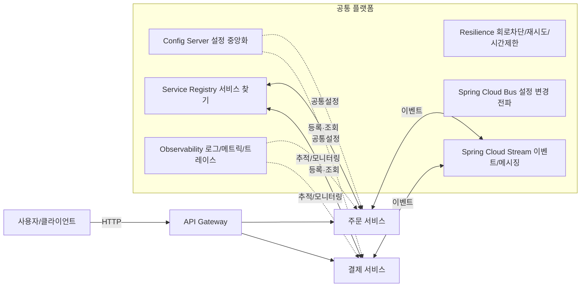

> 요약: **Spring Cloud는 ‘분산 시스템 공통 문제(설정, 라우팅, 서비스 찾기, 장애 격리, 관측성, 이벤트 처리)’를 스프링 방식으로 표준화한 도구 모음**이다.

---

## 0) 배경: Spring Cloud가 필요한 이유

모놀리식(한 덩어리)에서 **마이크로서비스(MSA)**로 분리하면 배포/확장이 쉬워지지만, 다음의 **공통 난제**가 생김.

* **설정(환경 변수) 폭증**: 서비스가 늘수록 설정이 흩어지고 일관성이 무너짐
* **서비스 위치 파악**: 인스턴스가 수시로 생겼다 사라지며, IP/포트가 고정되지 않음
* **네트워크 장애**: 느린 응답/부분 장애가 전체 장애로 번짐(연쇄 장애)
* **관측성 부족**: 요청이 여러 서비스를 거치면, 어디가 느린지 알기 어려움
* **경계 보안**: 외부로부터의 진입점과 내부 호출 정책을 일관되게 적용해야 함
* **동기+비동기 혼합**: 실시간 응답과 후속 처리(이벤트)의 균형이 필요함

> 용어 풀이
>
> * **분산 시스템**: 서로 다른 프로세스/서버가 네트워크로 협력하는 형태.
> * **레질리언스(Resilience)**: 장애를 흡수하고 빠르게 복원하는 능력.
> * **관측성(Observability)**: 로그·메트릭·트레이스로 내부 상태를 파악할 수 있는 정도.

**Spring Cloud의 역할**은 위 문제를 해결하는 **플랫폼 레이어**를 제공하는 것

---

## 1) 큰그림: Spring Cloud가 다루는 영역

* **Config Server**: 설정의 **단일 진실 공급원(SSOT)** 역할
* **Service Registry**: **누가 어디에 떠 있는지**를 알려줌
* **Gateway**: 외부 진입점과 정책(라우팅, 인증, 제한)을 **한 곳**에서 통제
* **Resilience**: 회로 차단, 재시도, 타임아웃 등으로 **연쇄 장애를 차단**
* **Observability**: 병목 구간을 **정량적으로** 보이게 만듦
* **Stream**: 서비스 간 **이벤트 기반** 통신을 표준화 함

> 비교: **Spring Boot**는 ‘서비스 하나’를 빠르게 만드는 프레임워크, **Spring Cloud**는 ‘서비스 여러 개’를 **운영**하기 위한 도구 모음.

---

## 2) 구성요소별 핵심 개념

### 2-1. Config Server — 설정의 중앙화와 일관성

* 문제: 서비스가 늘수록 설정이 **복제·드리프트(서서히 서로 달라짐)** 됨.
* 개념: 설정을 **중앙 저장소**(보통 Git)에 두고, 각 서비스가 **부팅 시/실행 중** 가져가도록 함.
* 효과: 환경별 설정 차이(prod/stage/dev), 공통 키 회수, **릴리즈와 설정 변경의 분리**가 가능.
* 보안: 비밀은 별도의 **Secret 저장소**(Vault/Parameter Store/KMS)에 두고, 참조로 연결.

### 2-2. Service Discovery — 누가 어디 있는가?

* 문제: 인스턴스는 **에페머럴(휘발성)** 하다. IP/포트가 고정이 아님.
* 모델: 서비스가 **레지스트리에 자신을 등록**하고, 호출자는 레지스트리에서 **목록을 조회**해 호출(클라이언트 측 로드밸런싱).
* 대안: Kubernetes 환경이면 **클러스터 DNS/Service**가 같은 역할을 함.

### 2-3. API Gateway — 정책의 단일 진입점

* 역할: 엔드포인트 통합, 라우팅, 인증/인가, 속도 제한, 헤더/경로 표준화.
* 이점: 클라이언트는 **하나의 주소**만 알면 되고, **보안/정책을 중앙에서** 적용 가능.
* 주의: 게이트웨이에 과도한 비즈니스 로직을 싣지 말 것(경계 역할 유지).

### 2-4. Resilience — 회로 차단/재시도/시간제한/격벽

* 회로 차단(Circuit Breaker): 실패율이 높아지면 **즉시 거절**하여 시스템을 보호.
* 재시도(Retry): **잠깐의 흔들림**을 흡수. 단, 무한 재시도는 금물(증폭 위험).
* 시간제한(Timeout): 느린 호출이 **스레드를 점유**해 전체를 붙잡지 않도록 상한선 설정.
* 격벽(Bulkhead): 자원(스레드/연결)을 **격리**해 한 구간의 장애가 다른 구간으로 번지지 않게 함.

### 2-5. Observability — 보이는 시스템

* 로그(Log): 사건 기록. **상관관계 ID(Trace/Span)**로 묶어야 의미가 커짐.
* 메트릭(Metrics): 수치화된 지표(QPS, 에러율, 지연시간 p95 등). **SLO/알람**의 기반.
* 트레이스(Traces): 요청이 거친 **호핑 경로**와 각 구간의 지연을 시각화.
* 원칙: 샘플링 비율, PII 마스킹, 라벨(태그) 설계가 품질을 좌우함.

### 2-6. Stream — 이벤트 중심 통신

* 동기(HTTP) vs 비동기(이벤트): 사용자 응답은 **동기**, 후속 처리/통지는 **비동기**가 적합.
* 장점: 결합도 감소, 완충 버퍼, **탄력적 확장**.
* 유념: **멱등성**(같은 메시지가 여러 번 와도 한 번처럼 처리), **DLQ(사망 편지함)**, **재처리 정책**.

### 2-7. Bus — 설정 변경의 라이브 반영

* 문제: 설정 변경 후 모든 서비스를 다시 배포하기 어렵다.
* 개념: **변경 이벤트를 브로커로 방송**해, 실행 중인 인스턴스에 **선택적 리프레시**를 전파한다.

---

## 3) 통신·데이터 설계 원칙 (Spring Cloud 관점)

### 3-1. 동기와 비동기의 경계

* **동기**: 요청/응답이 한 트랜잭션처럼 보이는 경로(예: 장바구니→주문 생성).
* **비동기**: 후속 처리(알림, 적립, 통계 집계). 사용자 경험에 **즉시성**이 덜 중요.

### 3-2. 트랜잭션과 SAGA

* 분산 트랜잭션(2PC)은 복잡/비용이 큼. 대신 **SAGA 패턴**(보상 트랜잭션)으로 일관성을 맞춤.
* 모델: **오케스트레이션**(중앙 조정자) vs **코레오그래피**(이벤트로 자율 협업).

### 3-3. 정확성/내구성

* **멱등성**: 같은 작업을 여러 번 수행해도 결과가 같음(중복 메시지 대비).
* **정확히 한 번(Exactly-Once)**: 이론적으로 어려우며, 실무는 ‘**적어도 한 번 + 멱등 처리**’가 기본.

---

## 4) 운영·플랫폼 관점의 의사결정

### 4-1. 어디서 Discovery를 할까?

* **Kubernetes**: 클러스터 DNS로 충분 → 별도의 Eureka 없이 단순.
* **VM/ECS 등**: 동적으로 변하는 인스턴스 → Eureka/Consul이 유용.

### 4-2. Gateway를 어디까지 쓸까?

* **반드시**: 라우팅, 인증, 속도 제한, 공통 헤더/로그.
* **지양**: 비즈니스 로직/오케스트레이션 과부하(서비스 내부 책임으로).

### 4-3. 설정과 비밀의 분리

* **환경 설정**: Git 기반(감사/롤백 용이).
* **비밀(Secrets)**: 전용 비밀 저장소 + 키 관리 체계.

### 4-4. 관측성 우선 순위

* ① **분산 트레이스**로 경로를 보이게 → ② 핵심 메트릭(에러율·지연 p95) → ③ 로그 상관관계.

---

## 5) Spring Cloud × Kubernetes/Service Mesh

* **Spring Cloud Kubernetes**: K8s의 ConfigMap/Secret/Service와 통합.
* **서비스 메시(Istio 등)**: mTLS, 트래픽 분할, 리트라이 등 **네트워크 정책을 사이드카**로 위임.
* **경계 정리**: 메시가 네트워크 레벨을 맡고, Spring Cloud는 **애플리케이션 레벨 정책/라이브러리**를 맡음.

---

## 6) 버전·호환성 사고방식 (BOM 개념)

* **BOM(Bill of Materials)**: 다수의 라이브러리 버전을 **묶어 호환**을 보장하는 목록.
* 효과: 개별 스타터의 버전을 일일이 맞출 필요가 없음 → **의존성 충돌/지옥** 완화.
* 원칙: Spring Boot 메이저 라인과 **맞는 Spring Cloud 릴리스 라인**을 고정.

---

## 7) 도입 순서 가이드 (현실적인 로드맵)

1. **관측성**부터(트레이스/메트릭) → 병목이 보이면 해결이 가능해짐.
2. **Gateway**로 진입점/정책을 표준화.
3. **Config 중앙화**로 설정 드리프트를 멈춤.
4. **Discovery/로드밸런싱**으로 확장성 확보.
5. **Resilience(회로/타임아웃/재시도)**로 연쇄 장애 차단.
6. **Stream(이벤트)**으로 비동기화·탄력 확장.

---

## 8) 안티패턴 체크리스트

* [ ] 서비스 수를 **불필요하게** 늘린다(분리 비용 > 이득).
* [ ] 게이트웨이에 **비즈니스 로직**을 과도하게 탑재한다.
* [ ] 재시도/타임아웃이 **전략 없이** 섞여 폭풍 재시도를 만든다.
* [ ] 공통 설정과 비밀을 **같은 저장소**에 둔다.
* [ ] 트레이스/로그에 **상관관계 ID**가 없다.
* [ ] 메시징에서 **DLQ/재처리 기준**이 없다.

---

## 9) 궁금한 점 모음

**Q. Eureka는 필수인가?**
A. 환경에 따라 다름. K8s라면 **DNS/Service**로 충분한 경우가 많다.

**Q. 게이트웨이와 쿠버네티스 Ingress 차이?**
A. Ingress는 **클러스터 관문(L7)**, 게이트웨이는 **애플리케이션 정책 레이어**.

---

## 10) 용어 사전

* **에페머럴(Ephemeral)**: 잠깐 살다 사라지는, 고정되지 않는(예: 컨테이너 IP).
* **드리프트(Drift)**: 시간이 지나며 설정/구성이 제각각 달라지는 현상.
* **백프레셔(Backpressure)**: 과부하 시 들어오는 요청을 조절/거절하는 메커니즘.
* **SLO(Service Level Objective)**: 서비스가 달성해야 하는 지표 목표(예: 가용성 99.9%).
* **p95**: 응답 시간의 95%가 이 값 이하라는 의미(꼬리 지연 파악에 유용).
* **멱등성(Idempotency)**: 같은 작업을 여러 번 해도 결과가 같은 성질.
* **DLQ(Dead Letter Queue)**: 실패한 메시지를 모아두는 전용 큐.

---

## 11) 마무리

Spring Cloud는 **코드 몇 줄로 마법을 부리는 도구**가 아니라, **분산 시스템 운영의 모범 사례**를 스프링 생태계에 녹여낸 **설계 철학**이다. 핵심은 도구 자체보다 **경계 설정, 책임 분리, 관측성 기반의 개선**에 있다. 이 글의 로드맵대로 **관측성 → 게이트웨이 → 설정 → 디스커버리 → 레질리언스 → 스트림** 순으로 도입하면, 위험을 통제하며 점진적으로 성숙도를 끌어올릴 수 있다.
