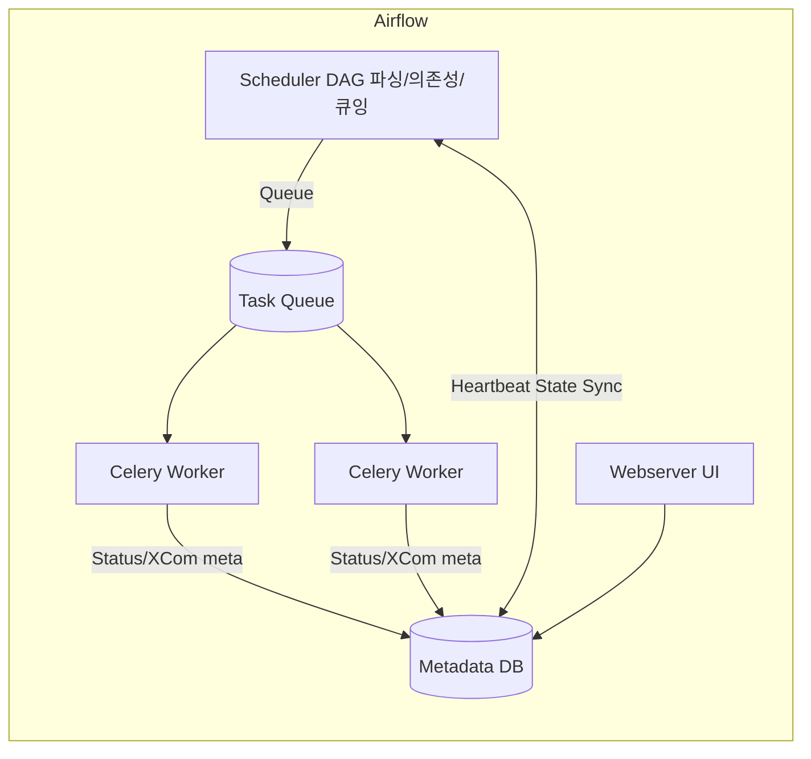

Airflow는 **스케줄러(Scheduler)와 익스큐터(Executor)**로 역할이 분리되어 있다. 스케줄러는 *무엇을 언제 실행할지* 결정하는 두뇌이고, 익스큐터는 *어디서 어떻게 실행할지*를 담당하는 팔과 다리이다.

---

## 1. Airflow 핵심 개체와 생명주기

* **DagRun**: 특정 실행일(Execution Date)에 대한 DAG의 한 번의 실행 단위이다.
* **TaskInstance(TI)**: DagRun 안의 개별 Task 실행 단위이다.
* **주요 상태(State)**: `none → scheduled → queued → running → success/failed` 이다. 재시도 시 `up_for_retry`를 거친다.
* **스케줄러 루프**: DAG 파일을 파싱하여 DAGBag에 적재 → 스케줄 조건 만족 시 DagRun 생성 → 의존성 확인 후 TI를 `scheduled/queued`로 전환한다.
* **좀비 감시**: 스케줄러는 하트비트와 메타스토어(메타데이터 DB) 상태를 기반으로 장시간 보고가 없는 TI를 회수(zombie detection)한다.

---

## 2. 스케줄러의 책임

* **의존성 해석**: `upstream/downstream`, `TriggerRule`, `depends_on_past`, `wait_for_downstream` 등을 평가한다.
* **리소스 제약 반영**: 전역 `parallelism`, DAG별 `max_active_runs`, 태스크별 **Pool**과 슬롯, **Queue** 등의 제약을 반영한다.
* **스케줄 결정**: 실행 가능 TI를 **큐(Queue)**에 올리며, 이 큐를 통해 익스큐터가 실제 실행을 담당한다.

> 핵심은 스케줄러가 **결정만** 하고, **실행은 하지 않는다**는 점이다.

---

## 3. 익스큐터의 책임과 종류

익스큐터는 스케줄러가 `queued`로 올린 작업을 실제로 실행한다.

* **SequentialExecutor**: 단일 프로세스로 순차 실행하는 모드이다. 개발/테스트 용도이다.
* **LocalExecutor**: 로컬 머신의 프로세스를 병렬로 활용한다. 단일 호스트 멀티프로세싱에 적합하다.
* **CeleryExecutor**: **분산 실행**을 위해 메시지 브로커와 워커 풀을 사용한다. 수평 확장이 가능하다.
* **KubernetesExecutor**: 태스크를 **Pod**로 동적으로 띄우는 방식이다. 격리가 뛰어나고 탄력적이다.

> 어떤 익스큐터를 쓰느냐가 **확장성·격리·운영 복잡도**를 좌우한다.

---

## 4. MWAA에서의 실행 모델 (CeleryExecutor 기반)

* **기본 전제**: MWAA(Managed Workflows for Apache Airflow)는 **CeleryExecutor**를 사용한다.
* **구성 요소**: 관리형 스케줄러, 웹서버, **Celery 워커 풀**, 그리고 관리형 메시지 큐/백엔드로 구성된다.
* **동작 흐름**: 스케줄러가 큐에 작업을 넣으면, Celery 워커가 이를 가져가 태스크를 실행한다. 실행 결과/상태는 메타데이터 DB에 반영된다.
* **스케일링**: 환경 크기(클래스)와 설정에 따라 워커 수와 동시 실행 수가 확장된다. 긴 대기형 작업은 **Deferrable Operator/Sensor**로 전환하여 워커 점유를 줄이는 것이 바람직하다.
* **설정 오버라이드**: `airflow.cfg` 직접 수정 대신 **환경 변수/오버라이드**로 병렬성·큐·풀을 조정하는 운용이 일반적이다.

> 요약하면 MWAA는 “스케줄러 = 결정 / Celery 워커 = 실행”의 분산 모델을 **관리형**으로 제공한다.

---

## 5. 병렬성·스루풋을 좌우하는 핵심 파라미터

* **전역**

  * `core.parallelism`: 동시에 실행 가능한 **전체 TI 상한**이다.
* **DAG 단위**

  * `max_active_runs`: 동시에 활성화될 수 있는 **DagRun 수**이다.
  * (Airflow 2.x) `max_active_tasks`: DAG 내 동시에 실행 가능한 **태스크 수 상한**이다.
* **태스크 단위**

  * `pool`/`pool_slots`: 공용 리소스 제한을 위한 슬롯 제어이다.
  * `queue`: Celery 큐 라우팅을 위한 라벨이다.
  * `retries`, `retry_delay`, `execution_timeout`: 안정성 제어이다.

> 병렬성은 **전역 → DAG → 태스크** 순으로 겹겹이 제한된다. 가장 작은 상한이 병목이 된다.

---

## 6. 큐·풀 설계 패턴

* **Queue 라우팅**: I/O 바운드, CPU 바운드, 외부망 호출 등 성격별로 큐를 분리한다. 예: `queue='io'`, `queue='cpu'` 등이다.
* **Pool로 급소 보호**: DB 커넥션, 외부 API rate limit는 **Pool 슬롯**으로 고정 상한을 둔다.
* **우선순위 관리**: `priority_weight` 또는 전용 큐로 긴급 작업의 선점을 보장한다.

---

## 7. 스케줄러·CeleryExecutor 데이터 흐름 (개념도)



---

## 8. 운영 체크리스트

* [ ] 전역 `parallelism`, DAG `max_active_runs`, 태스크 `max_active_tasks`가 서로 모순되지 않는가?
* [ ] 장시간 대기형 센서는 **`mode="reschedule"` 또는 Deferrable**로 전환했는가?
* [ ] 공용 자원은 **Pool**로 슬롯을 제한했는가?
* [ ] Celery **Queue**를 성격별로 분리했는가? 워커가 해당 큐를 서브스크라이브하는가?
* [ ] 실패/재시도 정책과 `execution_timeout`을 설정했는가?
* [ ] 장기 실행 태스크는 체크포인트/멱등성으로 **재시작 친화적**인가?

---

## 9. 설정 예시 모음

> MWAA에서는 `airflow.cfg`를 직접 수정하지 않고 **오버라이드/환경 변수**를 활용하는 방식이 일반적이다.

**전역 병렬성/스케줄러**

```ini
# airflow.cfg 개념 예시 (직접 수정 불가 환경에서는 오버라이드 사용)
[core]
parallelism = 64

[scheduler]
max_tis_per_query = 32
min_file_process_interval = 30
num_runs = -1  # 지속 실행
```

**DAG 레벨**

```python
dag = DAG(
  dag_id="example",
  schedule_interval="0 3 * * *",
  catchup=False,
  max_active_runs=2,  # 동시 DagRun 2개
)
```

**태스크 레벨 큐·풀**

```python
@task(queue="io", pool="db_pool", pool_slots=2)
def load_to_db():
    ...
```

**Celery 워커 동시성(개념)**

```bash
# 워커 컨테이너 환경 변수 예시
CELERYD_CONCURRENCY=8
CELERYD_MAX_TASKS_PER_CHILD=50
```

---

## 10. 언제 어떤 익스큐터를 선택할까

| 상황              | 권장 익스큐터            | 이유                           |
| --------------- | ------------------ | ---------------------------- |
| 로컬 개발/학습        | SequentialExecutor | 설정이 단순하다.                    |
| 단일 호스트 소규모 운영   | LocalExecutor      | 설치가 간단하고 병렬 실행이 가능하다.        |
| 관리형 확장·분산 실행    | **CeleryExecutor** | 워커 수평 확장과 큐 기반 탄력성이 좋다.      |
| 강한 격리/쿠버네티스 표준화 | KubernetesExecutor | 작업을 Pod로 격리하며 인프라 표준화가 용이하다. |

> MWAA는 기본적으로 CeleryExecutor를 제공하므로, **큐·풀·병렬성 설계**가 성능의 핵심이다.

---

## 11. 트러블슈팅

* **대기열만 쌓이고 실행이 안 된다**: 전역/풀/큐/워커 동시성 상한 중 어느 것이 병목인지 메트릭과 로그로 확인한다.
* **센서가 워커를 오래 잡아먹는다**: `reschedule` 모드 또는 Deferrable 센서로 교체한다.
* **DB 연결 고갈**: 풀 슬롯 축소 또는 연결 풀링/재시도 백오프를 조정한다.
* **스케줄러 과부하**: `max_tis_per_query`, 파일 파싱 주기, DAG 수를 점검한다.

---

## 마무리

스케줄러는 **결정**, 익스큐터는 **실행**을 담당한다. MWAA는 CeleryExecutor 기반 분산 실행을 관리형으로 제공하므로, **큐·풀·병렬성·센서 전략**을 올바르게 설계하는 것이 운영 품질을 좌우한다.
