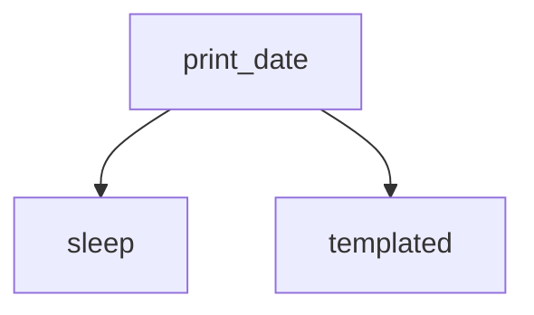

Apache Airflow에서 DAG(Directed Acyclic Graph)를 정의할 때, 단순히 태스크의 순서를 지정하는 것뿐만 아니라 다양한 실행 옵션을 함께 설정할 수 있다. 이 옵션들은 태스크의 재시도 정책, SLA, 실행 환경(큐/풀), 에러 핸들링, 트리거 조건 등에 영향을 미친다.

---

## DAG 기본 구조 예시

```python
from datetime import datetime, timedelta
from airflow import DAG
from airflow.providers.standard.operators.bash import BashOperator

with DAG(
    dag_id="tutorial",
    description="A simple tutorial DAG",
    schedule_interval=timedelta(days=1),
    start_date=datetime(2021, 1, 1),
    catchup=False,
    default_args={
        "depends_on_past": False,
        "retries": 1,
        "retry_delay": timedelta(minutes=5),
    },
    tags=["example"],
) as dag:

    t1 = BashOperator(
        task_id="print_date",
        bash_command="date",
    )
```

---

## 주요 파라미터 정리 (표 형식)

| 파라미터                      | 설명                                        | 기본값                    | 예시                                | 활용 사례             |
| ------------------------- | ----------------------------------------- | ---------------------- | --------------------------------- | ----------------- |
| **default_args**         | DAG 내 모든 태스크에 공통 적용되는 기본 인자               | `{}`                   | `{ 'retries': 1 }`                | 공통 정책을 손쉽게 적용     |
| **depends_on_past**     | 이전 실행(Task Instance)이 성공해야 현재 실행 진행 여부 결정 | `False`                | `True`                            | 순차적 종속성이 필요한 ETL  |
| **retries**               | 실패 시 재시도 횟수                               | `0`                    | `retries=3`                       | 일시적 오류 허용         |
| **retry_delay**          | 재시도 간격                                    | `timedelta(minutes=5)` | `timedelta(minutes=10)`           | API rate limit 대응 |
| **queue**                 | 실행할 워커 큐 지정                               | `default`              | `queue='bash_queue'`              | 특정 워커 리소스 분리      |
| **pool**                  | 동시 실행 개수를 제한하는 풀 지정                       | 없음                     | `pool='db_pool'`                  | DB Connection 보호  |
| **priority_weight**      | 스케줄링 우선순위 가중치                             | `1`                    | `priority_weight=10`              | 중요한 태스크 우선 실행     |
| **end_date**             | DAG 실행 종료일                                | 없음                     | `datetime(2025, 12, 31)`          | 특정 기간 캠페인 한정      |
| **wait_for_downstream** | 이전 DAG 실행의 다운스트림 태스크 완료까지 대기 여부           | `False`                | `True`                            | 데이터 일관성 보장        |
| **execution_timeout**    | 태스크 최대 실행 시간                              | 없음                     | `timedelta(minutes=30)`           | 무한 대기 방지          |
| **sla**                   | 태스크 완료 목표 시간                              | 없음                     | `sla=timedelta(hours=1)`          | SLA 모니터링          |
| **trigger_rule**         | 태스크 실행 조건                                 | `all_success`          | `trigger_rule='all_failed'`       | 특정 조건에서만 실행       |
| **on_failure_callback** | 실패 시 실행할 함수                               | 없음                     | `on_failure_callback=alert_func`  | 알림/Slack 연동       |
| **on_success_callback** | 성공 시 실행할 함수                               | 없음                     | `on_success_callback=log_func`    | 성공 로깅             |
| **on_retry_callback**   | 재시도 시 실행할 함수                              | 없음                     | `on_retry_callback=retry_alert`   | 재시도 모니터링          |
| **sla_miss_callback**   | SLA 위반 시 실행할 함수                           | 없음                     | `sla_miss_callback=notify_func`   | SLA 경고            |
| **on_skipped_callback** | 태스크 건너뜀 시 실행할 함수                          | 없음                     | `on_skipped_callback=skip_logger` | 조건부 태스크 추적        |

---

## 실행 조건 (Trigger Rules)

Airflow는 DAG 실행 시 각 태스크가 언제 실행될지를 **Trigger Rule**로 제어한다.

| Trigger Rule  | 설명                         |
| ------------- | -------------------------- |
| `all_success` | 모든 업스트림 태스크가 성공해야 실행 (기본값) |
| `all_failed`  | 모든 업스트림 태스크가 실패해야 실행       |
| `one_success` | 업스트림 중 하나라도 성공 시 실행        |
| `one_failed`  | 업스트림 중 하나라도 실패 시 실행        |
| `none_failed` | 업스트림이 실패하지 않았을 때 실행        |
| `always`      | 업스트림 결과와 관계없이 항상 실행        |

---

## 시각적 예시 (Mermaid)



위 예시는 `t1 >> [t2, t3]` 관계를 나타내며, `print_date` 태스크 완료 후 `sleep`과 `templated` 태스크가 병렬로 실행된다.

---

## 정리

* DAG 파라미터는 단순한 옵션이 아니라 **워크플로우 신뢰성, 성능, 운영 효율성**에 직결된다.
* `retries`, `timeout`, `queue`, `trigger_rule` 등의 적절한 조합은 장애 대응력과 안정성을 크게 향상시킨다.
* 팀 단위 운영에서는 `pool`, `priority_weight`, `callback 함수` 등을 활용하여 **리소스 제약과 알림 체계**를 관리하는 것이 권장된다.
