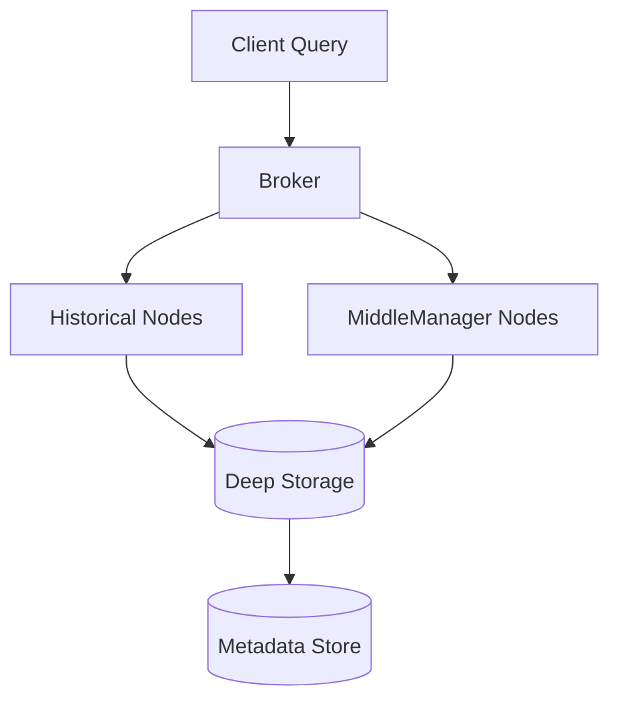

## 아파치 드루이드(Apache Druid)란?

**Apache Druid**는 대규모 데이터셋에 대해 *초고속 실시간 분석*을 수행하기 위해 설계된 **분산형 컬럼 기반 OLAP 데이터베이스**이다.
일반적인 관계형 데이터베이스(RDBMS)나 Hadoop 기반 분석 엔진보다 훨씬 빠른 쿼리 응답 속도와 높은 동시성을 제공한다.

> Druid는 OLAP(On-Line Analytical Processing)에 특화된 시스템으로, 대량의 이벤트 데이터(로그, 클릭스트림, 센서 데이터 등)를 초 단위로 집계하고 시각화할 수 있도록 설계된 엔진이다.

## Druid의 주요 특징

### 1. 실시간 데이터 수집 (Real-time ingestion)

Druid는 Kafka, Kinesis 등의 스트리밍 소스 또는 배치 파일(CSV, JSON, Parquet 등)로부터 **실시간으로 데이터를 수집**하고 즉시 쿼리에 활용할 수 있다.

이를 통해 “오늘의 데이터”를 기다리지 않고 **초 단위의 분석(Real-time Analytics)** 이 가능하다.

---

### 2. 빠른 쿼리 성능 (Sub-second query)

Druid는 **컬럼 지향(column-oriented)** 저장 구조를 사용하며, 데이터는 세그먼트(Segment) 단위로 압축·인덱싱된다.
이 구조 덕분에 필요한 컬럼만 읽고 빠르게 집계할 수 있어, 수십억 행의 데이터도 **밀리초 단위로 응답**이 가능하다.

> 예: 10억 건의 클릭 로그에서 하루별 사용자 수를 계산하는 쿼리도 1초 내로 응답할 수 있다.

---

### 3. 고가용성과 확장성 (High availability & scalability)

Druid는 완전한 분산형 구조로, **Broker / Coordinator / Historical / MiddleManager** 등의 역할을 분리해 수평 확장이 용이하다.

* **Historical 노드**: 과거 데이터(세그먼트)를 저장하고 조회를 담당
* **MiddleManager 노드**: 실시간 인덱싱 및 데이터 적재 담당
* **Broker 노드**: 클라이언트 쿼리를 분산·병합 처리
* **Coordinator 노드**: 세그먼트 배치, 로드 밸런싱, 메타데이터 관리 담당



> 이 구조는 데이터가 수십 TB 단위를 넘어가도 노드 증설만으로 부하 분산이 가능하게 한다.

---

### 4. 유연한 데이터 집계 (Roll-up & Granularity)

Druid는 데이터 적재 시 **미리 집계(Roll-up)** 를 수행할 수 있다. 예를 들어, 초 단위 로그를 분 단위로 미리 집계하면 저장 공간과 쿼리 비용이 대폭 줄어든다.

* **Roll-up**: 데이터 인서트 시점에 그룹화하여 미리 요약 저장
* **Granularity**: 시간 단위(초/분/시간/일)를 지정하여 집계 수준을 정의

> 이 기능은 로그, 모니터링, IoT 데이터 등 시간 기반 데이터 처리에 매우 유용하다.

---

### 5. 유연한 쿼리 언어 (Druid SQL)

Druid는 JSON 기반의 Native Query뿐만 아니라 **Druid SQL**을 지원하여, 기존 SQL 사용자도 쉽게 사용할 수 있다.

예시 쿼리:

```sql
SELECT country, COUNT(*) AS users, SUM(impressions) AS total_impressions
FROM clickstream
WHERE __time >= CURRENT_TIMESTAMP - INTERVAL '1' DAY
GROUP BY country
ORDER BY total_impressions DESC;
```

> Druid SQL은 내부적으로 Native Query로 변환되어 고속 실행된다.

---

## Druid의 기본 아키텍처 개요

Druid는 여러 컴포넌트가 협력하여 데이터를 수집, 저장, 쿼리한다.

| 구성요소               | 역할       | 설명                                |
| ------------------ | -------- | --------------------------------- |
| **Broker**         | 쿼리 라우팅   | 사용자 요청을 받아 여러 노드로 분산 후 결과 병합      |
| **Coordinator**    | 세그먼트 관리  | Historical 노드 간 데이터 배치 및 메타데이터 관리 |
| **Overlord**       | 작업 스케줄러  | 데이터 적재(ingestion) 작업 관리           |
| **MiddleManager**  | 인덱싱      | 실시간 데이터 ingestion 및 segment 생성    |
| **Historical**     | 저장소      | 완성된 segment를 저장하고 쿼리 응답           |
| **Deep Storage**   | 영구 저장소   | S3/HDFS/GCS 등 외부 스토리지에 세그먼트 보관    |
| **Metadata Store** | 메타데이터 DB | PostgreSQL/MySQL 등 관계형 DB로 상태 관리  |

---

## Druid의 주요 활용 사례

| 분야               | 활용 예시                      |
| ---------------- | -------------------------- |
| **웹/앱 분석**       | 클릭스트림 분석, 사용자 행동 추적, 세션 집계 |
| **IoT / 센서 데이터** | 실시간 기기 상태 모니터링, 이상 탐지      |
| **보안 로그 분석**     | 대규모 네트워크 로그 실시간 탐색         |
| **비즈니스 모니터링**    | 매출/트래픽/광고 실시간 대시보드         |

> 특히 Druid는 Grafana, Superset, Metabase 등 BI 도구와의 연동이 뛰어나 실시간 분석 대시보드를 구현하기 쉽다.

---

## 정리

| 구분         | 내용                                   |
| ---------- | ------------------------------------ |
| **데이터 모델** | 컬럼 지향, 세그먼트 기반 저장                    |
| **쿼리 엔진**  | Native Query, Druid SQL              |
| **적재 방식**  | Batch / Real-time (Kafka, Kinesis 등) |
| **저장소**    | Deep Storage + Historical 노드         |
| **확장성**    | 완전 분산형, 수평 확장 가능                     |

> **한 줄 요약:** Druid는 "대규모 실시간 분석에 최적화된 분산형 OLAP 엔진"이다.
