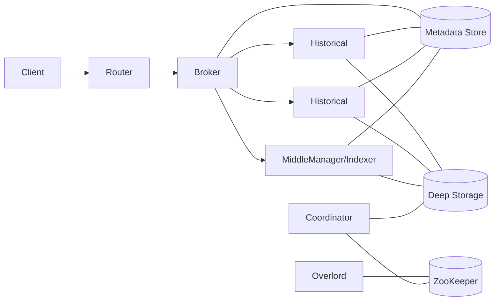
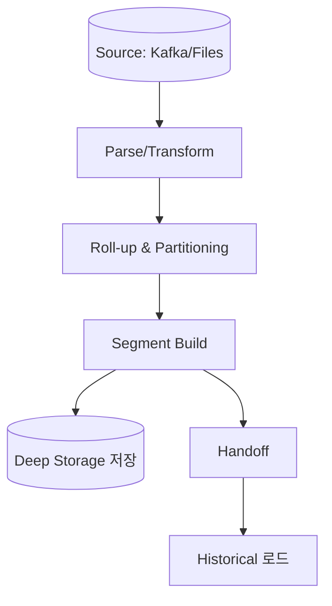
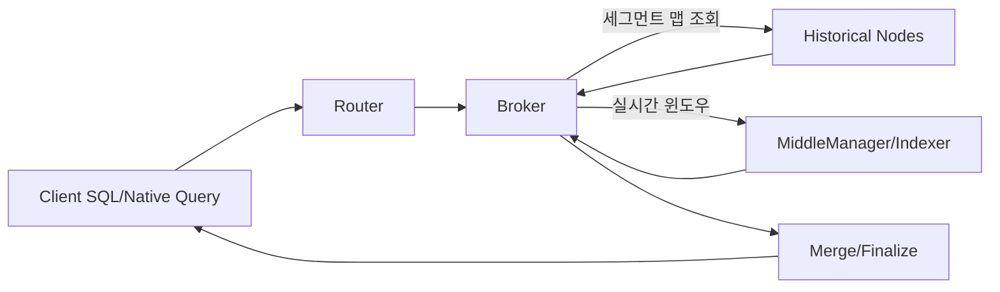

## 1. 왜 이런 아키텍처인가

Druid는 **대규모 시계열·이벤트 데이터에 대한 초고속 집계**를 목표로 설계된 **분산형 컬럼 지향 OLAP 데이터베이스**이다. 트래픽 모니터링, 클릭스트림 분석, 광고 지표, IoT 센서 데이터 등에서 **실시간 적재와 초·밀리초 단위 응답**이 요구되므로, 수집·저장·쿼리 컴포넌트를 역할별로 분리하고 수평 확장 가능하도록 설계되어 있다.

* **컬럼 지향 저장**과 **사전 인코딩·압축·비트맵 인덱스**로 최소 I/O로 집계를 수행한다.
* **세그먼트(segment)** 단위의 불변(immutable) 파일을 **Deep Storage**에 보관하여 내고장성과 비용 효율을 확보한다.
* **Broker–Historical/Indexing** 분산 처리 모델로 고동시성 쿼리를 지원한다.

---

## 2. 핵심 컴포넌트 한눈에 보기



| 컴포넌트                        | 핵심 역할                               | 비고                                    |
| --------------------------- | ----------------------------------- | ------------------------------------- |
| **Router**                  | 다중 Broker/Overlord로 라우팅             | 선택적 구성이나 콘솔 접근 및 멀티 테넌시 라우팅에 유용하다.    |
| **Broker**                  | 쿼리 게이트웨이. 세그먼트 위치 계산, 서브쿼리 분배·결과 병합 | 결과 캐시/부분 결과 스트리밍을 통해 지연을 낮춘다.         |
| **Historical**              | 완성된 세그먼트 읽기 전용 조회                   | Deep Storage의 세그먼트를 로컬 캐시에 로드하여 응답한다. |
| **MiddleManager / Indexer** | 실시간/배치 인덱싱 작업 수행, 세그먼트 생성·핸드오프      | 작업 단위(Task)로 병렬 처리한다.                 |
| **Overlord**                | 인덱싱 작업 스케줄링 및 리소스 할당                | MiddleManager/Indexer와 상호작용한다.        |
| **Coordinator**             | 세그먼트 로드/드롭 규칙, 재분배, 복제 관리           | 티어별 용량·규칙 기반 자동 배치이다.                 |
| **Deep Storage**            | 세그먼트 영구 저장(HDFS/S3/GCS 등)           | 클러스터 외부 내구성 저장소이다.                    |
| **Metadata Store**          | 메타데이터(RDBMS) 보관                     | 데이터소스·세그먼트·규칙·작업 상태를 저장한다.            |
| **ZooKeeper**               | 리더 선출·락·서비스 디스커버리                   | 고가용성의 핵심이다.                           |

---

## 3. 세그먼트 구조와 수명주기

### 3.1 세그먼트란 무엇인가

세그먼트는 시간 구간(Interval)·버전(Version)·파티션(Partition)으로 식별되는 **불변의 컬럼형 데이터 파일**이다. 각 컬럼은 사전 인코딩과 압축, 선택적 비트맵 인덱스를 포함한다. 불변 특성 덕분에 **쓰기-읽기 경합 없이** 고동시성 조회가 가능하다.

### 3.2 생성부터 핸드오프까지



1. **Parse/Transform**: 스키마 적용, 필드 변환/필터링, 타임스탬프 정규화이다.
2. **Roll-up & Partitioning**: 시간 그라뉼러리티(초/분/시간/일)와 차원 키 기준으로 미리 집계 및 파티셔닝한다.
3. **Segment Build**: 인덱싱 작업이 세그먼트를 생성한다.
4. **Deep Storage 저장**: 완성 세그먼트는 외부 스토리지에 내구성 있게 저장된다.
5. **Handoff**: MiddleManager의 실시간 세그먼트가 Historical에 인계되어 조회 전용으로 전환된다.

### 3.3 버전과 Overshadowing

동일 시간 구간의 더 **최신 버전** 세그먼트가 이전 버전을 **가린다(overshadow)**. Coordinator는 가려진 세그먼트를 드롭하여 스토리지 공간과 조회 비용을 줄인다.

### 3.4 콤팩션과 최적화

많은 작은 세그먼트는 조회 성능을 저하시킨다. **콤팩션(compaction)** 작업으로 세그먼트 크기를 통합하고 인덱스를 최적화한다. 일반적으로 **수백 MB 단위**의 균일한 세그먼트가 조회 효율이 높다.

---

## 4. 데이터 적재(ingestion) 경로

### 4.1 스트리밍 vs 배치

* **스트리밍**: Kafka/Kinesis 등에서 이벤트를 지속적으로 인덱싱한다.
* **배치**: S3/HDFS/로컬 파일(CSV/JSON/Parquet)을 정해진 주기로 일괄 적재한다.

### 4.2 인덱싱 작업 모델

인덱싱은 작업(Task) 단위로 수행된다. 대표 종류는 다음과 같다.

* `index_parallel`: 병렬 배치 인덱싱이다.
* `kafka`: 실시간 스트리밍 인덱싱이다.
* `compaction`: 세그먼트 통합·재인덱싱이다.

#### 예시: 배치 인덱싱 튜닝 스니펫

```json
"tuningConfig": {
  "type": "index_parallel",
  "maxRowsPerSegment": 5000000,
  "maxRowsInMemory": 100000,
  "partitionsSpec": { "type": "dynamic" }
}
```

### 4.3 규칙 기반 배치·보존

Coordinator는 규칙에 따라 세그먼트를 티어에 로드하거나 드롭한다.

* **영구 로드 규칙**

```json
{
  "type": "loadForever",
  "tieredReplicants": { "_default_tier": 2 }
}
```

* **보존 기간 드롭 규칙(90일 초과 삭제)**

```json
{ "type": "dropByPeriod", "period": "P90D" }
```

* **자동 콤팩션 구성**

```json
{
  "dataSource": "clickstream",
  "inputSegmentSizeBytes": 500000000,
  "tuningConfig": { "partitionsSpec": { "type": "dynamic" } }
}
```

---

## 5. 쿼리 처리 흐름



1. **Router**: 다중 Broker 앞단 라우팅 계층이다.
2. **Broker**: 메타데이터를 바탕으로 필요한 세그먼트를 계산하고 하위 서버들로 서브쿼리를 분배한다.
3. **Historical**: 완성 세그먼트에서 집계를 수행하여 부분 결과를 반환한다.
4. **MiddleManager/Indexer**: 실시간 구간의 최신 데이터를 포함하여 질의에 응답할 수 있다.
5. **Broker Merge**: 부분 결과를 시간/차원 기준으로 병합·정렬·리미트 후 반환한다.

> 브로커/히스토리컬/리절트 캐시를 적절히 활용하면 반복 질의 비용을 크게 줄일 수 있다.

---

## 6. 확장성과 고가용성

* **수평 확장**: 조회 부하는 **Broker/Historical**, 인덱싱 부하는 **MiddleManager/Indexer**를 증설하여 분산한다.
* **복제**: 티어와 규칙을 통해 세그먼트 복제본 수를 조정한다.
* **장애 대응**: Historical/Indexer 장애 시에도 Deep Storage와 Metadata Store에 기반하여 빠르게 재로드된다. ZooKeeper는 리더 선출과 서비스 디스커버리를 제공한다.

---

## 7. 운영 체크리스트

* **세그먼트 크기**: 지나치게 작은 세그먼트를 피하고 콤팩션을 주기적으로 수행한다.
* **그라뉼러리티**: 비즈니스 분석 단위를 기준으로 시간 그라뉼러리티(분/시간/일)를 설계한다.
* **차원 설계**: 고카디널리티 차원은 필요 최소한으로 유지하고, 프리디카트 필터가 많은 컬럼에 인덱스를 활용한다.
* **캐시 전략**: Broker/Historical 캐시의 TTL과 예약어휘(결과 집계)에 맞추어 적절히 조정한다.
* **규칙 관리**: 티어별 로드/드롭/백업 규칙을 명확히 정의한다.
* **리소스 분리**: 인덱싱과 조회 워크로드를 서로 다른 노드 풀로 분리한다.

---

## 8. 아키텍처 궁금점

**Q1. RDB나 데이터 웨어하우스와 무엇이 다른가?**
- Druid는 트랜잭션 일관성보다는 **조회 성능과 실시간성**에 최적화되어 있다. 데이터는 불변 세그먼트로 축적되며, 커스텀 인덱스·롤업·분산 병합으로 매우 빠른 집계를 제공한다.

**Q2. 대시보드/BI 도구와의 통합은 쉬운가?**
- 표준 JDBC/SQL과 REST API를 지원하므로 Grafana, Superset, Metabase 등과 쉽게 연동된다.

**Q3. 오랜 기간 데이터를 보존해도 되는가?**
- Deep Storage에 장기간 저장이 가능하며, 조회 빈도가 낮은 구간은 저비용 티어로 이동시켜 비용을 최적화할 수 있다.

---

## 9. 요약

* Druid는 **세그먼트 중심**의 분산 OLAP 아키텍처로, 실시간 적재와 고속 조회를 동시에 만족시키도록 설계되어 있다.
* 역할 분리(브로커·히스토리컬·인덱싱)와 외부 영구 저장소(Deep Storage) 조합으로 **탄력적 확장**과 **고가용성**을 달성한다.
* 올바른 **롤업·파티셔닝·세그먼트 크기·규칙 관리**가 성능과 비용을 좌우한다.
