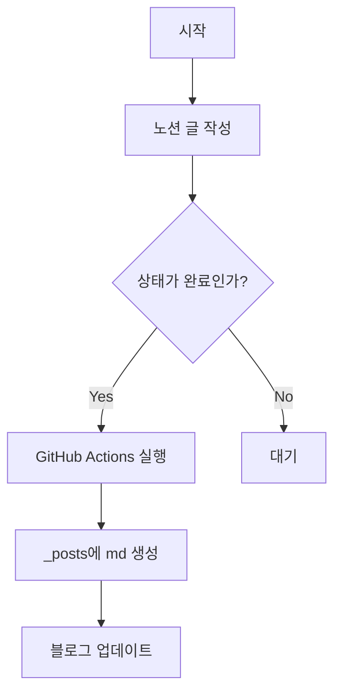

## 1. 테스트 글


테스트 글


---

- [ ] 안녕

```python
printf('하이')
```



```mermaid
flowchart TD
    A[시작] --> B[노션 글 작성]
    B --> C{상태가 완료인가?}
    C -- Yes --> D[GitHub Actions 실행]
    D --> E[_posts에 md 생성]
    E --> F[블로그 업데이트]
    C -- No --> G[대기]
```

