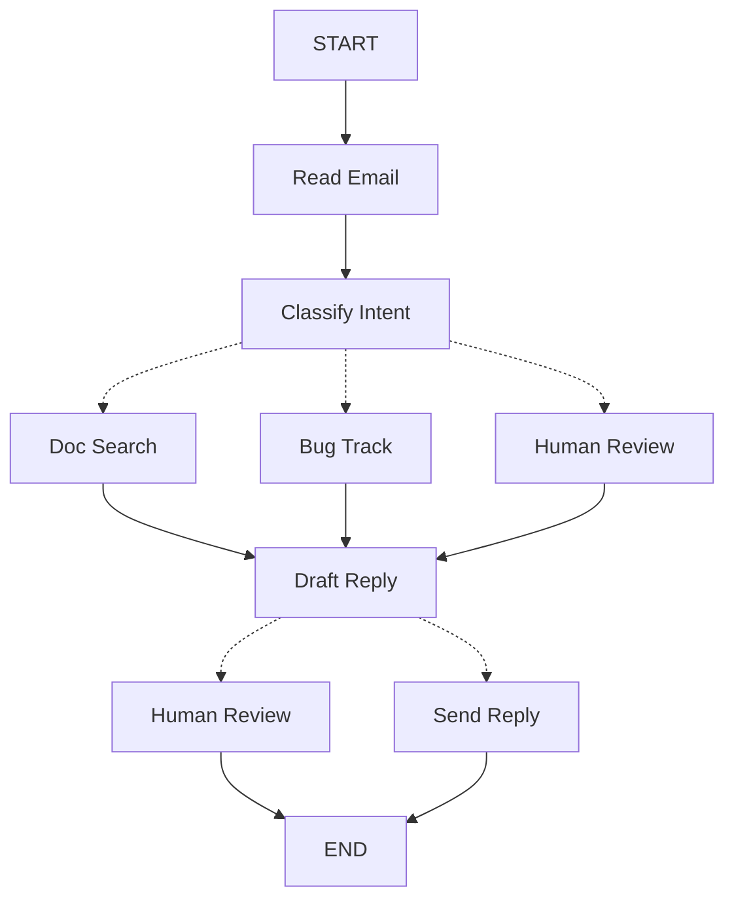

## Thinking in LangGraph


LangGraph로 에이전트를 만든다는 것은, 먼저 전체 작업을 **노드(node)** 라는 분리된 단계로 쪼개는 것에서 출발하는 일이다. 그 다음 각 노드에서 일어날 수 있는 **결정과 전이(transition)** 를 정의한다. 마지막으로 모든 노드를 하나의 **공유 상태(state)** 로 연결하여, 각 노드가 동일한 기억(메모리)을 읽고 쓰도록 구성한다.


이 글은 LangGraph로 **고객 지원 이메일 에이전트**를 만든다는 가정 아래, 설계 사고 과정을 단계별로 따라가며 설명한다.


---


## 자동화할 프로세스부터 시작하기


고객 지원 이메일을 처리하는 AI 에이전트를 만들어야 한다고 가정한다. 제품팀이 요구하는 기능은 다음과 같다.


```bash
에이전트가 해야 할 일:

- 고객이 보낸 이메일을 읽고
- 긴급도와 주제를 분류하고
- 필요한 문서를 찾아서
- 적절한 답변을 작성하고
- 복잡한 문제는 사람에게 넘기고
- 필요하면 후속 조치까지 관리해야 한다

처리해야 할 예시 상황:

1. 단순 질문:“비밀번호 어떻게 초기화해요?”
2. 버그 제보: "PDF로 내보내면 기능이 자꾸 죽어요"
3. 긴급 결제 문제: "구독 요금이 두 번 결제됐어요!"
4. 기능 요청: "다크 모드 추가해줄 수 있나요?"
5. 복잡한 기술 문제: "API 연동이 가끔씩 504 에러가 나요"
```


이런 요구사항을 LangGraph로 구현할 때는 보통 **5단계**의 동일한 사고 흐름을 따른다.


---


## Step 1. 워크플로우를 분리된 단계로 맵핑하기


가장 먼저 해야 할 일은 프로세스의 서로 다른 단계를 식별하는 것이다. 각 단계는 **하나의 노드(= 하나의 역할만 수행하는 함수)** 가 된다. 그리고 노드들이 어떻게 연결되는지, 가능한 경로를 스케치한다.





이 다이어그램의 화살표는 “갈 수 있는 경로”를 표현할 뿐이다. 실제로 어느 경로로 갈지 결정하는 로직은 **각 노드 내부**에 있다.


이제 노드가 무엇을 해야 하는지 역할을 정리한다.

- `Read Email`: 이메일 내용을 추출하고 파싱한다.
- `Classify Intent`: LLM으로 긴급도와 주제를 분류하고, 다음 행동으로 라우팅한다.
- `Doc Search`: 지식 베이스에서 관련 정보를 검색한다.
- `Bug Track`: 이슈 트래킹 시스템에 버그를 생성하거나 업데이트한다.
- `Draft Reply`: 적절한 답변 초안을 생성한다.
- `Human Review`: 복잡하거나 위험한 이슈는 사람에게 승인/처리를 요청한다.
- `Send Reply`: 이메일 답장을 발송한다.
> 팁: 어떤 노드는 다음 단계로 갈 경로를 “선택”한다(Classify Intent, Draft Reply, Human Review). 반면 어떤 노드는 항상 같은 다음 단계로만 진행한다(예: Read Email은 항상 Classify Intent로 이동, Doc Search는 항상 Draft Reply로 이동).

---


## Step 2. 각 단계가 무엇을 해야 하는지 유형을 정하기


그래프의 각 노드가 수행하는 작업의 성격과 필요한 컨텍스트를 정한다. 문서에서는 크게 네 종류로 분류한다.

- **LLM 단계(LLM steps)**: 이해/분석/생성/추론 결정이 필요할 때 사용한다.
- **데이터 단계(Data steps)**: 외부에서 정보를 조회해야 할 때 사용한다.
- **액션 단계(Action steps)**: 외부 시스템에 실제 동작을 수행해야 할 때 사용한다.
- **사용자 입력 단계(User input steps)**: 사람의 개입이 필요할 때 사용한다.

### LLM steps


이해, 분석, 텍스트 생성, 라우팅 판단이 필요한 단계에 해당한다.

- **Classify intent**
    - 고정 컨텍스트(프롬프트): 분류 카테고리, 긴급도 정의, 출력 포맷
    - 동적 컨텍스트(상태에서): 이메일 내용, 발신자 정보
    - 기대 결과: 라우팅을 결정할 수 있는 구조화된 분류 결과
- **Draft reply**
    - 고정 컨텍스트(프롬프트): 톤 가이드라인, 회사 정책, 템플릿
    - 동적 컨텍스트(상태에서): 분류 결과, 검색 결과, 고객 이력
    - 기대 결과: 리뷰에 올릴 수 있을 정도의 전문적인 이메일 답변 초안

### Data steps


외부에서 정보를 가져와야 하는 단계에 해당한다.

- **Document search**
    - 파라미터: 의도(intent)와 주제(topic)로부터 만든 질의
    - 재시도: 필요(일시적 장애를 가정), 지수 백오프 적용 가능
    - 캐싱: 흔한 질의는 캐시해 API 호출을 줄일 수 있다.
- **Customer history lookup**
    - 파라미터: 상태의 고객 이메일 또는 고객 ID
    - 재시도: 필요하되, 실패 시 기본 정보로 폴백하는 전략이 유용하다.
    - 캐싱: 필요(예: TTL 기반으로 최신성과 성능 균형을 맞춤)

### Action steps


외부 시스템에 영향을 주는 실제 동작 단계이다.

- **Send reply**
    - 실행 시점: 승인 이후(사람 승인 또는 자동 승인)
    - 재시도: 필요(네트워크 이슈 대비, 지수 백오프)
    - 캐싱 금지: 매 발송은 유일한 동작이므로 캐시 대상이 아니다.
- **Bug track**
    - 실행 시점: intent가 “bug”인 경우 항상 실행
    - 재시도: 필요(버그 리포트를 잃지 않는 것이 중요)
    - 반환값: 답변에 포함할 수 있는 티켓 ID

### User input steps


사람의 판단/승인이 필요한 단계이다.

- **Human review node**
    - 판단 컨텍스트: 원본 이메일, 초안 답변, 긴급도, 분류 결과
    - 기대 입력: 승인 여부(boolean) + 필요 시 수정된 답변
    - 트리거: 높은 긴급도, 복잡한 이슈, 품질 우려 등

---


## Step 3. 상태(State) 설계하기


상태는 모든 노드가 접근할 수 있는 공유 메모리이다. “에이전트가 일을 처리하면서 알게 된 것과 결정한 것을 적어두는 노트”처럼 생각하면 된다.


### 상태에 무엇을 넣어야 하는가


각 데이터 조각에 대해 다음 질문을 던진다.

- 여러 단계에 걸쳐 **유지되어야 하는가?** 그렇다면 상태에 넣는다.
- 다른 데이터로부터 **다시 계산/도출 가능한가?** 그렇다면 저장하지 말고 필요할 때 계산한다.

이메일 에이전트라면 보통 다음을 추적해야 한다.

- 원본 이메일과 발신자 정보(나중에 재구성 불가)
- 분류 결과(여러 다운스트림 노드에서 사용)
- 검색 결과 및 고객 데이터(비용이 큰 호출이므로 재조회 회피)
- 답변 초안(리뷰 단계까지 유지 필요)
- 실행 메타데이터(디버깅/복구 목적)

### 상태는 raw로 두고, 프롬프트는 필요할 때 포맷하기


핵심 원칙은 다음과 같다.

- 상태에는 **가공되지 않은 raw 데이터**를 저장한다.
- 프롬프트용 포맷팅은 **각 노드 내부에서 필요할 때** 수행한다.

이렇게 분리하면 다음과 같은 장점이 있다.

- 노드마다 같은 데이터를 서로 다른 방식으로 포맷해서 쓸 수 있다.
- 프롬프트 템플릿을 바꿔도 상태 스키마를 수정하지 않아도 된다.
- 디버깅 시 어떤 데이터가 들어갔는지 명확해진다.
- 상태 스키마를 깨지 않고도 에이전트가 진화할 수 있다.

아래는 상태 정의 예시이다.


```python
from typing import TypedDict, Literal

class EmailClassification(TypedDict):
    intent: Literal["question", "bug", "billing", "feature", "complex"]
    urgency: Literal["low", "medium", "high", "critical"]
    topic: str
    summary: str

class EmailAgentState(TypedDict):
    email_content: str
    sender_email: str
    email_id: str

    classification: EmailClassification | None

    search_results: list[str] | None
    customer_history: dict | None

    draft_response: str | None
    messages: list[str] | None
```


이 상태에는 프롬프트 템플릿이나 지시문, 포맷된 문자열이 없다. 분류 결과는 LLM이 반환한 딕셔너리 형태 그대로 저장한다.


---


## Step 4. 노드 만들기


각 단계를 함수로 구현한다. LangGraph에서 노드는 “현재 상태를 입력으로 받아 작업을 수행하고, 상태 업데이트를 반환하는 파이썬 함수”이다.


### 에러를 상황에 맞게 처리하기


에러는 하나의 방식으로 처리하지 않는다. 에러 유형에 따라 고치는 주체와 전략이 달라진다.


| Error Type                   | Who Fixes It | Strategy                  | When to Use               |
| ---------------------------- | ------------ | ------------------------- | ------------------------- |
| 일시적 오류(네트워크, rate limit 등)   | 시스템(자동)      | 재시도 정책                    | 재시도하면 해결될 확률이 높을 때        |
| LLM이 회복 가능한 오류(도구 실패, 파싱 이슈) | LLM          | 에러를 상태에 저장하고 루프백          | LLM이 원인을 보고 전략을 바꿀 수 있을 때 |
| 사용자가 고칠 수 있는 오류(정보 누락 등)     | 사람           | `interrupt()`로 중단 후 입력 요청 | 사용자 입력이 없으면 진행 불가할 때      |
| 예기치 못한 오류                    | 개발자          | 그대로 전파                    | 원인 규명이 필요할 때              |


### 1) 일시적 오류: RetryPolicy 적용


```python
from langgraph.types import RetryPolicy

workflow.add_node(
    "search_documentation",
    search_documentation,
    retry_policy=RetryPolicy(max_attempts=3, initial_interval=1.0)
)
```


### 2) LLM 회복 가능 오류: 상태에 에러를 남기고 루프


```python
from langgraph.types import Command


def execute_tool(state: State) -> Command[Literal["agent", "execute_tool"]]:
    try:
        result = run_tool(state['tool_call'])
        return Command(update={"tool_result": result}, goto="agent")
    except ToolError as e:
        return Command(
            update={"tool_result": f"Tool error: {str(e)}"},
            goto="agent"
        )
```


### 3) 사용자 입력 필요: interrupt()로 멈추기


```python
from langgraph.types import Command


def lookup_customer_history(state: State) -> Command[Literal["draft_response"]]:
    if not state.get('customer_id'):
        user_input = interrupt({
            "message": "Customer ID needed",
            "request": "Please provide the customer's account ID to look up their subscription history"
        })
        return Command(
            update={"customer_id": user_input['customer_id']},
            goto="lookup_customer_history"
        )

    customer_data = fetch_customer_history(state['customer_id'])
    return Command(update={"customer_history": customer_data}, goto="draft_response")
```


### 4) 예기치 못한 오류: 잡지 말고 올리기


```python
def send_reply(state: EmailAgentState):
    try:
        email_service.send(state["draft_response"])
    except Exception:
        raise
```


---


### 이메일 에이전트 노드 구현 예시


노드는 상태를 받아 작업하고 상태 업데이트를 반환한다는 원칙을 기억한다.


### Read + Classify


```python
from typing import Literal
from langgraph.graph import StateGraph, START, END
from langgraph.types import interrupt, Command, RetryPolicy
from langchain_openai import ChatOpenAI
from langchain.messages import HumanMessage

llm = ChatOpenAI(model="gpt-5-nano")


def read_email(state: EmailAgentState) -> dict:
    """Extract and parse email content"""
    return {
        "messages": [HumanMessage(content=f"Processing email: {state['email_content']}")]
    }


def classify_intent(
    state: EmailAgentState,
) -> Command[Literal["search_documentation", "human_review", "draft_response", "bug_tracking"]]:
    """Use LLM to classify email intent and urgency, then route accordingly"""

    structured_llm = llm.with_structured_output(EmailClassification)

    classification_prompt = f"""
    Analyze this customer email and classify it:

    Email: {state['email_content']}
    From: {state['sender_email']}

    Provide classification including intent, urgency, topic, and summary.
    """

    classification = structured_llm.invoke(classification_prompt)

    if classification['intent'] == 'billing' or classification['urgency'] == 'critical':
        goto = "human_review"
    elif classification['intent'] in ['question', 'feature']:
        goto = "search_documentation"
    elif classification['intent'] == 'bug':
        goto = "bug_tracking"
    else:
        goto = "draft_response"

    return Command(
        update={"classification": classification},
        goto=goto
    )
```


### Search + Tracking


```python
def search_documentation(state: EmailAgentState) -> Command[Literal["draft_response"]]:
    """Search knowledge base for relevant information"""

    classification = state.get('classification', {})
    query = f"{classification.get('intent', '')} {classification.get('topic', '')}"

    try:
        search_results = [
            "Reset password via Settings > Security > Change Password",
            "Password must be at least 12 characters",
            "Include uppercase, lowercase, numbers, and symbols"
        ]
    except SearchAPIError as e:
        search_results = [f"Search temporarily unavailable: {str(e)}"]

    return Command(
        update={"search_results": search_results},
        goto="draft_response"
    )


def bug_tracking(state: EmailAgentState) -> Command[Literal["draft_response"]]:
    """Create or update bug tracking ticket"""

    ticket_id = "BUG-12345"

    return Command(
        update={
            "search_results": [f"Bug ticket {ticket_id} created"],
            "current_step": "bug_tracked"
        },
        goto="draft_response"
    )
```


### Draft + Human Review + Send


```python
def draft_response(state: EmailAgentState) -> Command[Literal["human_review", "send_reply"]]:
    """Generate response using context and route based on quality"""

    classification = state.get('classification', {})

    context_sections = []

    if state.get('search_results'):
        formatted_docs = "
".join([f"- {doc}" for doc in state['search_results']])
        context_sections.append(f"Relevant documentation:
{formatted_docs}")

    if state.get('customer_history'):
        context_sections.append(
            f"Customer tier: {state['customer_history'].get('tier', 'standard')}"
        )

    draft_prompt = f"""
    Draft a response to this customer email:
    {state['email_content']}

    Email intent: {classification.get('intent', 'unknown')}
    Urgency level: {classification.get('urgency', 'medium')}

    {chr(10).join(context_sections)}

    Guidelines:
    - Be professional and helpful
    - Address their specific concern
    - Use the provided documentation when relevant
    """

    response = llm.invoke(draft_prompt)

    needs_review = (
        classification.get('urgency') in ['high', 'critical'] or
        classification.get('intent') == 'complex'
    )

    goto = "human_review" if needs_review else "send_reply"

    return Command(
        update={"draft_response": response.content},
        goto=goto
    )


def human_review(state: EmailAgentState) -> Command[Literal["send_reply", END]]:
    """Pause for human review using interrupt and route based on decision"""

    classification = state.get('classification', {})

    # interrupt()는 반드시 먼저 실행되어야 한다.
    human_decision = interrupt({
        "email_id": state.get('email_id',''),
        "original_email": state.get('email_content',''),
        "draft_response": state.get('draft_response',''),
        "urgency": classification.get('urgency'),
        "intent": classification.get('intent'),
        "action": "Please review and approve/edit this response"
    })

    if human_decision.get("approved"):
        return Command(
            update={
                "draft_response": human_decision.get(
                    "edited_response",
                    state.get('draft_response','')
                )
            },
            goto="send_reply"
        )

    return Command(update={}, goto=END)


def send_reply(state: EmailAgentState) -> dict:
    """Send the email response"""
    print(f"Sending reply: {state['draft_response'][:100]}...")
    return {}
```


---


## Step 5. 모두 연결하기(Wire it together)


이제 노드들을 그래프로 연결한다. 노드 내부에서 라우팅을 직접 결정하도록 만들었기 때문에, 그래프에는 최소한의 필수 엣지만 두면 된다.


그리고 `interrupt()`를 이용한 human-in-the-loop를 쓰려면, 실행 중 상태를 저장했다가 재개할 수 있도록 **checkpointer**와 함께 컴파일해야 한다.


```python
from langgraph.checkpoint.memory import MemorySaver
from langgraph.types import RetryPolicy

workflow = StateGraph(EmailAgentState)

workflow.add_node("read_email", read_email)
workflow.add_node("classify_intent", classify_intent)

workflow.add_node(
    "search_documentation",
    search_documentation,
    retry_policy=RetryPolicy(max_attempts=3)
)
workflow.add_node("bug_tracking", bug_tracking)
workflow.add_node("draft_response", draft_response)
workflow.add_node("human_review", human_review)
workflow.add_node("send_reply", send_reply)

workflow.add_edge(START, "read_email")
workflow.add_edge("read_email", "classify_intent")
workflow.add_edge("send_reply", END)

memory = MemorySaver()
app = workflow.compile(checkpointer=memory)
```


그래프 구조가 최소인 이유는, 노드가 `Command`로 **상태 업데이트 + 다음 목적지(goto)** 를 함께 반환하면서 라우팅을 수행하기 때문이다. 또한 `Command[Literal[...]]` 같은 타입 힌트로 노드가 갈 수 있는 목적지를 명시하여 흐름을 추적 가능하게 만든다.

> 참고: 로컬 서버(Agent Server) 실행 환경에 따라 checkpointer 없이 컴파일하는 구성이 필요할 수 있다.

---


## 에이전트 실행해보기


긴급한 결제 이슈(사람 리뷰가 필요한 케이스)로 실행해 본다.


```python
initial_state = {
    "email_content": "I was charged twice for my subscription! This is urgent!",
    "sender_email": "customer@example.com",
    "email_id": "email_123",
    "messages": []
}

config = {"configurable": {"thread_id": "customer_123"}}
result = app.invoke(initial_state, config)

print(f"human review interrupt:{result['__interrupt__']}")

from langgraph.types import Command

human_response = Command(
    resume={
        "approved": True,
        "edited_response": "We sincerely apologize for the double charge. I've initiated an immediate refund..."
    }
)

final_result = app.invoke(human_response, config)
print("Email sent successfully!")
```


그래프는 `interrupt()`에 도달하면 멈추고, checkpointer에 상태를 저장한 뒤 입력을 기다린다. 이후 재개 시점에는 며칠이 지나도 동일 지점부터 이어서 실행된다. `thread_id`는 이 대화/케이스의 상태를 묶어 저장하기 위한 키이다.


---


## Summary and next steps


### Key Insights


고객 지원 이메일 에이전트를 만들면서 확인할 수 있는 LangGraph식 사고는 다음과 같다.

- **단계를 분해한다**: 각 노드는 한 가지 일을 잘 수행한다. 이 분해는 스트리밍 진행 상황, 중단/재개 가능한 실행, 단계별 디버깅을 가능하게 만든다.
- **상태는 공유 메모리이다**: raw 데이터를 저장하고, 포맷은 노드에서 필요할 때 만든다. 같은 데이터를 노드별로 다르게 활용할 수 있다.
- **노드는 함수이다**: 상태를 입력으로 받고, 작업 후 상태 업데이트를 반환한다. 라우팅이 필요하면 `Command`로 업데이트와 목적지를 함께 선언한다.
- **에러는 흐름의 일부이다**: 일시적 오류는 재시도, LLM 회복 가능 오류는 루프, 사용자 입력 필요는 `interrupt()`, 예기치 못한 오류는 버블업으로 처리한다.
- **사람 입력은 1급 시민이다**: `interrupt()`는 무기한 실행을 멈추고 상태를 저장하며, 입력을 주면 정확히 멈춘 지점에서 재개한다. 다른 로직과 함께 쓸 때는 `interrupt()`가 반드시 먼저 실행되어야 한다.
- **그래프 구조는 자연스럽게 단순해진다**: 필수 엣지만 두고, 분기 로직은 노드 내부에서 처리한다. 현재 노드와 상태만 봐도 다음 행동을 추적할 수 있다.

---


### Advanced considerations: 노드 분해(Granularity)의 트레이드오프


왜 `Read Email`과 `Classify Intent`를 합치지 않고 나누었는지, 왜 `Doc Search`와 `Draft Reply`를 분리했는지 같은 질문이 생길 수 있다. 여기에는 **회복력(resilience)** 과 **관측 가능성(observability)** 의 트레이드오프가 있다.

- **회복력 관점**: LangGraph의 durable execution은 노드 경계에서 체크포인트를 만든다. 중단/실패 후 재개할 때는 멈춘 노드의 시작부터 다시 실행된다. 노드가 작을수록 체크포인트가 더 자주 생기고, 문제가 생겨도 반복 작업량이 줄어든다. 반대로 여러 작업을 큰 노드 하나에 합치면, 말미에서 실패했을 때 처음부터 다시 실행해야 한다.

이 이메일 에이전트에서 이렇게 나눈 이유는 다음과 같다.

- **외부 서비스 격리**: Doc Search와 Bug Track은 외부 API 호출이다. 느리거나 실패할 수 있으므로 LLM 호출과 분리해 재시도 정책을 노드 단위로 적용하기 쉽다.
- **중간 가시성**: `Classify Intent`를 독립 노드로 두면, 에이전트가 어떤 결정을 했는지(왜 human review로 갔는지 등)를 중간 단계에서 확인하기 좋다.
- **실패 모드의 차이**: LLM 호출, DB 조회, 이메일 발송은 실패 원인과 재시도 전략이 다르다. 분리하면 각자에 최적화된 정책을 적용할 수 있다.
- **재사용성과 테스트**: 작은 노드는 단위 테스트가 쉽고, 다른 워크플로우에 재사용하기도 쉽다.

다른 유효한 선택도 있다. 예를 들어 `Read Email`과 `Classify Intent`를 한 노드로 합치면 그래프는 더 단순해진다. 다만 그 노드 내부 후반에서 실패하면 앞부분까지 같이 재실행되는 비용이 생긴다. 많은 경우 중간 가시성과 디버깅 장점 때문에 분리 쪽이 실무에서 유리한 편이다.


또한 Step 2의 캐싱 논의는 LangGraph 프레임워크 기능이 아니라 **애플리케이션 설계 선택**이다. 캐시는 각 노드 내부에서 요구사항에 맞게 구현한다.


성능 관점에서는 “노드가 많으면 느려지는가?” 같은 의문이 생길 수 있다. 기본적으로 LangGraph는 체크포인트를 백그라운드로 기록하는 모드가 있어(비동기 durability 모드), 노드 경계가 늘어난다고 반드시 느려지는 것은 아니다. 필요하면 완료 시점에만 기록하거나, 매 체크포인트를 동기로 기다리는 모드로도 조정할 수 있다.


---


### Where to go from here


이 글은 LangGraph로 에이전트를 설계할 때의 사고방식을 다룬다. 다음 주제로 확장할 수 있다.

- human-in-the-loop 패턴: 도구 실행 전 승인, 배치 승인 등
- Subgraphs: 복잡한 작업을 하위 그래프로 분리
- Streaming: 사용자에게 실시간 진행 상황을 전달
- Observability: LangSmith를 통한 디버깅/모니터링
- Tool Integration: 웹 검색, DB 질의, 외부 API 등 더 많은 도구 연결
- Retry Logic: 지수 백오프 등 재시도 전략 고도화
