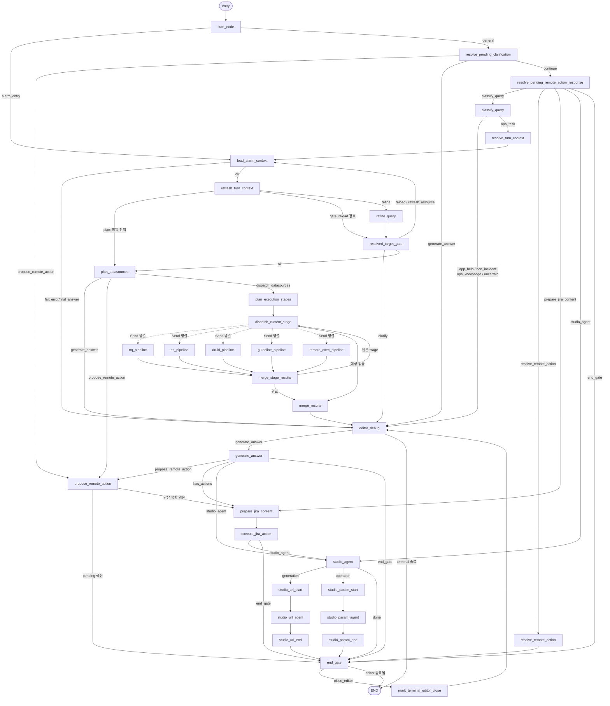

안녕하세요. 테스트 글입니다.


## 테스트를 위한 글


테스트 글입니다.

<details markdown="1">
<summary>토글 테스트 해보기</summary>

**안녕 토글** 테스트

1. 리스트도 테스트 하는중
2. 하이
3. 세번째

</details>


---

> 인용글도 테스트 중

---


> 안녕 콜아웃 테스트
{: .prompt-tip }


> 이것도 콜아웃 테스트
{: .prompt-warning }


> 이것도 콜아웃 테스트
{: .prompt-info }


> 이것도 콜아웃 테스트
{: .prompt-danger }


---


$$
|x|
$$


---


$|x|$ → 인라인 수학공식 테스트


---


<div class="notion-tabs" markdown="1">
<input type="radio" name="notion-tabs-1" id="notion-tabs-1-0" checked="checked" />
<label for="notion-tabs-1-0">탭</label>
<div class="notion-tab-panel" markdown="1">

첫 번째 탭 제목


<div class="notion-indent" markdown="1">

첫 번째 탭 본문 테스트


```bash
코드블럭 테스트
```

</div>

두 번째 탭 제목


<div class="notion-indent" markdown="1">

두 번째 탭 본문 테스트

</div>

<details markdown="1">
<summary>토글도 테스트</summary>

토글 안에 굵은 글씨 테스트 해보기 **하이하이**


</details>


세 번째 탭 제목


<div class="notion-indent" markdown="1">

세 번째 탭 본문 테스트

1. 리스트도
2. 테스트
- [x] 체크박스도
- [ ] 테스트

들여쓰기도 테스트


<div class="notion-indent" markdown="1">

하이하이 입니다.

</div>

</div>

</div>
</div>


_캡션 테스트_


---


<div class="notion-columns" markdown="1">
<div class="notion-column" markdown="1">

단 테스트


하이하이


헬로우

</div>
<div class="notion-column" markdown="1">


</div>
</div>


---





<div class="notion-columns" markdown="1">
<div class="notion-column" markdown="1">

본문 이미지 하나
콜아웃 (💡 하나, ⚠️ 하나, 아이콘 없는 것 하나)
인용문 하나  ← 콜아웃과 구분되는지 확인용
토글 (안에 굵은 글씨 + 목록)
체크박스 목록


단 나누기 2단
코드 블록 (mermaid 하나, 일반 언어 하나)
수식 (블록 + 인라인)
표
오디오 파일

</div>
<div class="notion-column" markdown="1">

본문 이미지 하나
콜아웃 (💡 하나, ⚠️ 하나, 아이콘 없는 것 하나)
인용문 하나  ← 콜아웃과 구분되는지 확인용
토글 (안에 굵은 글씨 + 목록)


체크박스 목록
단 나누기 2단
코드 블록 (mermaid 하나, 일반 언어 하나)
수식 (블록 + 인라인)
표
오디오 파일

</div>
</div>


| 표   | 제   | 목   |
| --- | --- | --- |
| ㅁㄴㅇ | ㄴㅇㄹ | ㅇㅇ  |
| ㅈㄷㄱ | ㄴㅇㄹ | ㅌㅊㅍ |


## 북마크 테스트





<a class="notion-bookmark" href="https://github.com/Mminzy22/Mminzy22.github.io" target="_blank" rel="noopener noreferrer"><span class="notion-bookmark-body"><span class="notion-bookmark-title">GitHub - Mminzy22/Mminzy22.github.io</span><span class="notion-bookmark-desc">Contribute to Mminzy22/Mminzy22.github.io development by creating an account on GitHub.</span><span class="notion-bookmark-meta"><span class="notion-bookmark-site">github.com</span></span></span><span class="notion-bookmark-thumb"></span></a>


---


## 임베딩 테스트





---


## 들여쓰기 테스트

1. 하이하이
    1. 하이하이
        1. 하이하이

위에는 리스트 들여쓰기 아래는 일반 들여쓰기


하이


<div class="notion-indent" markdown="1">

하이하이


<div class="notion-indent" markdown="1">

하이하이하이

</div>

</div>
